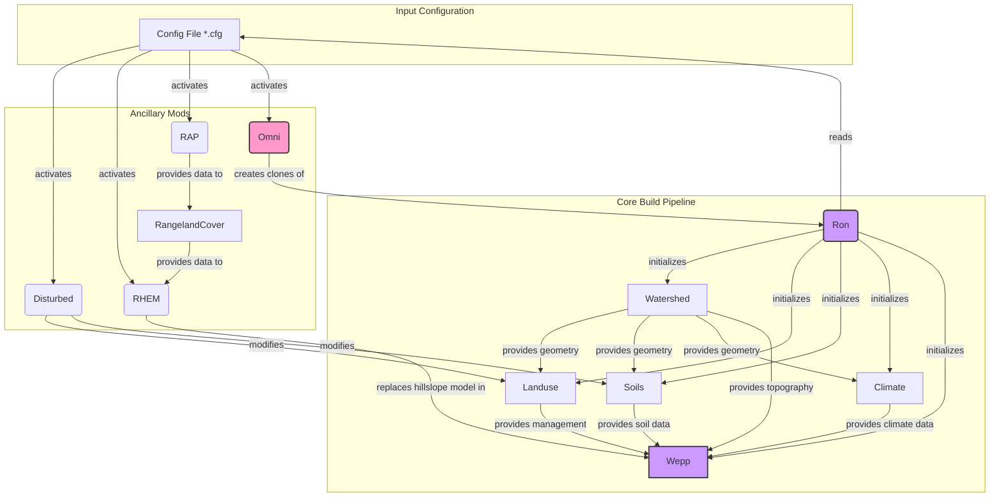

# WEPPpy `nodb` System: Architecture and Build Process

> **Author**: Gemini AI Agent  
> **Last Updated**: 2025-10-27  
> **Purpose**: A definitive technical reference for the `wepppy.nodb` architecture, detailing the project build lifecycle, parameterization, modular extensions, and programmatic interaction patterns for developers and AI agents.

---

## Table of Contents

1.  [**System Philosophy**](#1-system-philosophy)
2.  [**High-Level Data Flow**](#2-high-level-data-flow)
3.  [**The Build Lifecycle: A Step-by-Step Deep Dive**](#3-the-build-lifecycle-a-step-by-step-deep-dive)
    -   [Stage 1: Initialization (`Ron`)](#stage-1-initialization-ron)
    -   [Stage 2: Map & DEM Acquisition (`Ron`)](#stage-2-map--dem-acquisition-ron)
    -   [Stage 3: Watershed Delineation (`Watershed`)](#stage-3-watershed-delineation-watershed)
    -   [Stage 4: Topographic Abstraction (`Watershed`)](#stage-4-topographic-abstraction-watershed)
    -   [Stage 5: Component Builds (`Landuse`, `Soils`, `Climate`)](#stage-5-component-builds-landuse-soils-climate)
    -   [Stage 6: WEPP Model Preparation (`Wepp`)](#stage-6-wepp-model-preparation-wepp)
4.  [**Parameterization and Configuration**](#4-parameterization-and-configuration)
    -   [Configuration Inheritance Model](#41-configuration-inheritance-model)
    -   [Key Configuration Reference](#42-key-configuration-reference)
5.  [**Modular Architecture: `mods` and `locales`**](#5-modular-architecture-mods-and-locales)
    -   [Regional Customization (`locales`)](#51-regional-customization-locales)
    -   [Ancillary Functionality (`mods`)](#52-ancillary-functionality-mods)
6.  [**For AI Agents: Programmatic Test Profile Generation**](#6-for-ai-agents-programmatic-test-profile-generation)
    -   [Critical Parameters for Extraction](#61-critical-parameters-for-extraction)
    -   [Example Test Profile and Script](#62-example-test-profile-and-script)

---

## 1. System Philosophy

The `wepppy.nodb` system is a file-based project management architecture designed for scientific modeling workflows. It eschews a traditional relational database for run-specific data in favor of serializing the state of Python objects directly into `.nodb` files (which are human-readable JSON). This design choice prioritizes:

-   **Portability**: An entire run, including its configuration and state, is self-contained within a single directory, making it easy to archive, transfer, and debug.
-   **Introspection**: The state of any component can be understood by simply reading its corresponding `.nodb` file.
-   **Concurrency Safety**: A distributed locking mechanism using Redis ensures that concurrent processes do not corrupt the project state.
-   **Performance**: While the primary state is on disk, Redis is heavily used as a high-speed cache for frequently accessed objects, providing performance benefits without sacrificing the durability of file-based persistence.

The core of the architecture is the `NoDbBase` class, which provides the foundational locking, serialization, and caching logic. All major project components inherit from this class.

---

## 2. High-Level Data Flow

The following diagram illustrates the data flow and dependencies between the core `nodb` components and the ancillary `mods` during a typical project build.

---

## 3. The Build Lifecycle: A Step-by-Step Deep Dive

A WEPPcloud project is built through a sequence of discrete stages. Understanding this sequence is critical for debugging and programmatic interaction.

### Stage 1: Initialization (`Ron`)

-   **Entry Point**: `Ron(wd, cfg_fn)` is called.
-   **Process**:
    1.  The `Ron` instance is created. It reads the specified `.cfg` file, which in turn inherits from `_defaults.toml`.
    2.  It determines the active `mods` and `locales` from the configuration.
    3.  Crucially, the `Ron` constructor immediately calls the constructors for all other core `nodb` components (`Watershed`, `Landuse`, `Soils`, `Climate`, `Wepp`) and any active `mods`.
-   **Artifacts**: The run directory (`wd`) is created, and all necessary `.nodb` files are created with their initial (mostly empty) state.

### Stage 2: Map & DEM Acquisition (`Ron`)

-   **Entry Point**: `ron.set_map(extent, center, zoom)` followed by `ron.fetch_dem()`.
-   **Process**:
    1.  The map bounding box is stored in the `ron.map` object.
    2.  `fetch_dem()` calls a web service (defined by `dem_db` in the config) to download a Digital Elevation Model raster covering the specified extent.
-   **Artifacts**: `dem/dem.tif` is created.

### Stage 3: Watershed Delineation (`Watershed`)

-   **Entry Point**: `watershed.set_outlet()`, `watershed.build_channels()`, `watershed.build_subcatchments()`.
-   **Process**:
    1.  An outlet point is specified.
    2.  A delineation backend (`WBT` or `TOPAZ`) is used to process the `dem.tif`.
    3.  This process traces flow paths, identifies channel networks based on a Critical Source Area (`csa`), and defines the boundaries of the subcatchments that drain to those channels.
-   **Artifacts**: A set of intermediate raster files are created in the `dem/` subdirectory (e.g., `dem/wbt/subwta.tif`, `dem/wbt/netful.tif`).

### Stage 4: Topographic Abstraction (`Watershed`)

-   **Entry Point**: `watershed.abstract_watershed()`.
-   **Process**: This is a computationally intensive step that translates the raw raster geometry from delineation into a conceptual WEPP model. It "walks" the landscape to determine flow paths, calculate slope profiles, and generate topological relationships (which hillslope flows into which channel).
-   **Artifacts**:
    -   `watershed/hillslopes.parquet`, `watershed/channels.parquet`: Contain detailed summaries of every hillslope and channel.
    -   `watershed/slope_files/*.slp`: Individual slope profile files for each hillslope, required by WEPP.
    -   `watershed/structure.pkl`: A pickled object defining the topological network of the watershed.

### Stage 5: Component Builds (`Landuse`, `Soils`, `Climate`)

-   **Entry Point**: `landuse.build()`, `soils.build()`, `climate.build()`.
-   **Process**: With the watershed geometry defined, these components can now build their respective data layers.
    -   `Landuse`: Maps land cover data (from `nlcd_db` or other sources based on `locales`) to each subcatchment, selecting an appropriate management file (`.man`).
    -   `Soils`: Maps soil data (from `ssurgo_db` or other sources) to each subcatchment, selecting or building a soil file (`.sol`).
    -   `Climate`: Generates a climate file (`.cli`) for the watershed using data from `cligen_db` or gridded products like `daymet`.
-   **Artifacts**: `landuse/landcov.asc`, `soils/soilscov.asc`, `climate/*.cli`, and libraries of `.man` and `.sol` files.

### Stage 6: WEPP Model Preparation (`Wepp`)

-   **Entry Point**: `wepp.prep_hillslopes()`, `wepp.prep_watershed()`.
-   **Process**: This is the final assembly step. The `Wepp` controller gathers all the artifacts from the previous stages—slopes, managements, soils, and climate—and writes the final set of input files required by the WEPP executable.
-   **Artifacts**: The `wepp/runs/` directory is populated with all necessary files for the WEPP model to run.

---

## 4. Parameterization and Configuration

The behavior of a WEPPcloud run is controlled by a set of configuration files located in `wepppy/nodb/configs/`.

### 4.1. Configuration Inheritance Model

1.  **`_defaults.toml`**: This file is the foundation, providing default values for a wide range of parameters, from data sources (`dem_db`) to model physics (`channel_erodibility`).
2.  **`*.cfg` Files**: Each of these files defines a specific project type (e.g., `disturbed.cfg`, `rhem.cfg`). They inherit all settings from `_defaults.toml` and can override them to define specialized behavior.

### 4.2. Key Configuration Reference

| Section       | Parameter                 | Type        | Default Value (from `_defaults.toml`) | Description                                                                                                                           |
| ------------- | ------------------------- | ----------- | ------------------------------------- | ------------------------------------------------------------------------------------------------------------------------------------- |
| `[general]`   | `name`                    | `string`    | *(none)*                              | A descriptive name for the configuration (e.g., "disturbed", "rhem").                                                              |
| `[general]`   | `cellsize`                | `integer`   | *(none)*                              | The resolution of the DEM in meters. Commonly `10` or `30`.                                                                           |
| `[general]`   | `dem_db`                  | `string`    | `"ned1/2024"`                         | The web service endpoint for the DEM data source. Can be overridden by locale-specific configs.                                     |
| `[general]`   | `locales`                 | `list[str]` | `[]`                                  | A list of strings that activate regional customizations (e.g., `["au"]`, `["eu"]`). *Critically important.*                           |
| `[nodb]`      | `mods`                    | `list[str]` | `[]`                                  | **The primary activation mechanism for ancillary functionality.** A list of mod names to load for the run.       |
| `[watershed]` | `delineation_backend`     | `string`    | `"topaz"`                             | The engine to use for watershed delineation. Modern runs should use `"wbt"` (WhiteboxTools). `topaz` is legacy. |
| `[watershed]` | `csa`                     | `integer`   | `100`                                 | Critical Source Area in hectares. The minimum drainage area required to form a channel.                 |
| `[landuse]`   | `mapping`                 | `string`    | *(none)*                              | **Extremely important.** Specifies which land cover mapping file to use (e.g., `"disturbed"`, `"au-disturbed"`). |
| `[soils]`     | `ssurgo_db`               | `string`    | `"ssurgo/gNATSGSO/2025"`              | The web service endpoint for the SSURGO soil database.                                                                  |
| `[climate]`   | `daymet_observed`         | `string`    | `"daymet/v4"`                         | The web service endpoint for Daymet gridded climate data.                                                               |
| `[wepp]`      | `bin`                     | `string`    | `"wepp_dcc52a6"`                      | The specific version of the WEPP Fortran executable to use for the simulation.                                                        |
| `[wepp]`      | `snow`                    | `boolean`   | `false`                               | Enables snow simulation, which adds routines for snow accumulation and melt.                                                        |
| `[rhem]`      | `mode`                    | `integer`   | `0`                                   | Controls the data source for the `RangelandCover` mod (0: USGS Shrubland, 1: Single, 2: RAP).                                       |

---

## 5. Modular Architecture: `mods` and `locales`

WEPPcloud uses a modular architecture to handle different scenarios and geographic regions.

### 5.1. Regional Customization (`locales`)

The `locales` key in the `[general]` config section is the primary driver of regional customization. The codebase contains conditional logic that checks for the presence of a locale in the `self.locales` property of a `nodb` instance.

**Examples**:
-   **Data Source Switching**: In `au-disturbed.cfg`, `locales=["au",]` causes the `Ron` controller to use `dem_db = "au/srtm-1s-dem-h"`.
-   **Model Logic Branching**: In `wepppy/nodb/core/soils.py`, the `build_domsoil_map()` method contains logic like `if 'eu' in self.locales: ...` to use European soil data.

### 5.2. Ancillary Functionality (`mods`)

`mods` are optional modules in `wepppy/nodb/mods/` activated via the `mods` list in the `[nodb]` config section.

-   **`Disturbed` / `Baer`**: For post-fire analysis. Takes a Soil Burn Severity (SBS) map and modifies `Landuse` and `Soils` properties to reflect fire effects. Prerequisite for the `Ash` mod.

-   **`RHEM` (Rangeland Hydrology and Erosion Model)**: An alternative erosion model for rangeland ecosystems. It requires specialized cover inputs from the `RangelandCover` mod.

-   **`RangelandCover`**: Provides detailed vegetation cover data for rangelands. Its behavior is controlled by the `[rhem]` config section. It can use data from the `RAP` mod.

-   **`Treatments`**: Applies land management scenarios (e.g., mulching). It is a tool used by other controllers (like `Omni`) to programmatically modify `.man` and `.sol` files.

-   **`Omni`**: A powerful scenario management tool. It creates clones of a base project in `_pups/omni/scenarios/`, applies different `Treatments` or `Disturbed` scenarios to each clone, runs the simulations, and provides tools for comparing the results.

