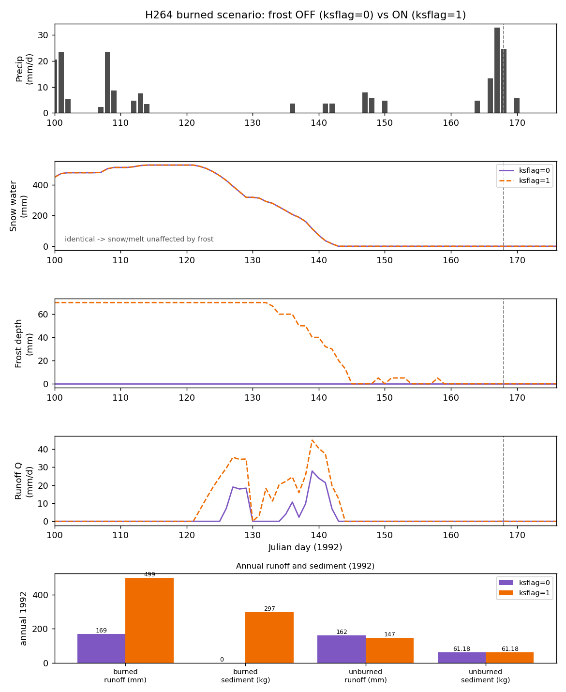
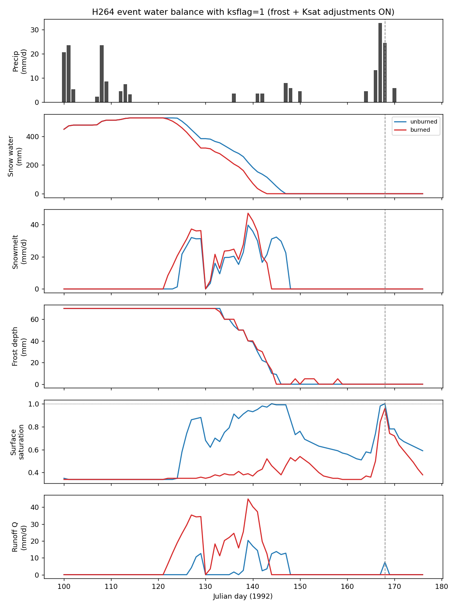

# Frost-Routine (`ksflag=1`) Sensitivity for H264

**Status: ARCHIVAL / SUPERSEDED FOR CURRENT HONEYED-MARATHONER RERUNS
(`2026-06-23`).** This sensitivity was run against the preserved
stale-parameter fixture. With corrected disturbed parameters, current H264
already has burned `ksflag=0` sediment greater than undisturbed sediment
(`297.7 kg/yr` versus `61.2 kg/yr`), so the old headline result that frost
"reverses" the inversion no longer applies to current outputs. The WEPP
`ksflag` mechanics below remain useful background.

Follow-on to `README.md` (the honeyed-marathoner OMNI sediment inversion). This
document asks how enabling WEPP's frost routine changes snowpack/melt and
runoff/erosion for hillslope `264`. It did not change the original
`2026-06-12` conclusion; after the `2026-06-23` corrected-parameter rerun, the
main report is superseded for current behavior and this note is archival.

**Evidence class:** executional. H264 was re-run on the dev container (not
`wepp1`) with `wepp_dcc52a6_hill` on a scratch copy of the committed fixture;
no production or fixture files were modified.

## What `ksflag` actually controls

`ksflag` is the second field on the line after `Any comments:` in the WEPP
`.sol` file. The WEPPcloud soil-builder sets it to `0` for these soils. It is
**not** a pure frost switch — `ksflag=1` enables three things together:

- the frost routine `frostN` (`winter.for`, gated by `if (ksflag.eq.1)`);
- WEPP's internal Ksat adjustments for crusting and canopy/cover effectiveness
  (`infpar.for`);
- the Kidwell recomputation of top-layer saturated conductivity (`soil.for`).

So the comparison below is `ksflag=1` (frost **and** Ksat adjustments) versus
`ksflag=0` (neither). Isolating frost alone would require decoupling the flag in
the FORTRAN and rebuilding; that was not done. The observed runoff change is
nonetheless clearly frost-driven (it tracks frozen-soil days during the melt
freshet, see below), with Ksat adjustments a secondary contributor.

Setting `ksflag=1` takes effect for these hillslopes because WEPPcloud models
forest as cropland (`lanuse=1`); WEPP only forces `ksflag=0` when
`lanuse != 1` (`infile.for`).

## Headline result

Historical fixture result: with frost enabled, the burned hillslope erodes far
more, and the original stale-parameter inversion reverses to the physically
expected direction.

| Quantity (H264, 1992) | Burned `ksflag=0` | Burned `ksflag=1` | Unburned `ksflag=0` | Unburned `ksflag=1` |
| --- | ---: | ---: | ---: | ---: |
| Annual runoff (mm) | 169 | **499** | 162 | 147 |
| Annual sediment leaving profile (kg) | **0.0** | **297.0** | 61.18 | 61.18 |
| Max frost depth (mm) | 0 | 70 | 0 | 70 |
| Snow-free day (Julian) | J143 | J143 | J147 | J147 |

Burned base sediment goes from exactly `0` to `297 kg`, overtaking the unburned
`61 kg`. The `ksflag=0` inversion documented in the main report is therefore
contingent on frost being disabled.

## Mechanism

- **Snowpack and melt are unaffected by frost.** Snow water equivalent and the
  melt-out day are identical between `ksflag=0` and `ksflag=1` (the two SWE
  traces overlie exactly). Frost acts on the soil, not the snow energy balance.
- **Frost shuts down infiltration during the melt freshet.** With `ksflag=1`
  the soil carries ~`70 mm` of frost through winter and early spring (frozen on
  177 days of 1992), and effective conductivity collapses toward zero on frozen
  days. Snowmelt that infiltrated under `ksflag=0` instead runs off: burned
  daily melt-season runoff roughly doubles to quadruples, and annual burned
  runoff nearly triples (`169 -> 499 mm`).
- **The extra melt runoff erodes the burned surface.** The burned scenario has
  low cover and high rill erodibility (`Kr`), so the frozen-soil melt runoff
  detaches sediment across the spring melt season — which becomes the dominant
  sediment source, not the single `1992-06-16` storm that drove the `ksflag=0`
  trace inversion.
- **The unburned scenario barely changes** (runoff `162 -> 147 mm`, sediment
  `61.18 kg` essentially unchanged). It freezes to the same depth, but its dense
  canopy/cover and low erodibility leave runoff and detachment little affected.



*Figure F1. Burned H264, `ksflag=0` vs `ksflag=1`. Snow is unchanged; frost
drives the spring runoff surge and the jump in annual runoff and sediment.*



*Figure F2. `ksflag=1` event water balance, burned vs unburned (compare with
Figure 1 in the main report, which is `ksflag=0`).*

## Interpretation

This interpretation applies to the preserved stale-parameter fixture, not to
the corrected `2026-06-23` honeyed-marathoner rerun.

Enabling frost gives the physically expected ordering (burned erodes more than
unburned) and removes the inversion. The production default `ksflag=0` disables
frost (and the internal Ksat adjustments) for these forest-as-cropland soils,
which is why the burned hillslope produced zero sediment and the trace inversion
appeared.

This does not establish a code defect — `ksflag=0` is the configured WEPPcloud
default, and the WEPP code intentionally gates the frost routine behind this
flag (the source comment restricts it to agricultural crops). It does sharpen
the one open modeling-calibration question carried in the main report's
Conclusion: whether frost (and the bundled Ksat adjustments) should be enabled
for high-elevation forest soils where a deep seasonal frozen layer would
realistically force snowmelt runoff. That is a configuration decision for the
modeling team, not a change required by this investigation.

Under the corrected disturbed parameters, enabling frost is not needed to remove
the H264 annual sediment inversion because the current `ksflag=0` burned run
already exceeds undisturbed sediment. This sensitivity was not re-run under the
corrected parameters.

## Reproduction

```
# on a scratch copy of the fixture run_root, for H264 both scenarios:
#   1. enable daily-winter output in p264.run (line 23: No -> Yes + ../output/H264.snow.dat)
#   2. set ksflag on the line after "Any comments:" in p264.sol: 1 0  ->  1 1
#   3. run:  wepp_dcc52a6_hill < p264.run
# Never run inside the fixture; it would overwrite the preserved ksflag=0 outputs.
```

## Artifacts

- `artifacts/event_water_balance_H264_ksflag1.csv` — `ksflag=1` daily series
  (burned and unburned: SWE, melt, frost depth, surface saturation, runoff).
- `artifacts/frost_comparison_H264_burned.csv` — burned scenario, `ksflag=0`
  vs `ksflag=1` daily series.
- `artifacts/frost_ksflag_analysis.py` — regenerates Figures F1 and F2 from the
  two CSVs.
- `artifacts/frost_runoff_comparison_H264.png` (Figure F1),
  `artifacts/event_water_balance_H264_ksflag1.png` (Figure F2).
