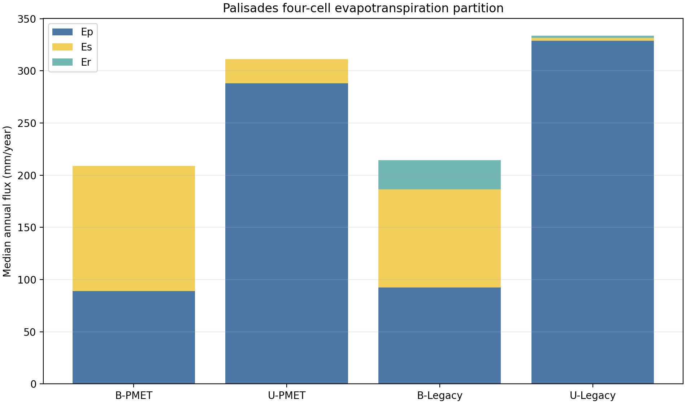

# Palisades four-cell annual ET partition

## Caption

Median annual `Ep`, `Es`, and `Er` for all 278 production-derived hillslopes, area-weighted to the watershed. PMET and legacy cells differ only by the presence of `pmetpara.txt` within each land state.

## Interpretation

Use the change from legacy to PMET within burned and undisturbed bars to identify ET-method effects. A materially larger burned change is the factorial interaction that could amplify the burned-versus-undisturbed contrast. Total ET and partition must be interpreted together; redistribution from `Ep` to `Es` is not an increase in atmospheric water loss unless total ET also rises.

## Provenance

Generated by `artifacts/four-cell-et/run_four_cell_et.py` from `/wc1/runs/up/upset-reckoning` using `wepp_260803_hill`.
