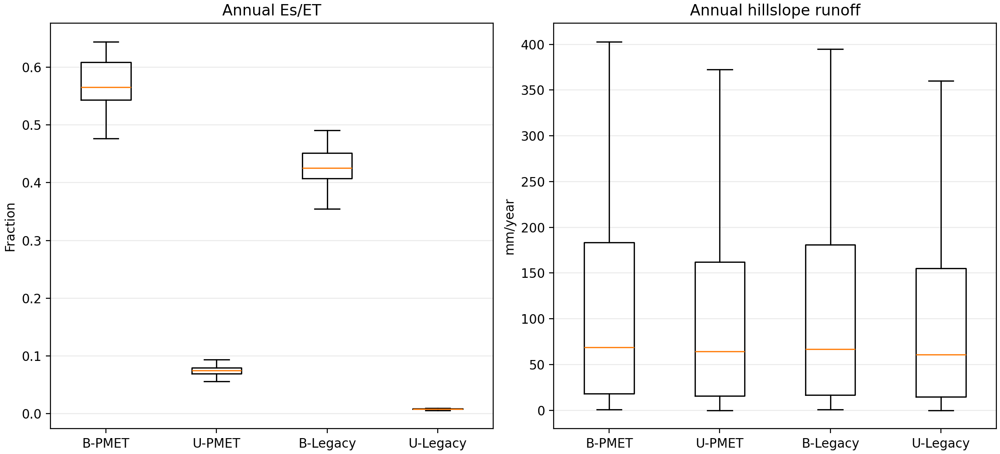

# Palisades four-cell Es fraction and runoff

## Caption

Annual distributions of soil evaporation as a fraction of total ET and daily hillslope runoff accumulated by year. Boxes cover the 46 climate years.

## Interpretation

The left panel shows whether PMET substantially reallocates ET toward soil evaporation. The right panel tests the hydrologically consequential link: whether that reallocation changes runoff generation differently in burned and undisturbed states. This figure does not measure channel routing or sub-daily peak shape.

## Provenance

Values are in `artifacts/four-cell-et/four-cell-annual.csv`.
