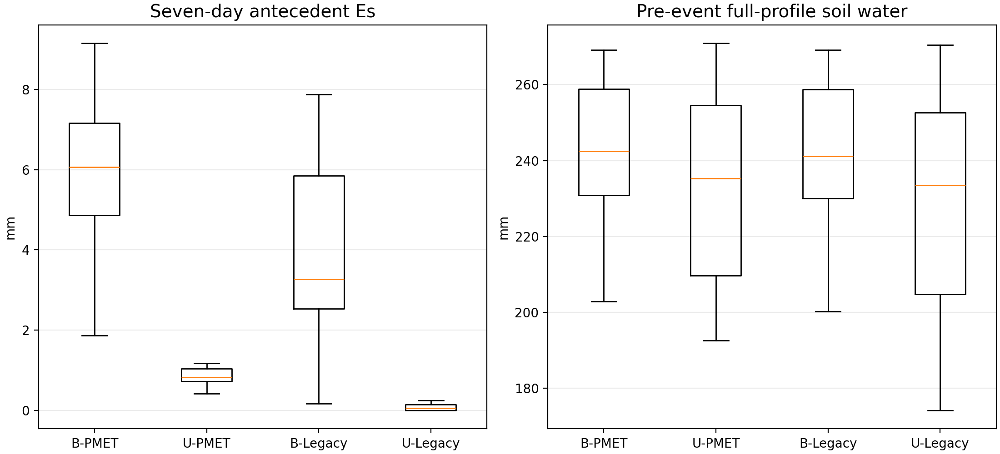

# Palisades four-cell flagged-event antecedent state

## Caption

Seven-day antecedent soil evaporation and full-profile soil water on the day before each of the 22 previously flagged outlet inversion events.

## Interpretation

A PMET mechanism capable of suppressing burned event runoff through excessive soil evaporation should produce both a larger burned `Es` increment and lower burned pre-event storage. If PMET changes `Es` without producing that storage response, its partition is diagnostically questionable but is not carrying the inversion through antecedent drying.

## Limitations

The event dates come from routed watershed results, while these four cells are hillslope-only replays. They diagnose antecedent/runoff-generation sensitivity, not channel synchronization.
