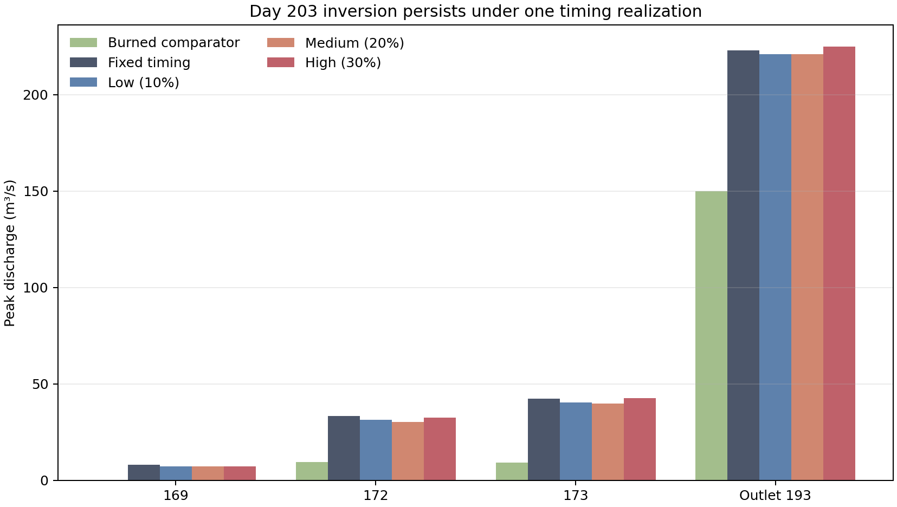

# Figure 1: Day-203 Peak Sensitivity

## Caption

Peak discharge on simulation year 34, Julian day 203 for the burned comparator,
the unmodified undisturbed routing result, and one deterministic low, medium,
and high hillslope-timing realization. Timing dispersion changes the
undisturbed peak but does not eliminate its inversion relative to burned.

## Extended Interpretation

The medium lane gives the largest attenuation at reaches 172 and 173: peaks
fall from `33.4` to `30.4 m3/s` and from `42.5` to `39.9 m3/s`. Reach 169 falls
from `8.26` to `7.38 m3/s`. These remain well above the corresponding burned
peaks of `9.60`, `9.32`, and effectively zero at reach 169. At outlet 193 the
medium result is `221 m3/s`, compared with `223 m3/s` undisturbed baseline and
`150 m3/s` burned.

The high lane is not monotonically lower: reach 173 rises to `42.7 m3/s` and
the outlet to `225 m3/s`. Stronger timing variation created a different
alignment rather than simply spreading all inflow. This is direct evidence
that synchronization can both attenuate and amplify a routed peak.

## Method and Limitations

H49-H61 received a fixed, zero-mean spatial pattern of duration multipliers.
Low, medium, and high amplitudes were 10%, 20%, and 30%. Peak input was divided
by the same multiplier, preserving `peak × duration`, runoff volume, and the
`chrqin` branch ratio. This figure represents one spatial realization at each
amplitude, not a Monte Carlo uncertainty interval.

Source table: [`day203_peaks.csv`](../artifacts/synchronization-results/day203_peaks.csv).
