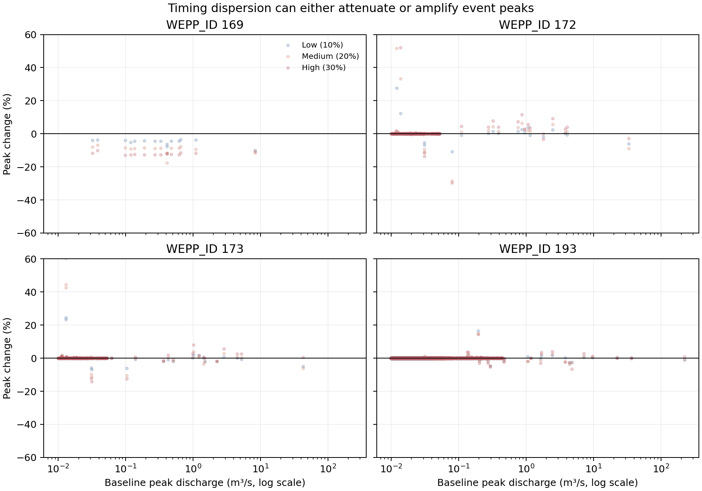

# Figure 2: Full-Record Peak Response

## Caption

Percent change from unmodified undisturbed peak discharge over the complete
100-year record for events with baseline peak at least `0.01 m3/s`. The x-axis
is logarithmic. Points are one deterministic spatial timing pattern evaluated
at three amplitudes.

## Extended Interpretation

Most plotted events are unchanged at the precision of `chan.out`, especially
downstream. Sensitivity is concentrated in a small event subset. Reach 169 has
15 qualifying events and consistently attenuates in this realization, with
median changes of approximately -4.4%, -8.8%, and -12.4% from low through high
amplitude. Reaches 172 and 173 contain both attenuation and amplification,
including isolated changes exceeding 40%. The outlet response is usually near
zero but is nonzero for selected events.

This distribution supports event-specific synchronization sensitivity rather
than a persistent direction of bias. Increasing timing variation is not
equivalent to monotonically reducing peak flow.

## Method and Limitations

All lanes completed the configured 100 years. The raw channel output reports
three significant digits, so small differences appear as exact zero. Percent
changes are clipped to ±60% in the plot for readability; the source table is
not clipped. Only one spatial realization was run, so the plot describes
sensitivity, not probability.

Source summary: [`full_record_summary.csv`](../artifacts/synchronization-results/full_record_summary.csv).
Compressed source data: [`channel_peaks_selected.csv.gz`](../artifacts/synchronization-results/channel_peaks_selected.csv.gz).
