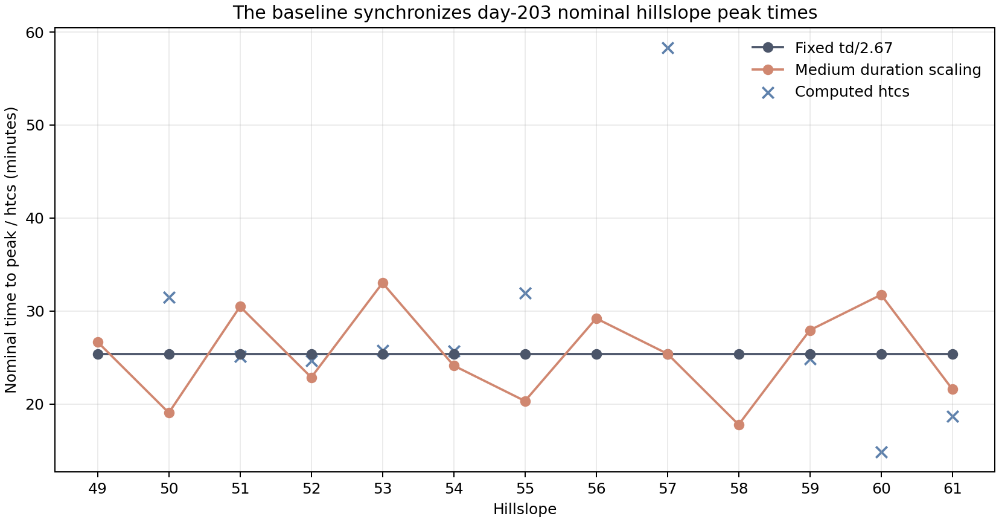

# Figure 3: Day-203 Hillslope Timing Inputs

## Caption

Nominal day-203 hillslope peak timing under the active fixed `td / 2.67`
relationship, the medium duration-scaling lane, and the dormant computed
`htcs` values. Missing `htcs` markers identify hillslopes without a surface
runoff event in the local day-203 pass record.

## Extended Interpretation

All surface-event hillslopes share a 4,068-second storm duration, placing the
active nominal peak at about 25.4 minutes. This is the synchronization imposed
by the current `chrqin` formulation. The medium lane spreads nominal times from
approximately 18 to 33 minutes while preserving event volume.

Computed `htcs` is similar to the fixed value for the three nonrectangular,
material contributors H52, H53, and H59. H57 has a much longer computed value,
but its day-203 hydrograph takes the rectangular branch, which does not consult
peak time. This explains why a direct `htcs` substitution alone is expected to
have limited effect unless rectangular-hydrograph treatment is also examined.

## Method and Limitations

The orange timing values describe the imposed input transformation, not routed
channel peak times. Computed `htcs` was plotted from unmodified pass records.
The attempted source-level `htcs` lane was rejected because the rebuilt
current source expects binary pass shards while this production fixture uses
legacy text shards; no result from that failed lane is presented.

Reproduction script: [`plot_synchronization_results.py`](../artifacts/plot_synchronization_results.py).
