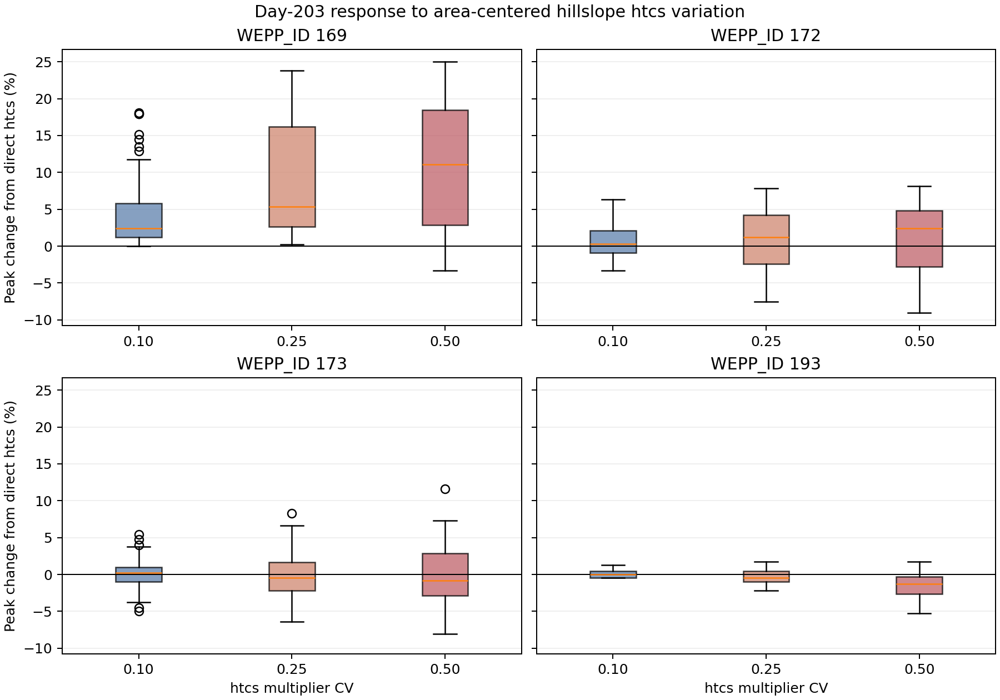

# Figure 4: Day-203 Contributor-Indexed `htcs` Ensemble

## Caption

Peak changes for 100 deterministic realizations at each spatial coefficient of
variation (CV 0.10, 0.25, and 0.50), relative to the compact direct-`htcs`
comparator. Multipliers were fixed by hillslope and normalized to an
area-weighted mean of one. The dashed line marks no change.

## Extended Interpretation

The inversion is not fragile to spatial differences in lateral-flow time of
concentration. Reach 169 is most sensitive: its median change grows from
`+2.43%` at CV 0.10 to `+11.04%` at CV 0.50. Reaches 172 and 173 have smaller,
mixed changes, while the outlet median stays between `0%` and `-1.31%`.
Timing variation can reshape upstream peaks but does not explain the reversal.

All 300 accepted realizations completed. Day-203 inflow and outflow at reaches
169, 172, 173, and 193 are invariant to output precision, confirming a timing
rather than daily-volume experiment.

## Method and Limitations

The fixture contains source year 34 relabeled as year 1. It preserves all
records and continuations for 138 hillslopes but lacks 33 preceding years of
channel state. This is paired routing sensitivity, not an absolute production
replay. CV 0.50 occasionally reached the upper time bound on one or two
hillslopes; no lower-bound clamps occurred. The multipliers are a sensitivity
distribution, not a calibrated landscape distribution.

## Source Data

- [`day203_ensemble.csv.gz`](../artifacts/htcs-results/day203_ensemble.csv.gz)
- [`day203_ensemble_summary.csv`](../artifacts/htcs-results/day203_ensemble_summary.csv)
- [`run_htcs_ensemble.py`](../artifacts/run_htcs_ensemble.py)
