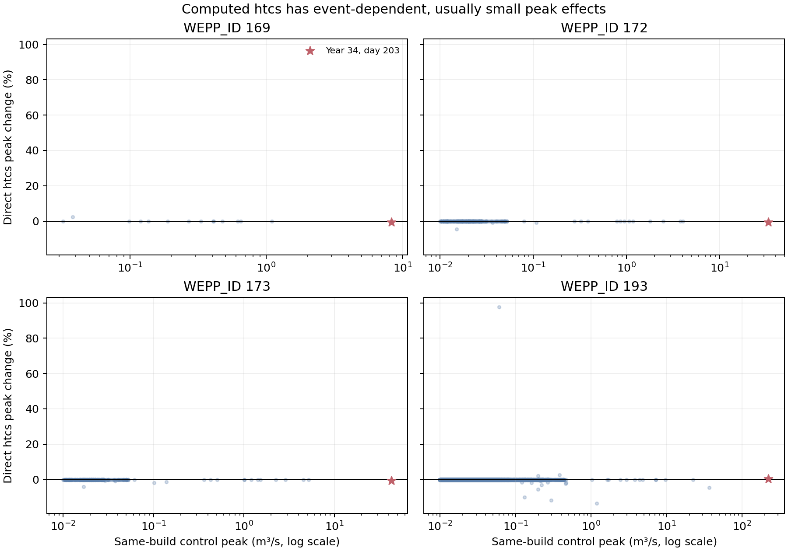

# Figure 5: Full-Record Response to Contributor-Indexed `htcs`

## Caption

Paired peak changes from direct contributor-indexed `htcs` relative to its
same-build legacy-routing control over 100 years. The focal year-34/day-203
event is starred. Only control peaks of at least `0.01 m3/s` are shown.

## Extended Interpretation

The response is sparse. Median change is zero at all four reaches. Qualifying
peaks change on 13.4% of events at reach 169, 2.1% at 172, 2.1% at 173, and
0.14% at the outlet. The focal event changes by approximately `-0.48%`,
`-0.60%`, `-0.71%`, and `+0.45%`, respectively. Computed lateral-flow time of
concentration therefore does not remove the inversion.

## Method and Limitations

The lanes use the same isolated build and differ only in lateral-inflow peak
time. This pair is the causal comparison. The control exactly reproduces the
archived production focal peaks, but not the complete archived record: the
available baseline objects did not reproducibly represent its legacy reader,
so the current routing source was rebuilt with the restored text reader.
Full-record inference is confined to this same-build pair. Rectangular inflow
records do not use `htcs` and are unchanged.

## Source Data

- [`full_record_selected_reaches.csv.gz`](../artifacts/htcs-results/full_record_selected_reaches.csv.gz)
- [`full_record_summary.csv`](../artifacts/htcs-results/full_record_summary.csv)
- [`plot_htcs_ensemble_results.py`](../artifacts/plot_htcs_ensemble_results.py)
