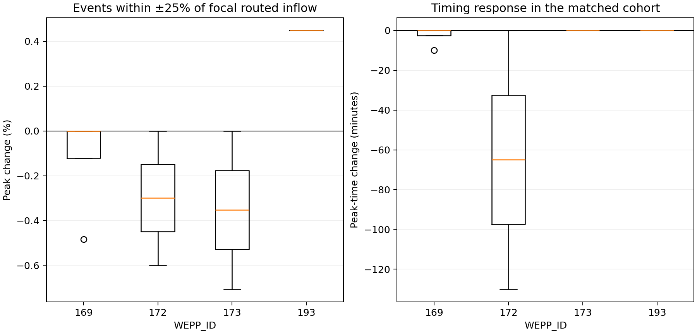

# Figure 6: `htcs` Response for Magnitude-Matched Events

## Caption

Peak and timing changes for events whose control routed inflow volume is
within 25% of the focal event. Changes compare direct contributor-indexed
`htcs` with the same-build control.

## Extended Interpretation

There is no evidence of a repeatable magnitude-conditioned response. Only four
events qualify at reach 169, two each at 172 and 173, and the focal event alone
at the outlet. Responses are mostly zero or modestly negative. The sample is
too small to establish a trend. No other event is within 25% of the focal peak
discharge at any selected reach, confirming that this storm is unusual in the
100-year realization.

## Method and Limitations

Matching uses daily channel inflow volume, not precipitation, antecedent state,
or storm duration. A larger climate ensemble is needed for events similar in
both runoff magnitude and storm structure. Timing can appear large when a
broad or multi-peaked hydrograph changes which local maximum is reported.

## Source Data

- [`full_record_selected_reaches.csv.gz`](../artifacts/htcs-results/full_record_selected_reaches.csv.gz)
- [`full_record_summary.csv`](../artifacts/htcs-results/full_record_summary.csv)
