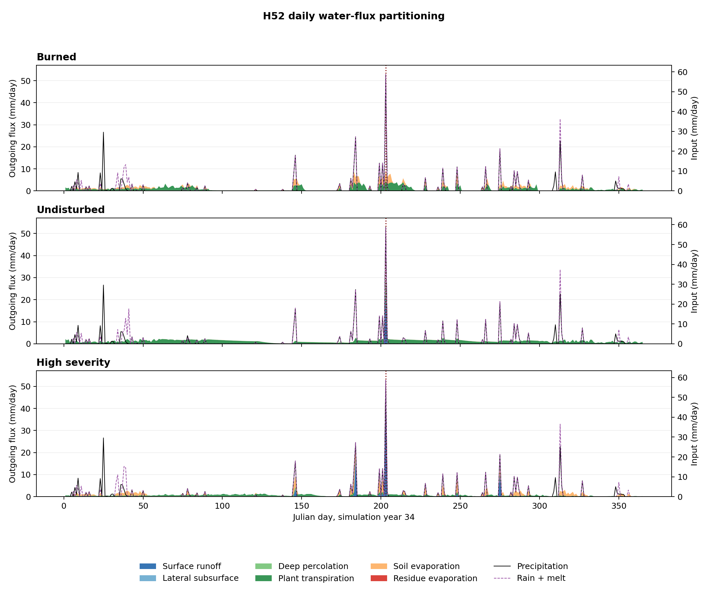

# H52: Simulation-Year-34 Water Fluxes

## Caption

Daily outgoing water fluxes for burned, undisturbed, and canonical high-severity
H52. Areas are
stacked in millimeters over the hillslope. Input lines show precipitation and
rainfall plus irrigation plus snowmelt. All three panels use the same axes; the
vertical line marks Julian day 203.

## Flux Totals

Values below are millimeters and use `Q`, `latqcc`, `Dp`, `Ep`, `Es`, and `Er`
for surface runoff, lateral subsurface flow, deep percolation, plant
transpiration, soil evaporation, and residue evaporation.

- Day 203 burned: Q=0.34, latqcc=0.06, Dp=0.00, Ep=4.31, Es=4.61, Er=0.00.
- Day 203 undisturbed: Q=23.55, latqcc=0.55, Dp=0.00, Ep=5.37, Es=0.05, Er=0.00.
- Day 203 high severity: Q=44.42, latqcc=0.00, Dp=0.00, Ep=1.21, Es=7.20, Er=0.00.
- Days 196-202 burned: Q=0.00, latqcc=0.00, Dp=0.00, Ep=11.40, Es=10.01, Er=0.00.
- Days 196-202 undisturbed: Q=0.00, latqcc=0.00, Dp=0.00, Ep=11.77, Es=0.29, Er=0.00.
- Days 196-202 high severity: Q=2.47, latqcc=0.00, Dp=0.00, Ep=5.05, Es=12.90, Er=0.00.
- Days 173-202 burned: Q=0.00, latqcc=0.00, Dp=0.00, Ep=43.86, Es=33.53, Er=0.00.
- Days 173-202 undisturbed: Q=0.00, latqcc=0.00, Dp=0.00, Ep=37.24, Es=1.32, Er=0.00.
- Days 173-202 high severity: Q=20.23, latqcc=0.00, Dp=0.00, Ep=21.46, Es=32.50, Er=0.00.
- Year 34 burned: Q=0.34, latqcc=1.28, Dp=35.02, Ep=296.39, Es=158.48, Er=0.00.
- Year 34 undisturbed: Q=23.55, latqcc=0.55, Dp=0.00, Ep=450.97, Es=7.70, Er=0.00.
- Year 34 high severity: Q=79.37, latqcc=2.10, Dp=40.41, Ep=161.42, Es=171.27, Er=0.00.

## Interpretation and Limitations

The largest undisturbed-minus-burned differences on day 203 are Q=+23.21 mm, Es=-4.56 mm, Ep=+1.06 mm.
The largest year-34 differences are Ep=+154.58 mm, Es=-150.78 mm, Dp=-35.02 mm. Positive values indicate a
larger undisturbed flux. These rankings identify the dominant accounting
contrasts for H52; they do not establish that the largest annual component
controls the event peak.

The common scale supports direct visual comparison. The stack describes daily
water partitioning but does not by itself prove causation or determine channel
peak synchronization. `RM` can lag `P` where snow stores and later releases
water. Fluxes are daily totals, so subdaily peak timing is not represented.

## Source Data

- `/wc1/ablation/stevens-canyon-peak-flow-20260803-hillslopes/burned/wepp/output/H52.wat.dat`
- `/wc1/ablation/stevens-canyon-peak-flow-20260803-hillslopes/undisturbed/wepp/output/H52.wat.dat`
- `/wc1/ablation/stevens-canyon-peak-flow-20260803-hillslopes/high_severity/wepp/output/H52.wat.dat`
