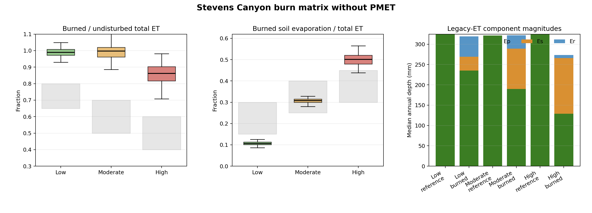

# Legacy-ET Burn Matrix

## Caption

Paired 100-year annual distributions after removing `pmetpara.txt` from both
burned and undisturbed hillslope lanes. Gray rectangles in the first two panels
are the severity-specific diagnostic target envelopes. The right panel shows
median absolute annual `Ep`, `Es`, and `Er`; each severity's undisturbed
reference uses the same area-weighted hillslope set as its burned treatment.

## Results

- Low: median ET ratio `0.990` (target `0.65-0.80`); median `Es/ET=0.106` (target `0.15-0.30`).
- Moderate: median ET ratio `0.997` (target `0.50-0.70`); median `Es/ET=0.308` (target `0.25-0.40`).
- High: median ET ratio `0.862` (target `0.40-0.60`); median `Es/ET=0.501` (target `0.30-0.45`).

No severity has a year inside both target envelopes. The legacy routine assigns
the undisturbed forest median `324 mm/year` entirely to `Ep`, with zero `Es`
and `Er`. Low- and moderate-severity ET remains effectively equal to the
undisturbed reference. High-severity ET declines, but not nearly enough, and
its soil-evaporation fraction remains above target.

## Extended Interpretation

Removing PMET changes the bookkeeping substantially but does not reproduce the
expected fire-severity response. In legacy WEPP, dense undisturbed forest
reaches the LAI rule's all-plant-side limit, while fire-reduced canopy and
residue transfer demand into `Es` and `Er`. Because potential ET is still
largely consumed, the low- and moderate-severity total-ET ratios remain near
one. This is evidence that selecting the legacy routine is not a defensible
post-fire correction by itself. It also shows the excessive post-fire ET
response is not unique to PMET: both routines encode canopy loss mainly as a
partition change, with too little reduction in total annual ET.

The target bands are diagnostic calibration goals, not site observations.
These results are hillslope-scale, area-weighted simulations; runoff was not
used in scoring and no watershed routing was run.

## Reproducibility

- [`legacy-et-ablation-summary.csv`](../../artifacts/legacy-et-ablation-summary.csv)
- [`legacy-et-ablation-annual.csv.gz`](../../artifacts/legacy-et-ablation-annual.csv.gz)
- [`run_legacy_et_ablation.py`](../../artifacts/run_legacy_et_ablation.py)
- [`plot_legacy_et_ablation.py`](../../artifacts/plot_legacy_et_ablation.py)
