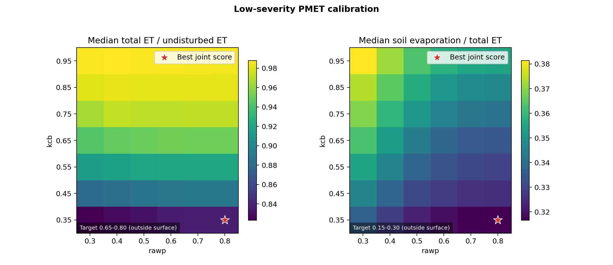

# Low-Severity PMET Calibration

## Caption

Median annual total-ET ratio and soil-evaporation fraction across 100 paired
climate years for the `kcb` and `rawp` grid. White contours mark the target
envelope boundaries. The red star is the minimum joint-distance candidate.

## Best Candidate

- `kcb=0.35`, `rawp=0.80`
- median ET ratio: `0.837`; target
  `0.65-0.80`
- median `Es/ET`: `0.317`; target
  `0.15-0.30`
- median annual `Ep=181.1 mm`,
  `Es=84.9 mm`, and
  `ET=267.7 mm`
- paired years inside both envelopes: `4%`

## Interpretation

16 of 42 candidates produced at least one paired year inside both envelopes. The surfaces test PMET coefficient sufficiency, not production
defaults. `kcb` and `rawp` remain physically provisional until independently
validated against observed post-fire ET components. Runoff was not included in
the score.

## Source Data

- [`pmet-calibration-summary.csv`](../../artifacts/pmet-calibration-summary.csv)
- [`pmet-calibration-annual.csv.gz`](../../artifacts/pmet-calibration-annual.csv.gz)
