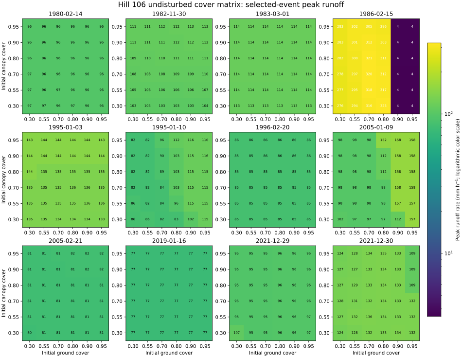

# Topanga 2025 Fire Peak-Flow Investigation

**Status: OPEN (`2026-08-07`).** This investigation reviews W. Elliot's July
2026 Topanga watershed analysis, reproduces its results, and expands the
analysis of burned-versus-undisturbed runoff and peak-flow behavior following
the January 2025 Palisades Fire.

## Starting Point

The supplied report compares these 43-year GridMET WEPPcloud runs:

- undisturbed original: `perceivable-fishnet`;
- burned original: `beatable-facial`;
- undisturbed working copy: `positional-mink`;
- burned working copy: `hand-to-mouth-drought`.

The report confirms an unexpected result: the undisturbed scenario has larger
2-, 5-, and 10-year peak-discharge estimates, while the burned scenario has
larger 20- and 25-year estimates. It explores antecedent rainfall, soil water,
lateral flow, storm intensity, anisotropy, hillslope-versus-watershed behavior,
and differences between WEPPcloud and WEPP Windows. These findings are the
investigation's starting hypotheses, not yet independently reproduced here.

## Investigation Questions

1. Can every reported return-period value and event date be reproduced from
   the archived WEPPcloud inputs and raw outputs?
2. Are the burned and undisturbed runs equivalent outside their intended
   management and soil parameterization differences?
3. What explains the peak-flow inversion: event ranking, antecedent state,
   lateral flow, spatially varying climate, hillslope timing, channel routing,
   or an interaction among them?
4. Why do the report's WEPPcloud and WEPP Windows hillslope water balances
   differ, and are the compared configurations truly equivalent?
5. How do modeled runoff volumes and peaks compare with appropriate observed
   Topanga-area streamflow records and alternative hydrologic estimates?

## Source Material

- [`artifacts/260806_Elliot_Topanga_Watershed_Peak_Flow_Analyses.pdf`](artifacts/260806_Elliot_Topanga_Watershed_Peak_Flow_Analyses.pdf)
  — W. Elliot, *Topanga Watershed Analyses: Before and After the Palisades
  Fire*, July 2026; supplied `2026-08-06`; 18 pages; SHA-256
  `871f823a8417a2f991db860e90c17f09329a6e0415e8fd485b33366dcbb88aee`.

The PDF is vendored unchanged and is tracked through the repository's global
Git LFS rule for `*.pdf` files.

- [`fixtures/hill-106/`](fixtures/hill-106/) — unchanged Hill 106 WEPPcloud
  inputs, hydrology sidecars, run logs, and generated outputs for both working
  copies, retrieved read-only from `wepp1` on `2026-08-07`.
- [`artifacts/windows-sidecar-ballpark.md`](artifacts/windows-sidecar-ballpark.md)
  — isolated Windows WEPP reconstruction showing that Elliot's unburned
  results match the lane with neither `wepp_ui.txt` nor `pmetpara.txt`; its ET
  interpretation is cross-referenced against the
  [Stevens Canyon legacy-ET ablation](../2026-08-03-stevens-canyon-peak-flow-inversion/artifacts/legacy-et-ablation-results.md).
- [`artifacts/bill-windows-replication-handoff.md`](artifacts/bill-windows-replication-handoff.md)
  — self-contained handoff for Elliot describing the Windows replication and
  the influence of the hourly seepage and Penman-Monteith sidecars.
- [`fixtures/hill-106/windows-reconstruction/burned-man-ballpark/`](fixtures/hill-106/windows-reconstruction/burned-man-ballpark/)
  — factorial management screen and a 40-year LAI `2.25` lane that closely
  reproduces Elliot's burned runoff, ET, lateral flow, and daily lateral-flow
  maximum.
- [`artifacts/kslast-anisotropy-calibration-study.md`](artifacts/kslast-anisotropy-calibration-study.md)
  — calendar-year 2020 soil calibration screens: 60 `kslast` × anisotropy
  cases, 42 horizon-Ksat × anisotropy cases, and 48 fixed-Ksat anisotropy ×
  PMET-Kcb cases. The closest reasonable candidate produces `9.35 mm` total
  runoff, still above the provisional `6.2 mm` target.
- [`artifacts/wepp-peak-flow-solver-documentation-and-topanga-evidence.md`](artifacts/wepp-peak-flow-solver-documentation-and-topanga-evidence.md)
  reconciles the official NSERL peak-flow method, the pinned WEPP-Forest
  implementation, and the controlled Topanga discontinuity evidence for
  stakeholder review.

## Current Findings

- Elliot's `288 mm` WEPPcloud value is not calendar-year 2020 surface runoff.
  It is the long-term mean unburned Hill 106 surface runoff plus lateral flow:
  `121 + 167 mm/year`. His corresponding `242 mm` Windows value is likewise
  the long-term mean `220 + 22 mm/year`.
- The archived WEPPcloud Hill 106 result for calendar year 2020 is `9.74 mm`
  surface runoff plus `105.92 mm` lateral flow, or `115.66 mm` combined.
- The observed `6.2 mm` value is independently reproduced from the Los Angeles
  County Topanga Creek F54C-R calendar-year 2020 volume of `234 acre-feet`
  divided by its `18.0 square mile` drainage area. It is measured channel
  discharge and therefore is not a surface-runoff-only observation.
- The observed and modeled values remain provisional as a calibration pair:
  Topanga Creek is a nearby but different drainage area, and gauged discharge
  combines every source and loss operating upstream of the gauge.
- The Windows reconstruction closely reproduces Elliot's Hill 106 results
  without `wepp_ui.txt` or `pmetpara.txt`. The hourly seepage sidecar strongly
  increases modeled lateral flow, while PMET changes ET and the remaining
  water partition.
- Restrictive-layer conductivity is the dominant calibration control. Raising
  `kslast` from the WEPPcloud value of `0.00011` to `0.6 mm/h` reduces 2020
  combined Hill 106 runoff from `115.66` to `12.16 mm` with the original
  anisotropy, Ksat, and Kcb: a `9.5×` reduction. Disabling the restrictive layer
  entirely gives the same `12.16 mm`, proving that `0.6 mm/h` has reached the
  no-restrictive-layer response plateau.
- The audited historical automatic rules have much less leverage. For the Hill
  106 restrictive-horizon Ksat of `0.108 mm/h`, setting `kslast` to `0.001×`,
  `0.01×`, `0.1×`, and `1.0×` that value produces `115.66`, `114.16`, `101.34`,
  and `39.18 mm` of 2020 combined runoff, respectively. The calibrated
  `0.6 mm/h` value is about `5.56×` the restrictive-horizon Ksat and lies
  outside those historical generation rules.
- Horizon Ksat and reasonable anisotropy and PMET-Kcb tuning provide secondary
  adjustments but do not close the remaining difference. With original Ksat,
  the closest screened case is `kslast = 0.6 mm/h`, anisotropy `1`, and
  `Kcb = 1.20`, producing `9.35 mm` runoff and `295.23 mm` ET. Relative to
  `Kcb = 0.95` and anisotropy `10` at the same Ksat and `kslast`, ET increases
  by `17.42 mm` while runoff falls by only `2.81 mm`; most additional ET
  displaces deep percolation rather than runoff.

## Full-Watershed No-Restriction Test

We reran all 140 hillslopes and watershed routing with the restrictive layer
disabled everywhere and PMET `Kcb = 1.20`. Original horizon Ksat, anisotropy,
climate, management, routing, and other sidecars were retained. Both runs
received `337.38 mm` of area-weighted precipitation in calendar year 2020.

| 2020 component | Original WEPPcloud | No restrictive layer, `Kcb = 1.20` | Change |
| --- | ---: | ---: | ---: |
| Precipitation | 337.38 mm | 337.38 mm | — |
| Surface runoff | 11.48 mm | 5.74 mm | -5.75 mm |
| Lateral flow | 114.12 mm | 11.97 mm | -102.15 mm |
| Deep percolation | 0.43 mm | 82.98 mm | +82.56 mm |
| Groundwater baseflow | 0.44 mm | 133.84 mm | +133.40 mm |
| ET | 265.77 mm | 262.76 mm | -3.02 mm |
| Component-sum streamflow | 126.04 mm | 151.55 mm | +25.51 mm |
| Routed outlet flow | 125.61 mm | 149.68 mm | +24.07 mm |

The restrictive layer therefore controls the modeled flow path more strongly
than the total discharge. In the original run, nearly all subsurface discharge
is lateral flow. Without the layer, lateral flow collapses, but deep drainage
enters WEPP's groundwater reservoir and returns as baseflow. Raising Kcb to
`1.20` changes 2020 ET by only about `3 mm`, so it does not offset that return.
The no-restriction run consequently produces about `24 mm` more routed outlet
flow than the original run, despite its much lower lateral flow.

The preserved original watershed artifacts support approximately `126 mm` of
combined 2020 streamflow, not the report's quoted `288 mm`. The `288 mm` value
is the report's long-term mean Hill 106 surface-plus-lateral result and should
not be used as the calendar-year 2020 routed-watershed baseline.

### Corrected Burned-Versus-Undisturbed Omni Comparison

We then compared the burned watershed with an undisturbed Omni scenario using
the same climate and full watershed routing. Both scenarios used the original
horizon Ksat and anisotropy, PMET, and a truly disabled restrictive layer: all
140 prepared hillslope soil files end in `0 0.0 0.0`. The PMET sidecar assigns
`Kcb = 1.20` to 133 natural hillslopes while retaining `Kcb = 0.95` for the
seven developed-moderate-intensity hillslopes. Both scenarios received
`337.38 mm` of area-weighted precipitation in calendar year 2020.

| 2020 component | Burned | Undisturbed Omni | Burned minus undisturbed |
| --- | ---: | ---: | ---: |
| Precipitation | 337.38 mm | 337.38 mm | 0.00 mm |
| Surface runoff | 10.47 mm | 5.86 mm | +4.61 mm |
| Lateral flow | 19.00 mm | 11.97 mm | +7.03 mm |
| Surface runoff plus lateral flow | 29.47 mm | 17.84 mm | +11.64 mm |
| Deep percolation | 158.47 mm | 83.62 mm | +74.85 mm |
| Groundwater baseflow | 217.90 mm | 134.60 mm | +83.30 mm |
| ET | 141.58 mm | 261.96 mm | -120.38 mm |
| Component-sum streamflow | 247.37 mm | 152.44 mm | +94.93 mm |
| Routed outlet flow | 245.28 mm | 150.57 mm | +94.71 mm |

Removing the restrictive layer does not eliminate the burned-versus-unburned
contrast. The burned watershed has about `120 mm` less ET and `95 mm` more
routed outlet flow in 2020. Surface runoff plus lateral flow accounts for only
about `12 mm` of that outlet difference; most of the remaining difference is
expressed through greater percolation and groundwater return as baseflow.
Accordingly, neither surface runoff alone nor surface runoff plus lateral flow
is equivalent to routed watershed discharge in this experiment.

The run completed through the normal RQ hillslope, watershed, interchange, and
cleanup pipeline. The service token authorized the parent run but rejected the
`;;omni;;undisturbed` composite child, contrary to the documented parent-run
authorization inheritance. The child was therefore submitted directly to the
same RQ entry point and queue without changing the token or bypassing the WEPP
workflow. This is an RQ-engine API authorization gap, not a model-run failure.

### Peak-Discharge Return Periods

We applied the same WEPPcloud Gringorten-corrected return-period analysis that
Elliot used to the corrected 45-year burned and undisturbed runs. The two
scenarios are ranked independently, so the dates need not match.

| Return period | Burned peak | Undisturbed peak | Burned difference |
| ---: | ---: | ---: | ---: |
| 2 years | 63.17 m³/s | 87.62 m³/s | -27.9% |
| 5 years | 83.95 m³/s | 112.51 m³/s | -25.4% |
| 10 years | 106.00 m³/s | 138.19 m³/s | -23.3% |
| 20 years | 124.38 m³/s | 161.64 m³/s | -23.1% |
| 25 years | 145.55 m³/s | 174.67 m³/s | -16.7% |

The independently ranked curves show a broader inversion than Elliot's
original runs: undisturbed peak discharge exceeds burned peak discharge at
every reported return period, not only at 2, 5, and 10 years. This is a useful
screening result but not a suitable process diagnostic because each row can
compare two different storms.

We therefore took the union of the ten dates selected by the two curves and
compared both scenarios on every date. The table below reports shared climate
context, paired peak discharge, and paired daily component-sum streamflow.

| Selected by | RP | Date | P | Prior 5-day P | Burned peak | Undisturbed peak | Burned daily flow | Undisturbed daily flow |
| --- | ---: | --- | ---: | ---: | ---: | ---: | ---: | ---: |
| Burned | 10 | 1982-11-30 | 75.6 mm | 31.0 mm | 106.0 m³/s | 95.0 m³/s | 39.9 mm | 37.7 mm |
| Undisturbed | 20 | 1983-03-01 | 134.3 mm | 157.5 mm | 62.7 m³/s | 161.6 m³/s | 112.5 mm | 114.4 mm |
| Burned | 25 | 1995-01-03 | 158.6 mm | 0.0 mm | 145.6 m³/s | 138.4 m³/s | 94.1 mm | 93.4 mm |
| Undisturbed | 25 | 1995-01-10 | 134.5 mm | 207.8 mm | 50.1 m³/s | 174.7 m³/s | 115.3 mm | 113.9 mm |
| Undisturbed | 5 | 1996-02-20 | 101.9 mm | 98.9 mm | 73.6 m³/s | 112.5 m³/s | 81.8 mm | 80.7 mm |
| Undisturbed | 10 | 2005-01-09 | 91.5 mm | 109.7 mm | 50.3 m³/s | 138.2 m³/s | 72.1 mm | 74.1 mm |
| Undisturbed | 2 | 2005-02-21 | 64.7 mm | 174.6 mm | 55.6 m³/s | 87.6 m³/s | 47.8 mm | 47.4 mm |
| Burned | 5 | 2019-01-16 | 49.3 mm | 105.8 mm | 84.0 m³/s | 64.6 m³/s | 34.9 mm | 29.9 mm |
| Burned | 2 | 2021-12-29 | 104.6 mm | 49.3 mm | 63.2 m³/s | 96.7 m³/s | 59.4 mm | 58.4 mm |
| Burned | 20 | 2021-12-30 | 75.9 mm | 140.6 mm | 124.4 m³/s | 128.9 m³/s | 60.9 mm | 58.7 mm |

Undisturbed peak flow is larger on seven of the ten paired dates. Across all
ten dates, daily streamflow differs by only `3.5%` on average, while the median
undisturbed-to-burned peak ratio is `1.53`. Event-day surface runoff differs by
only `1.7 mm` on average, lateral flow by `0.8 mm`, and event-day ET by
`0.04 mm`. Thirty-day antecedent ET and prior-day channel storage also do not
track the sign of the peak difference consistently. The anomaly is therefore
primarily in within-day hydrograph shape or routing, not daily water volume.

`wepp_dcc52a6` does not provide the usable total-profile soil-moisture state
needed to complete the antecedent-state diagnosis. We intentionally omit that
metric rather than infer it from incomplete output. A targeted rerun with
`wepp_260803` would be required to compare total soil moisture on these exact
dates.

The independently ranked results are archived in
[`artifacts/no-restriction-kcb12-peak-return-periods.csv`](artifacts/no-restriction-kcb12-peak-return-periods.csv),
the paired-date values in
[`artifacts/no-restriction-kcb12-selected-date-peaks.csv`](artifacts/no-restriction-kcb12-selected-date-peaks.csv),
and the return-period curves in
[`artifacts/no-restriction-kcb12-peak-return-periods.svg`](artifacts/no-restriction-kcb12-peak-return-periods.svg).
The full paired context—including 30-day precipitation and ET, event-day
surface runoff, lateral flow, percolation, baseflow, and prior-day channel
storage—is in
[`artifacts/no-restriction-kcb12-date-context.csv`](artifacts/no-restriction-kcb12-date-context.csv).

### Hill 106 Mutation Inventory

Before defining a mechanism-specific study, we compared every prepared Hill
106 input. Climate, slope, run control, and `wepp_ui.txt` are identical. PMET
also supplies the same effective `Tah_9591` values (`Kcb = 1.20`, `rawp = 0.8`)
in both scenarios. The numeric differences are plant height, maximum root
depth, maximum LAI, initial canopy cover, paired initial interrill/rill cover,
Ksat adjustment factor, rill erodibility, and first-horizon Ksat. Interrill and
rill cover should be treated as one ground-cover mutation because the
disturbed-landsoil lookup assigns them together.

Static tracing further narrows the effective hydrologic set. `kr` is rill
erodibility and does not feed back into runoff or `PeakRO`. `ksatfac` is also
inactive for these version-9002 soils because `ksatadj = 0`. They remain useful
negative controls rather than causal peak-flow factors. The complete inventory
and proposed response fields are in
[`artifacts/hill106-input-difference-inventory.md`](artifacts/hill106-input-difference-inventory.md),
with machine-readable values in
[`artifacts/hill106-input-parameter-differences.csv`](artifacts/hill106-input-parameter-differences.csv).

#### Burned Surface-Ksat Mutation

We isolated first-horizon Ksat with three Hill 106 runs: the burned baseline at
`20 mm/h`, the same burned parameter set with only first-horizon Ksat changed
to the undisturbed value of `35 mm/h`, and the undisturbed baseline at
`35 mm/h`. The authoritative rerun used
`wepp_runner/bin/wepp_260803`, SHA-256
`4a5158e224c175ac06c760f1006cc19f7691a9bd28911d94788af2622ba178a5`.
This is the designated `negmelt` build; results reported here supersede the
initial exploratory run with `wepp_260727`, which came from the master branch.

The February 14, 1980 event provides a nearly controlled reproduction of the
peak inversion:

| Hill 106 case | Pre-event soil water | Runoff | Effective intensity | Effective duration | `PeakRO` |
| --- | ---: | ---: | ---: | ---: | ---: |
| Burned, Ksat 20 | 211.87 mm | 60.12 mm | 39.23 mm/h | 1.260 h | 47.71 mm/h |
| Burned, Ksat 35 | 211.85 mm | 58.63 mm | 46.73 mm/h | 0.632 h | 92.71 mm/h |
| Undisturbed, Ksat 35 | 201.91 mm | 59.91 mm | 46.73 mm/h | 0.637 h | 94.09 mm/h |

Changing only burned surface Ksat almost exactly reproduces the undisturbed
effective intensity, duration, and peak. It slightly reduces runoff volume
while nearly doubling `PeakRO`. An instrumented replay shows that this is not a
physical concentration of infiltration-excess runoff. Higher Ksat increases
the daily soil-water surface surplus from `37.00` to `51.64 mm`. WEPP divides
that complete daily volume by the positive rainfall-excess duration and adds
the resulting constant rate only to intervals already carrying excess. Because
the duration simultaneously falls from `4537` to `2478 s`, the imposed surplus
rate increases from `29.36` to `75.00 mm/h`.

The mutation also changes the ponding-time sentinel `tp(2)` from `0` to
`5100 s`, switching the peak calculation from `APPMTH` to `HDRIVE`. Forcing a
common solver reduces but does not eliminate the reversal: paired Ksat-20 and
Ksat-35 peaks are `61.75` and `92.71 mm/h` through `HDRIVE`, and `47.71` and
`85.16 mm/h` through `APPMTH`. The primary defect is therefore the assignment
of a daily saturation-excess volume to an assumed subdaily duration; the
solver branch switch adds a second discontinuity. Full operands and
counterfactuals are in
[`artifacts/hill106-ksat-peakflow-diagnostic.md`](artifacts/hill106-ksat-peakflow-diagnostic.md).

The antecedent water balance points in the opposite direction and therefore
strengthens this interpretation. During the 30 days before the event, the
Ksat-mutated burned case has `6.28 mm` plant transpiration and `41.80 mm` soil
evaporation (`48.08 mm` total), while undisturbed has `49.17 mm` plant
transpiration and `19.33 mm` soil evaporation (`68.50 mm` total). Undisturbed
loses about `20 mm` more through ET and enters the storm `9.9 mm` drier.

Across the complete 45-year simulation, burned ET is `9,627.4 mm` and
undisturbed ET is `15,824.8 mm`, a difference of `6,197.4 mm`, or about
`137.7 mm/year`. Raising burned Ksat reduces its cumulative runoff from
`5,404.6 mm` to `5,031.4 mm`, but increases its maximum hillslope `PeakRO`
from `130.5` to `274.7 mm/h`. On the 88 paired dates where the undisturbed peak
exceeds the original burned peak, the Ksat mutation reduces the summed
positive peak gap by `70%` (`2,138` to `633 mm/h`). Ksat is therefore a major
timing control, although remaining vegetation, ground-cover, and hydraulic
friction interactions still matter on individual dates.

The `wepp_260803` event-level results, including preceding 30-day ET and
pre-event total-profile soil water, are archived in
[`artifacts/hill106-burned-ksat35-event-comparison.csv`](artifacts/hill106-burned-ksat35-event-comparison.csv).
The reproducible parser and comparison routine are in
[`artifacts/analyze_hill106_ksat_mutation.py`](artifacts/analyze_hill106_ksat_mutation.py).

#### Undisturbed High-ET Screen and Effective-Duration Discontinuity

We screened the undisturbed no-restrictive-layer Hill 106 input with
`wepp_260803` using PMET `Kcb = 1.20`, `1.30`, and `1.40`. A second management
lane increased initial canopy cover from `0.70` to `0.90` and maximum LAI from
`5` to `6`; all soil and ground-cover parameters remained fixed. Increasing
Kcb from `1.20` to `1.40` raised 2020 ET from `295.0` to `308.5 mm` and reduced
combined surface-plus-lateral runoff from `10.04` to `8.94 mm`. It changed the
median peak on the ten established comparison dates by only about `-0.3%`.
Uniformly densifying the hillslope canopy did not improve the runoff target:
at `Kcb = 1.20`, combined runoff increased to `10.51 mm` despite slightly
higher ET.

The dense-management lane exposed a more important peak-flow discontinuity on
February 15, 1986. Following `149.1 mm` precipitation over five days, the
surface infiltration zone was nearly saturated before another `64.7 mm`
event. The baseline and dense cases produced nearly identical runoff
(`43.47` and `44.05 mm`) and effective rainfall intensity (`39.12 mm/h`), but
`PeakRO` changed from `3.56` to `294.42 mm/h`.

The reported `EffDur` simultaneously changed from `12.20` to `0.150 h`, but
this is not an independently calculated rainfall-excess duration. WEPP derives
output `EffDur` after calculating the peak as `runtmp / peakro`, with a one-day
cap. The peak jump therefore causes the apparent duration collapse. The
management mutation changed LAI, canopy height, live/dead biomass, rill width,
and the friction state under near-saturated conditions, pushing the kinematic
peak calculation into a different response regime. Determining the exact
transition requires an instrumented replay of `drlast`, `remax`, `ealpha`,
composite friction, `apr`, the selected `hdrive`/`appmth` path, `tstar`, and
`vstar`.

The screen results are archived in
[`artifacts/hill106-high-et-screen-summary.csv`](artifacts/hill106-high-et-screen-summary.csv),
the paired peak dates in
[`artifacts/hill106-high-et-screen-selected-dates.csv`](artifacts/hill106-high-et-screen-selected-dates.csv),
and the response plot in
[`artifacts/hill106-high-et-screen.svg`](artifacts/hill106-high-et-screen.svg).
Exact baseline and dense-canopy input decks for OpenWEPP development are in
[`artifacts/openwepp-hill106-effective-duration-reproducer/`](artifacts/openwepp-hill106-effective-duration-reproducer/).

#### Undisturbed Canopy- and Ground-Cover Matrix

We then isolated initial canopy cover from paired initial interrill/rill cover
in a 6-by-6 matrix, holding maximum LAI at `5`, Ksat at `35 mm/h`, PMET at
`Kcb = 1.20`, and all other inputs constant. The 36 cases used cover levels
`0.30`, `0.55`, `0.70`, `0.80`, `0.90`, and `0.95`; `c70_g90` is the original
undisturbed management. Each case was run over the complete 45-year climate
record with `wepp_260803`.

The response is event specific and often discontinuous, not a general rule
that increasing cover increases peak flow. Seven of 12 selected events vary by
less than 10% over the complete matrix. The clearest counterexample is
February 15, 1986: at the original canopy cover of `0.70`, changing paired
ground cover from `0.80` to `0.90` changes `PeakRO` from `312.29` to
`3.56 mm/h`, although runoff changes only from `43.41` to `43.47 mm`, effective
rainfall intensity remains `39.12 mm/h`, and pre-event soil water changes only
from `211.45` to `211.10 mm`. The same two-regime boundary occurs at every
tested canopy level. Canopy cover alone does not reproduce the jump.

Smaller step-like responses occur on January 10, 1995, January 9, 2005, and
December 30, 2021, including both upward and downward steps. The matrix
therefore localizes a cover-dependent hydraulic/solver interaction but does
not yet identify one cover variable as the unique cause. In particular, the
earlier dense-management screen also changed maximum LAI, and its
high-ground-cover case entered the opposite peak regime. The compact
`c70_g80` and `c70_g90` inputs now bracket the 1986 transition for instrumented
OpenWEPP work.

The complete design, event table, and interpretation are in
[`artifacts/hill106-cover-matrix-study.md`](artifacts/hill106-cover-matrix-study.md).
Machine-readable results are in
[`artifacts/hill106-cover-matrix-selected-events.csv`](artifacts/hill106-cover-matrix-selected-events.csv)
and
[`artifacts/hill106-cover-matrix-summary.csv`](artifacts/hill106-cover-matrix-summary.csv),
with response surfaces in
[`artifacts/hill106-cover-matrix-selected-events.svg`](artifacts/hill106-cover-matrix-selected-events.svg).

The dates on which increasing ground cover raises `PeakRO` are not physically
credible cover responses. In WEPP, greater paired interrill/rill cover
increases hydraulic friction and should broaden or reduce a peak when forcing
and runoff volume are otherwise fixed. On January 9, 2005, for example,
increasing ground cover from `0.80` to `0.90` changes runoff only from `71.186`
to `71.166 mm` and pre-event soil water only from `213.21` to `213.20 mm`, yet
`PeakRO` jumps from `97.74` to `157.62 mm/h`. The internally constructed
effective intensity rises from `38.27` to `41.15 mm/h`, while reported
`EffDur` collapses from `0.728` to `0.451 h`.

January 10, 1995 shows the same pattern more gradually: runoff and antecedent
water are essentially unchanged while effective intensity and peak increase
across cover thresholds. Because output `EffDur` is calculated after the peak
as runoff divided by peak rate, its contraction is a symptom rather than a
cause. These upward steps contradict the direct sign of the cover-friction
equations and are best interpreted as additional expressions of the peak-flow
defect: cover-dependent friction and geometry move an event across internal
intensity or solver thresholds, concentrating nearly the same daily runoff
volume into a larger computed peak. The modest November 30, 1982 increase is
less definitive because runoff volume also rises across the cover sweep, but
additional roughness should still counteract rather than reinforce that
increase.

*Hill 106 selected-event `PeakRO` across the canopy- and ground-cover matrix.
Click the figure to open the full-size SVG.*

## OpenET Screening at Hill 106

We queried the [OpenET raster point API](https://openet.gitbook.io/docs/quick-start)
at the centroid of WEPP Hill 106 (`wepp_id = 106`, TOPAZ 483), longitude
`-118.651694` and latitude `34.060035`. The archived series uses the monthly
OpenET Ensemble, version 2.1, with gridMET reference ET and millimeter units.
It covers January 2016 through December 2025 and was retrieved on August 7,
2026. The complete monthly ET, NDVI, precipitation, and reference-ET series is
in [`artifacts/openet-hill-106-monthly-2016-2025.csv`](artifacts/openet-hill-106-monthly-2016-2025.csv),
with a reproducible visualization in
[`artifacts/openet-hill-106-pre-post-fire.svg`](artifacts/openet-hill-106-pre-post-fire.svg).

### Prefire ET Magnitude and Failed Water-Balance Check

| OpenET period or statistic | ET |
| --- | ---: |
| 2016–2024 annual mean | 1,033 mm/year |
| 2016–2024 annual median | 1,045 mm/year |
| 2016–2024 annual range | 864–1,153 mm/year |
| 2020 | 1,045 mm/year |
| 2024 | 1,153 mm/year |
| 2025 | 754 mm/year |

The absolute OpenET series fails a basic long-term water-balance check and is
not a defensible ET calibration target at this site. From 2016 through 2025,
OpenET reports `10,055 mm` of ET but only `5,527 mm` of gridMET precipitation,
a cumulative deficit of `4,528 mm`. A single year can draw on antecedent soil
storage, groundwater, run-on, or irrigation, but those sources cannot
plausibly support this decade-long deficit on an unirrigated upland chaparral
hillslope. Calendar-year 2020 is similarly inconsistent: OpenET gives
`1,045 mm` ET against `313 mm` precipitation, while the burned,
no-restrictive-layer, `Kcb = 1.20` WEPP Hill 106 run gives `147 mm` ET.

The discrepancy is not caused by one outlying OpenET ensemble member. The
2020 point estimates are high across every applicable component model:

| OpenET v2.1 model | 2020 ET |
| --- | ---: |
| eeMETRIC | 802 mm |
| SSEBop | 889 mm |
| Ensemble | 1,045 mm |
| PT-JPL | 1,066 mm |
| geeSEBAL | 1,114 mm |
| DisALEXI | 1,379 mm |

SIMS returns no estimate because it is not implemented for non-agricultural
pixels. OpenET's own
[accuracy and known-issues guidance](https://etdata.org/accuracy-known-issues/)
reports low accuracy in shrublands: monthly ensemble mean absolute error is
approximately `63%`, with `r² = 0.48`. It explicitly advises against using
`ET - precipitation` to infer water sources in shrublands because product
error can exceed the inferred flux. The 2024 OpenET accuracy assessment also
finds the greatest model variability and error in water-stressed western
shrublands and grasslands. See the
[USGS publication summary](https://www.usgs.gov/publications/assessing-accuracy-openet-satellite-based-evapotranspiration-data-support-water)
and [peer-reviewed article](https://www.nature.com/articles/s44221-023-00181-7).

OpenET estimates ET from remotely sensed surface temperature, vegetation, and
surface-energy-balance relationships; the point calculation is not constrained
to close a local precipitation water balance. At this heterogeneous 30 m
shrubland pixel, all applicable models appear to share a large systematic
error. Polygon averaging can reduce random pixel error but cannot repair a
common model bias of this magnitude. The absolute OpenET ET values should
therefore be rejected for Kcb calibration unless an independent water source
or field observation explains the imbalance.

### Prefire Versus Postfire Signal

Because the fire occurred during January 2025, the cleanest initial comparison
uses February through December and excludes the mixed prefire/postfire January
composite.

| February–December metric | 2016–2024 mean | 2025 | Change |
| --- | ---: | ---: | ---: |
| ET | 997 mm | 735 mm | -26% |
| Mean NDVI | 0.581 | 0.452 | -22% |
| Reference ET | 1,068 mm | 991 mm | -7% |
| Precipitation | 397 mm | 743 mm | +87% |

The 2025 ET reduction is accompanied by a similarly large NDVI reduction but
only a small reduction in atmospheric evaporative demand. It also occurs
despite greater total February–December precipitation, although much of the
2025 precipitation arrived in October–December after the main dry-season ET
period. The pattern is therefore consistent with fire-driven vegetation loss,
not simply a dry or low-demand year. Because the absolute ET product fails the
water-balance check and published research finds weak shrubland performance,
the `26%` ET reduction is only a qualitative corroborating signal, not a
calibration multiplier. NDVI is the more direct evidence of vegetation loss.
This is also not a controlled attribution: one postfire year, monthly
composites, rainfall timing, and vegetation recovery all remain confounding
factors. December 2025 NDVI rebounds to `0.760`, so the postfire effect should
be evaluated month by month rather than represented as a permanent annual
multiplier.

OpenET documents monthly data from 2000 onward and notes that recent data can
be revised as source imagery and model inputs mature; the fixed version and
retrieval date above preserve the provenance of this comparison. See the
[OpenET availability guidance](https://openet.gitbook.io/docs/additional-resources/data-availability).

## Evidence Status

| Claim or artifact | Status |
| --- | --- |
| 1980 Ksat/`surdra` timing mechanism | Confirmed for fixture event |
| `tp(2)` solver-switch contribution | Confirmed secondary mechanism |
| 1986 canopy/cover discontinuity | Reproduced; immediate branch unresolved |
| Cross-watershed prevalence | Not established |
| Which 1986 peak regime is physically correct | Not established |
| OpenET absolute ET as a calibration target | Rejected for this application |
| Early exploratory executable results | Superseded where noted |

Protocol development and generalization now belong to the
[WEPP peak-flow discontinuity multi-site audit](../2026-08-08-wepp-peak-flow-discontinuity-multi-site-audit/README.md).
