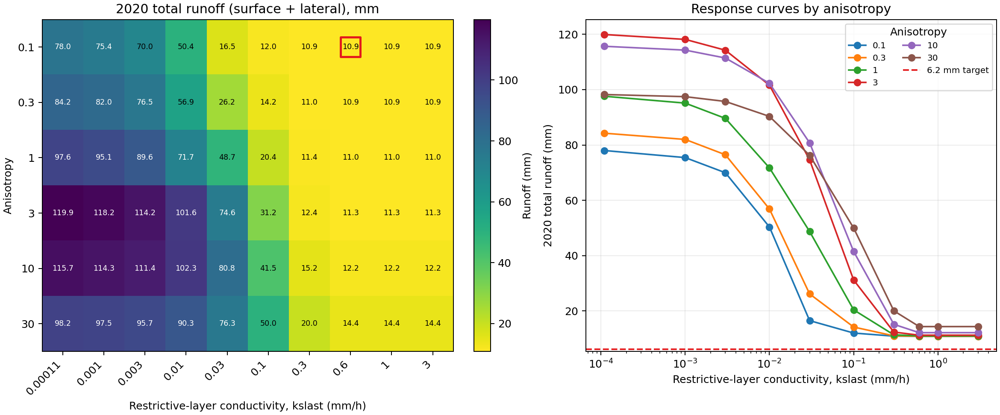
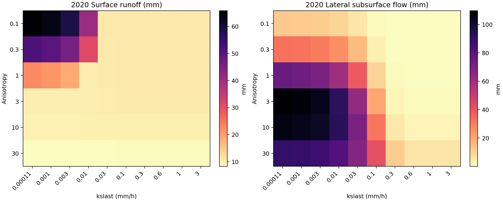
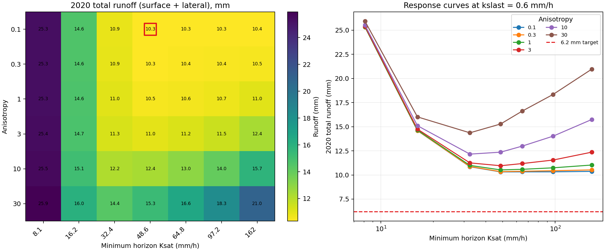
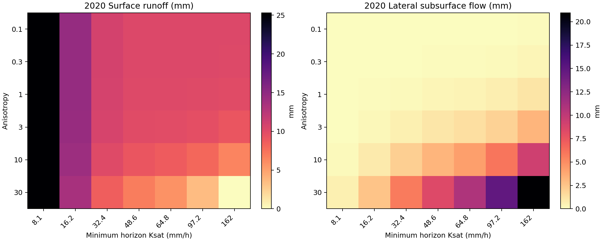
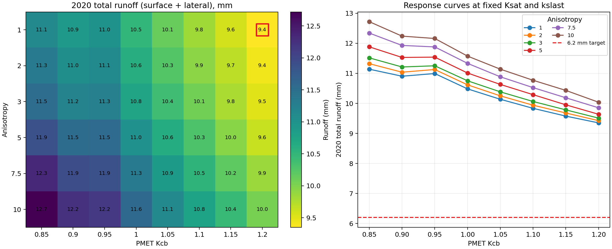
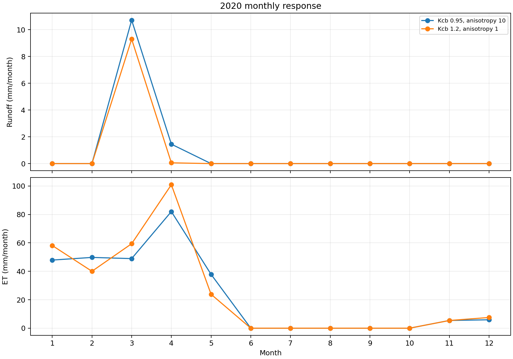

# Hill 106 2020 `kslast` × Anisotropy Calibration Screen

## Result

The two-parameter screen cannot reduce modeled 2020 runoff to the reported
`6.2 mm` target. The closest of 60 tested combinations is:

| Parameter or flux | Value |
| --- | ---: |
| `kslast` | `0.6 mm/h` |
| anisotropy | `0.1` |
| surface runoff | `10.83 mm` |
| lateral flow | `0.02 mm` |
| total runoff | `10.85 mm` |
| error above target | `4.65 mm` |
| ET | `278.09 mm` |
| printed deep percolation | `93.63 mm` |

The same result repeats at `kslast = 1` and `3 mm/h`, establishing a response
plateau. Raising `kslast` further cannot close the remaining gap at anisotropy
`0.1`. Reducing anisotropy removes nearly all lateral flow, but the resulting
surface-runoff floor remains above the target.

The component figure explains the tradeoff. Increasing `kslast` transfers
water from lateral flow to deep percolation. Reducing anisotropy also suppresses
lateral flow, but at low `kslast` it produces substantially more surface
runoff. Once drainage is unconstrained, the lowest total is still about
`10.85 mm`.

## Method

- Input: undisturbed Hill 106 fixture from `positional-mink`.
- Executable: `wepp_dcc52a6_hill`, SHA-256
  `365d44d643f70c5eee54e0ea81e74a125003799df8c912bab9ff267c476308a8`.
  This is byte-identical to the vendored `wepp_dcc52a6` executable.
- Simulation: the complete 1980–2024 run was replayed for every candidate;
  metrics were extracted only for calendar year 2020, preserving antecedent
  state and spin-up.
- Sidecars: `wepp_ui.txt`, `pmetpara.txt`, `gwcoeff.txt`, and `snow.txt` were
  retained unchanged.
- Fixed soil properties: both horizon Ksat values and the `10,000 mm`
  restrictive-layer thickness.
- Screen: `kslast = 0.00011–3 mm/h`; anisotropy = `0.1–30`.
- Objective: absolute error between `6.2 mm` and Hill 106 surface runoff plus
  lateral subsurface flow.

The archived baseline combination (`kslast = 0.00011 mm/h`, anisotropy `10`)
reproduced the fixture byte-for-byte and gives `115.66 mm` total runoff in
2020: `9.74 mm` surface runoff plus `105.92 mm` lateral flow.

The complete result table is
[`kslast-anisotropy-2020-matrix.csv`](kslast-anisotropy-2020-matrix.csv). Run
[`run_kslast_anisotropy_matrix.py`](run_kslast_anisotropy_matrix.py) with the
WEPPpy virtual environment to reproduce the matrix and regenerate both PNG and
SVG figures.

## Interpretation

`kslast` remains the canonical first calibration knob for restrictive-layer
drainage, and anisotropy is the appropriate companion parameter for lateral
partitioning. This screen shows that those two parameters do not span the
reported target for this climate, management, geometry, and horizon Ksat.

The result should not be treated as a failed watershed calibration. The
`6.2 mm` value and Hill 106 are not yet established as a like-for-like observed
and modeled drainage area, and one annual volume cannot identify two soil
parameters. Before adding another calibration knob, confirm the observed
watershed, drainage-area normalization, calendar-year completeness, and which
WEPP flow terms belong in the comparison. The subsequent horizon-Ksat screen
documented below also fails to span the target. Vegetation/PMET parameters
should be constrained with ET evidence rather than fitted to runoff alone.

The legacy daily water file prints deep percolation to two decimal places, so
its annual `Dp` sum is useful for comparative partitioning but not
high-precision mass-balance calibration.

## Fixed-`kslast` Ksat × Anisotropy Screen

A second 42-case matrix fixed `kslast` at `0.6 mm/h` and scaled both horizon
Ksat values together while preserving their original `35:32.4` ratio. The
minimum horizon Ksat spanned `8.1–162 mm/h`; the original `32.4 mm/h` value was
included. Anisotropy again spanned `0.1–30`.

The closest combination is:

| Parameter or flux | Value |
| --- | ---: |
| `kslast` | `0.6 mm/h` |
| minimum horizon Ksat | `48.6 mm/h` |
| upper horizon Ksat | `52.5 mm/h` |
| anisotropy | `0.1` |
| surface runoff | `10.28 mm` |
| lateral flow | `0.04 mm` |
| total runoff | `10.32 mm` |
| error above target | `4.12 mm` |

The response has a shallow minimum. Below `48.6 mm/h`, inadequate horizon
conductivity increases surface runoff. Above it, the small surface-runoff
reduction is overtaken by increasing lateral flow. Consequently, Ksat plus
anisotropy improves the fit by only `0.53 mm` relative to the first matrix and
still cannot span the `6.2 mm` target.

The complete table is
[`fixed-kslast-ksat-anisotropy-2020-matrix.csv`](fixed-kslast-ksat-anisotropy-2020-matrix.csv).
Run
[`run_ksat_anisotropy_matrix.py`](run_ksat_anisotropy_matrix.py) with the
WEPPpy virtual environment to reproduce the matrix and figures.

## Fixed-Ksat Anisotropy × PMET Kcb Screen

A third 48-case matrix retained the original horizon Ksat values (`35` and
`32.4 mm/h`) and fixed `kslast` at `0.6 mm/h`. It screened reasonable uniform
anisotropy values from `1–10` and PMET `Kcb` values from `0.85–1.20`, bracketing
the original `Kcb = 0.95`.

The closest combination is:

| Parameter or flux | Value |
| --- | ---: |
| `kslast` | `0.6 mm/h` |
| minimum horizon Ksat | `32.4 mm/h` |
| anisotropy | `1` |
| PMET `Kcb` | `1.20` |
| surface runoff | `9.19 mm` |
| lateral flow | `0.16 mm` |
| total runoff | `9.35 mm` |
| error above target | `3.15 mm` |
| ET | `295.23 mm` |
| printed deep percolation | `78.05 mm` |

At the same fixed Ksat and `kslast`, the original `Kcb = 0.95`, anisotropy `10`
case produces `12.16 mm` runoff, `277.81 mm` ET, and `92.27 mm` printed deep
percolation. The closest candidate adds `17.42 mm` ET but reduces runoff by only
`2.81 mm`; most of the extra ET displaces deep percolation instead. Even the
upper end of the screened Kcb range therefore cannot reach `6.2 mm`.

The monthly comparison shows that the ET change is also strongly seasonal,
with the largest increase in March-April rather than a uniform annual shift.
This reinforces the need for independent seasonal ET evidence before treating
`Kcb = 1.20` as a calibration candidate.

The complete annual and monthly tables are
[`fixed-ksat-anisotropy-kcb-2020-matrix.csv`](fixed-ksat-anisotropy-kcb-2020-matrix.csv)
and
[`fixed-ksat-anisotropy-kcb-2020-matrix-monthly.csv`](fixed-ksat-anisotropy-kcb-2020-matrix-monthly.csv).
Run [`run_anisotropy_kcb_matrix.py`](run_anisotropy_kcb_matrix.py) with the
WEPPpy virtual environment to reproduce the matrix and figures.
