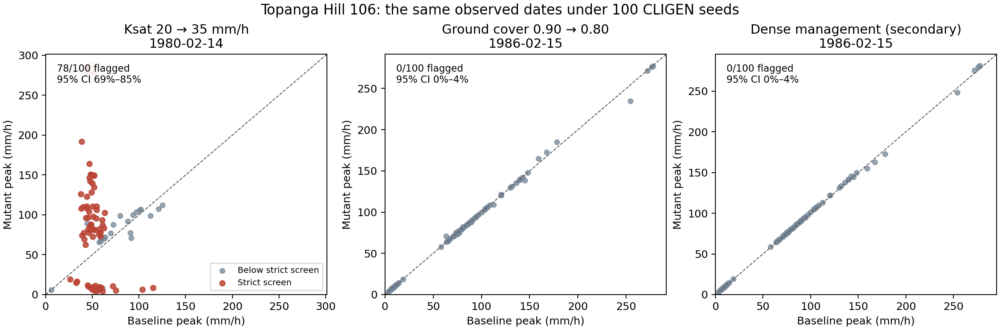
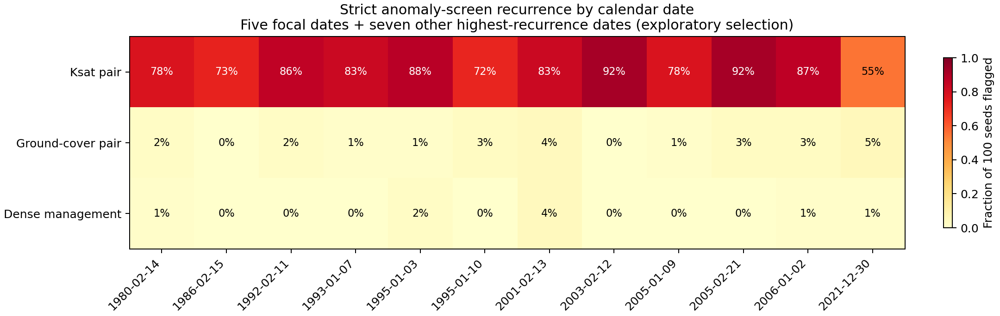

# Topanga CLIGEN seed recurrence

Scientific owner: WEPPpy. Execution date: 2026-10-06. Site: Topanga Hill 106.
Status: COMPLETE. Five-seed pilot validated; all 100 prespecified inference
seeds completed, with 540 successful full-history hillslope runs including
controls/repeats. No sampled seed was dropped or replaced.

## Results

**Changing CLIGEN seeds does not eliminate screened anomalies, but it can move
them to different dates.** The 1980 Ksat case commonly recurs on its original
date. The dramatic 1986 cover/dense cases were absent on that date in this
100-seed sample, even though other dates frequently passed the same screen.

| Frozen pair | Strict screen on primary date | Pointwise 95% Wilson interval | Any strict-screen date in 1980–2024 | Pointwise 95% interval |
| --- | ---: | --- | ---: | --- |
| Ksat 20 → 35, 1980-02-14 | 78/100 (78%) | 68.9–85.0% | 100/100 (100%) | 96.3–100% |
| Cover 0.90 → 0.80, 1986-02-15 | 0/100 (0%) | 0–3.7% | 85/100 (85%) | 76.7–90.7% |
| Dense management, 1986-02-15 | 0/100 (0%) | 0–3.7% | 77/100 (77%) | 67.8–84.2% |

Zero observed recurrence is not proof of zero probability. Every focal date
had observer events in all 100 seeds, so these zeros do not hide absent events.
These are seed-conditional **screening rates**, not physical flood probabilities
or confirmed numerical-defect rates.

### Dates and original signatures

| Observed date | Ksat pair | Cover pair | Dense management |
| --- | ---: | ---: | ---: |
| 1980-02-14 | 78% | 2% | 1% |
| 1986-02-15 | 73% | 0% | 0% |
| 1995-01-10 | 72% | 3% | 0% |
| 2005-01-09 | 78% | 1% | 0% |
| 2021-12-30 | 55% | 5% | 1% |

These entries all use the same strict screen and denominator 100; they do not
assert that every original pair/date was anomalous. Full intervals and original
signature endpoints are in [focal probabilities](artifacts/focal-probabilities.csv).
Only **12/100** seeds retained both the 1980 Ksat strict flag and the original
two-lane solver/assignment signature (95% interval 7.0–19.8%). Thus 78% recurrence
of a large peak discrepancy is not 78% recurrence of an identical mechanism.

The original Ksat history had 41 strict-screen dates. A sampled seed retained
a median 28 of them, lost 13 and added 18 new dates; total flagged dates ranged
33–56 (median 46). Cover retained a median zero of four original dates and
added two; dense management retained zero of three and added one. Counts and
their ranges are in [date overlap](artifacts/date-overlap.csv).

Examples absent from the original pair's strict-screen set are 1995-01-03
for Ksat (88/100), 2001-01-12 for cover (13/100), and 2010-12-18 for dense
management (10/100). These are exploratory selections, not extra prespecified
hypothesis tests. The [all-date table](artifacts/date-probabilities.csv) retains
all measured dates and flags, not just conspicuous examples.

### Manual event review

Twenty lane packets from ten selected paired cases were inspected. Examples:

| Pair/date/seed | Baseline → mutant peak (mm/h) | Evidence |
| --- | --- | --- |
| Ksat, 1980-02-14, original | 47.709 → 92.716 | Positive-excess assignment in both; APPMTH → HDRIVE |
| Ksat, 1980-02-14, 733 | 47.641 → 142.291 | Strict screen persists with APPMTH in both; surplus assignment shrinks from 4531 to 1480 s |
| Ksat, 1980-02-14, 7 | 58.660 → 66.844 | Strict screen lost; peak change about 14% |
| Cover, 1986-02-15, original | 3.563 → 312.292 | Storm → positive-excess assignment; 43920 → 451 s |
| Cover, 1986-02-15, 7 | 9.877 → 9.864 | Both use storm-duration assignment; original jump disappears |
| Cover, 2001-01-12, 11261 | 8.502 → 248.910 | New flagged date; storm → positive-excess assignment, 20160 → 684 s |
| Dense, 2010-12-18, 11261 | 128.439 → 185.009 | New flagged date; HDRIVE in both, positive-excess assignment 508 → 305 s |

This supports timing compression and seed-dependent branch/forcing context,
not a claim that every screened event is discontinuous or physically wrong.
No new local parameter brackets were executed. Evidence remains reproduced
screened behavior with selected branch-level diagnostics, not a newly confirmed
implementation-defect census.

The unchanged historical replay passed 15/20 lane cases and failed five
including duplicate baseline packets. Source inspection explained the failures:
in the storm-only surplus branch, `irs.for` replaces `remax` with `s(1)`, while
the packet's pre-surplus `remax` is what the old replay always uses. The old
failures are preserved. A separate post-hoc, source-checked
[branch replay](branch_replay.py) uses that branch's actual operand; **20/20
selected cases then reproduce the production peak exactly**. This does not
alter model results or repair production code. In storm-only cases, the old
replay's APPMTH domain diagnostics must not be interpreted as actual production
operands. See [manual review](artifacts/manual-review.csv) and
[supplemental replay](artifacts/manual-branch-replay.csv).

### Validation outcome and next step

Independent readback verified 100 distinct numerical storm series, exact fixed
daily meteorology, unchanged lane inputs, all 4,000 compressed inference output
and trace hashes, and 66,910 event-pair records. Recomputed strict-screen counts
match the published tables. The two inference retries reproduce their rejected
raw climates byte-for-byte. See [artifact validation](artifacts/artifact-validation.json)
and [retry record](artifacts/inference-retry-report.json).

This is sufficient to answer the initial seed-recurrence question. The useful
next experiment is targeted small-parameter bracketing of the newly retained
cases, plus a corrected observer/replay contract that records the actual
solver operands. Increasing N alone would narrow these conditional intervals
but would not establish defect prevalence, cross-site generality or downstream
routing effects. Those are separate studies, not executed here.

## Question and scope

When the observed daily climate is held fixed, do the known paired peak-flow
anomalies recur under different CLIGEN storm realizations, on which dates, and
with what seed-conditional probability?

This follows the [multi-site audit](../2026-08-08-wepp-peak-flow-discontinuity-multi-site-audit/README.md),
but is a deliberately small, manually reviewed, known-positive experiment.
It does not repeat the 1,088-trial small-mutation census. It does not estimate
physical flood probability, watershed outlet response, cross-site prevalence,
or the incidence of confirmed implementation defects.

## Frozen experiment

Each seed runs five complete 1980–2024 hillslope histories (16,437 days), making
three paired comparisons with identical climate within each pair:

| Pair | Baseline → mutation | Primary date | Interpretation |
| --- | --- | --- | --- |
| `ksat` | Ksat 20 → 35 mm/h | 1980-02-14 | Original restrictive-layer Ksat fixture |
| `cover` | Ground cover 0.90 → 0.80 | 1986-02-15 | Original management fixture without restrictive layer |
| `dense` | Original → dense management | 1986-02-15 | Secondary; canopy and LAI change together |

These are broad historical known-positive contrasts, not ±1% Ksat or ±0.01
cover probes. The Ksat and management decks are different strata and are not
interchangeable. Terrain, soils, management, initial conditions, dates and
executable are frozen within each lane. Full-history runs allow seed-specific
antecedent states. The 1980 event has only 44 preceding simulated days; no extra
spin-up was invented. No watershed routing is performed.

CLIGEN 5.323 observed mode uses `-t6 -I2 -rSEED`, the frozen `ws.prn` and
`ca041484.par`. Only duration, normalized peak time (`tp`) and normalized peak
intensity (`ip`) are replaced. Their historical one-decimal serialization is
preserved. Dates, precipitation, temperature, radiation, wind and dew point are
copied exactly from the archived, spatially corrected model-consumed climate.
Unseeded generation with this serialization reproduces all original storm
fields numerically. The climate header's nominal 100 years is incorrect;
parsed daily dates establish the actual 45-year record.

Pilot seeds are 0, 1, 12345, 54321 and 99999, with an independent repeat of
12345. The inference sample is 100 uniformly sampled integer seeds without
replacement from 0–99999 excluding those five, using Python
`random.Random(20261006)`. The list was frozen before runs. Pilot and original
controls are excluded from the probability denominator. The original climate
and a second identical control also run all five lanes.

## Endpoints and uncertainty

The primary screen requires both paired events, absolute peak change above
0.36 mm/h, relative peak change above 25%, and relative runoff change below 5%.
Denominator floors are 0.36 mm/h for peak and 0.01 mm for runoff. Comparisons
are strict inequalities. Existing broader flags are retained separately;
solver switches, twofold peaks and expected-response reversals are not by
themselves proof of a defect. The dense-management direction flag is only a
legacy heuristic, not an established physical monotonicity condition.

Events are outer-joined on year, day, OFE and solver-call ordinal. Missing
events are recorded as absent, never converted to zero-valued hydrology.
A seed with no matched event on a date cannot satisfy the strict screen;
event-presence counts are published alongside recurrence. Failed runs cannot
be counted as non-anomalous. Analysis requires all 100 seeds to finish.

Report `k/100` and two-sided 95% Wilson intervals at each fixed date and for
at least one screened event anywhere in the fixed history. The seed is the
sampling unit; dates and paired comparisons are dependent. Intervals are
pointwise Monte Carlo summaries, not simultaneous confidence statements over
the thousands of exploratory date comparisons. Uniform seed sampling is not
proof of independent physical storms or generator statistical quality.

`original_signature_recurred` additionally requires that the original event
passed the strict screen and that both lanes retain their original solver
and surplus-assignment mode. This is a trace-signature endpoint, not a
confirmed-mechanism census. Manual replay uses the original plus the smallest
sampled seed with persistence/loss for each primary case, and one new screened
date per pair ranked by frequency then date. This selection rule is explicit;
manual examples are not a random prevalence sample.

## Validation and qualifications

The observer was rebuilt from unchanged WEPP-Forest commit
`ea25ad79ef7dab20206bca095b2958786f5ae317`, with gfortran 13.3.0. Forest acceptance
reproduced the historical canonical hashes, full-precision packets, isolated
replay, inactive-parameter control and observer active/inactive parity.
The original 1986 peaks reproduce 3.563 → 312.292 mm/h for cover and
3.563 → 294.416 mm/h for dense management.

Cross-host byte equality initially failed. Peak/erosion text files remained
exact; maximum observer differences were 3.73e-9 m and 2.28e-13 m/s, and water
output differed by at most 1e-5 mm. All paired classifications were identical.
Before seeded model execution, acceptance was refined to require exact
peak/erosion output, observer differences below 1e-8 m or 1e-12 m/s, and water
differences below 2e-5 mm. HBP compressed files differ across hosts, are
retained, and are not used for any routing claim. Same-host original repeats
and the pilot seed repeat are byte-identical for all five lanes' canonical
outputs and diagnostic traces.

Initial CLIGEN pilot attempts failed the general climate-quality guard.
The same warnings occur during original-climate regeneration. They name
precipitation, dew point or wind variables that this experiment replaces with
frozen observed daily values. The study-only guard therefore retains these
warnings but permits only named frozen daily fields, with exact consumed
daily-value parity required. Unknown or retained-storm-field warnings, runtime
errors, nonfinite values and date mismatches remain fatal. The rejected
attempts and full logs are preserved. No production guard was weakened.
Results remain conditional on this legacy generator and serialization.

During inference, seeds 53846 and 46045 additionally warned about generated
wet-day probability; seed 53846 also warned about maximum temperature. Raw
observed dates, precipitation and temperatures still matched exactly. The
study-only name list was completed to include wet-day probability, both
temperatures and radiation, all fixed by the consumed daily record. This
post-start refinement is retained explicitly, before final probability
analysis. These seeds are rerun unchanged, not replaced or dropped. The
probability target is the frozen-observation experiment with qualified legacy
generation, not a sample restricted to warning-free CLIGEN runs.

Restricted WEPP-Forest source means **internal reproducibility**, not public
rebuildability. Public scripts, compact evidence and hashes support inspection;
an external reviewer cannot rebuild the observer from this repository alone.

## Reproduction and artifacts

The [work package](../../work-packages/20261006_topanga_cligen_seed_recurrence/package.md)
and its tracker record authority, deviations and execution evidence.
The [reproduction record](reproduction.md) gives actual build flags, commands,
runtime versions, retained failures and publication boundaries.
`prepare.py` stages the archived decks/tools and seeds on forest; `accept.py`
checks rebuilt binaries against historical fixtures. `study.py` runs controls,
pilot and inference, `check_gates.py` enforces acceptance, `analyze.py` recomputes
probabilities and manual replay, and `figures.py` renders scientific figures.
`script_checks.py` tests screening boundaries, pairing absence and intervals.

Scripts run beside the staged `bin/`, `tools/`, `inputs/`, `climate-source/`
and manifest files, not directly in a checkout without those inputs. Bulk
outputs remain under `/wc1/studies/topanga-seed-recurrence-20261006` on openwepp;
forest build and acceptance evidence is under
`/home/workdir/topanga-seed-recurrence-20261006`. Source runs and dirty source
checkouts were not modified. No service or application deployment was needed.

### Data contract (study schema 1)

| Artifact | Grain and interpretation |
| --- | --- |
| `seeds.json` | Ordered pilot/inference seed lists and sampler identity |
| `input-manifest.json` | Relative input/tool path → SHA-256 |
| `runs/SEED/terminal.json` | Seed climate identity plus five lane input/output identities |
| `runs/SEED/LANE/events.parquet` | Year/day/OFE/ordinal, full-precision observer scalars |
| `analysis/event-pairs.parquet` | Seed × pair × date × OFE × ordinal, outer-joined events and flags |
| `focal-probabilities.csv` | Pair × flag × five prespecified dates; `k`, `n`, probability, pointwise Wilson bounds and presence count |
| `any-event-probabilities.csv` | Pair × flag; seeds with any flagged date in 45 years |
| `date-probabilities.csv` | Pair × flag × observer date; exploratory pointwise recurrence |
| `date-overlap.csv` | Seed × pair; counts of retained/lost/new strict-screen dates relative to original |
| `focal-values.csv` | Seed × pair × focal date; original report values, units in column names |
| `manual-review.csv` | Selected seed/date/lane; packet scalars, replay disposition and diagnostics |
| `manual-branch-replay.csv` | Same selected lane cases, with source-checked production operands; supplements original replay |
| `manual/*/packet.json` | Full-precision Phase 1 versioned immutable packet, with payload hash |
| `manual/*/production-operand-replay.json` | Supplemental replay provenance, operand derivation, peaks and exact production delta |
| `artifact-validation.json` | Independent arithmetic, daily invariants and decompressed-output hash readback |
| `storage-manifest.json` | Internal evidence path, byte size and SHA-256; excludes itself |

`_m`, `_m_s`, `_s` and `_mm_h` suffixes specify meters, meters/second, seconds
and millimeters/hour. Probabilities and normalized shape parameters are
dimensionless. Dates are ISO calendar dates, not rank or return period.
Missing paired scalar values are null/NaN, with explicit event-presence flags.
CSV empty replay fields indicate unresolved replay, not zero. This additive
study schema does not alter production run artifacts or application contracts.
