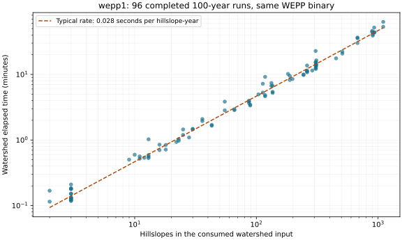

# wepp1 watershed timeout scaling assessment

Read-only production assessment, 2026-09-28. No jobs, settings, processes or
services were changed. Recommendation only; no runtime implementation.

## Conclusion

Include watershed size alongside climate years. A simple hillslope-year budget
is supported by this sample; separately fitting hillslope and channel weights
is not supported because their counts are almost perfectly correlated.

Provisional policy for continuous watershed jobs:

    timeout_hours = max(12, ceil(0.05 * simulation_years * hillslopes / 3600))

The coefficient is seconds per hillslope-year. It rounds up the observed
same-binary 95th percentile rate (0.047); the median is 0.028. The 12-hour floor
preserves existing allowances and covers startup overhead for tiny projects.
This is a candidate operational allowance, not a guaranteed upper runtime bound
or an accepted canonical contract. It needs validation with additional binaries,
large watersheds and long climates before broad rollout.

For 1,908 hillslopes and 1,000 years this gives **27 hours**, versus an estimated
17–18 hours of execution. At 500 years it gives 14 hours. Do not multiply two
independently normalized years/size factors each floored at one: use their
workload product, then apply the existing overall floor.

## Incident and comparison

| Run | Years | Hillslopes | Channels | Watershed result |
| --- | ---: | ---: | ---: | --- |
| electromagnetic-woodcutter | 500 | 1,908 | 876 | Completed in 31,519.98 seconds (8.76 hours) |
| indistinguishable-keep | 1,000 | 1,908 | 876 | RQ timeout at 43,200.03 seconds; last reported year 698 |

Both prepared inputs use `wepp_dcc52a6`; their runner-recorded SHA-256 is
`365d44d643f70c5eee54e0ea81e74a125003799df8c912bab9ff267c476308a8`.
Their consumed watershed structure, slope and channel files also match byte for byte:

| Input | SHA-256 (both runs) |
| --- | --- |
| pw0.str | `695f439fe1d69dbbcd6a3503630a799c227391957788ea7229a7e34c888c1915` |
| pw0.slp | `7f5e7ca4d0bc3dc7d6a26d4c0353f23786a454904188a68272978618c7c4f886` |
| pw0.chn | `a5ebf0764f17e0b9e7b29d90dd1f7e02319863c5c3a493c5febed1f5a877bf33` |

This is a same-binary, same-topology comparison, not proof that every other input is identical.

Successful job `d2f534cb-8de7-4212-9cad-8b813eb77baf` ran from
2026-09-22 18:42:10.048864 UTC to 2026-09-23 03:27:30.026953 UTC.
Failed job `be3f7f1a-cb56-4728-b93b-3ccdc7166b48` ran from
2026-09-26 04:38:08.530483 UTC to 2026-09-26 16:38:08.559948 UTC.
The exception in Redis is `rq.timeouts.JobTimeoutException` at 43,200 seconds.
The final native log write precedes timeout by about 5.43 seconds.

Linear extrapolation of the completed run gives **17.51 hours** for 1,000 years.
The failed run's reported progress gives **17.19 hours**, treating year 698 as
an approximate progress marker rather than proof that the year completed.
Their close agreement supports a legitimate runtime overrun, rather than evidence
of a stalled computation. Neither estimate is a completed 1,000-year measurement.

## Sample and provenance

Host identity was verified as `wepp1`. Host root is `/geodata/wc1`; container root
is `/wc1`. The target exists in both views. `rq-worker`, `rq-worker-batch`,
`rq-engine` and `weppcloud` were running. Collection used read-only SSH and
`docker exec -i docker-rq-worker-1 python -`; no production scripts were staged.

Redis collection ended 2026-09-28 21:28:21 UTC; metadata collection ended
21:30:36 UTC. Read the default/batch finished, failed and started registries,
batched `HGET data` to identify watershed functions, then `Job.fetch` only for
matches. Inspected 11,532 registry job IDs and found 298 watershed jobs:
173 finished, 114 failed and 11 stopped. Successful results normally expire
seven days after completion; retained failures include older history. This is a
retained sample, not a complete unbiased historical census. Timeout durations
are lower bounds on required runtime, not completed runtimes; fitting successes
alone can underestimate the slow tail. The incident progress and completed
500-year comparison provide a separate check for this specific overrun.

Of 186 distinct run IDs, 135 still existed. Match native `pw0.err` mtime to RQ
end time within 120 seconds and require prepared `pw0.run` mtime no later than
job start plus two seconds. This yields 127 aligned records: 123 successful and
four failed. Successful observations span 2026-09-21 through 2026-09-28 UTC.
Require native success and final year matching prepared years before modeling.

Count hillslope pass references in the consumed `pw0.run` and channel records
(type 2) in `pw0.str`, whose mtime also precedes execution. Read years from the
prepared run-file tail and verify against native year markers. Do not assign
current NoDb settings to historical jobs. Two runs actually had mismatched
current versus prepared watershed sizes; analysis uses the prepared sizes.
Raw controller reads used JSON only and did not hydrate or mutate NoDb objects.

Plain `rq.log` records identified the failed job but generally contain neither
start timestamps nor elapsed durations. Redis job timestamps supply the timings;
prepared inputs and native logs supply the workload and completion evidence.

## Relationship to watershed size

There are 112 aligned successful `wepp_dcc52a6` jobs, representing 52 distinct
(hillslope count, channel count) groups. Climate lengths span 4–500 years and
watershed sizes span 1–1,908 hillslopes. Most are 100-year runs.

For the 96 same-binary, 100-year jobs:

| Hillslopes | Jobs | Median watershed time |
| --- | ---: | ---: |
| 1–100 | 49 | 42.91 seconds |
| 101–300 | 22 | 8.38 minutes |
| 301–700 | 16 | 15.92 minutes |
| 701–1,500 | 9 | 44.20 minutes |

Hillslope count versus elapsed time has Spearman correlation **0.992** within
these 100-year jobs. Hillslope versus channel count has correlation **0.998**
across the same-binary sample. Either size measure predicts well; current evidence
cannot isolate their independent computational contributions.

Fit ordinary least squares to log elapsed time, using log predictors:

| Predictors | Log-scale R² | Held-out group median error factor | Held-out group 90th-percentile error factor |
| --- | ---: | ---: | ---: |
| Years only | 0.266 | 4.29× | 15.94× |
| Years and hillslopes | 0.990 | 1.15× | 1.28× |
| Years and channels | 0.992 | 1.15× | 1.28× |
| Years and hillslopes + channels | 0.992 | 1.15× | 1.26× |

Validation leaves each size group out together to reduce leakage from repeated
or related projects. Within each held-out group, summarize absolute multiplicative
prediction errors by their median; the table reports quantiles across groups.
These are retrospective sample errors, not future confidence bounds. Grouping by
counts does not prove independent geography or meteorology.

The years/hillslopes fit has exponents 0.887 and 0.966, respectively, close enough
to linear workload scaling to favor a simple operational formula over fitted
fractional powers. Six verified `wepp_260803` successes are insufficient to assume
identical performance across releases. Binary identity, climate/event severity,
output options and concurrent load remain potential runtime differences.

## Implementation implications

Use `climate.input_years` and `watershed.sub_n` when preparing a new job, and
check against consumed inputs for no-preparation execution. Record years,
hillslopes, channels, binary identity and selected timeout in job metadata at
submission so future analysis does not depend on surviving latest artifacts.

Apply one policy at all four continuous watershed enqueue paths in
`wepppy/rq/wepp_rq_pipeline.py`. Do not change the shared 43,200-second timeout
for unrelated stages. Single-storm runs are outside this calibration. Failed
jobs retain their stored timeout; deployment alone does not change retry budgets.
Keep explicit subprocess termination/reaping on timeout/cancellation in scope
before operational retry; the current runner does not guarantee this cleanup.
A policy ceiling and behavior beyond the observed size range need an explicit
operational decision; do not silently truncate a calculated budget and imply
it was sufficient.

The current logs also contain native warnings about missing February 29 records:
101 in the 500-year log and 150 in the incomplete 1,000-year log. The warning says
leap-year annual values will not be output. This is a separate climate/output
compatibility issue; increasing a timeout does not resolve it.

## Retained artifacts and reproduction

- [timings.csv](timings.csv): 127 matched jobs, including four failures kept out of fits.
- [analysis.json](analysis.json): exact statistics and model coefficients.
- [analyze.py](analyze.py): reproduces statistics and chart without contacting production.

From the repository root:

    .venv/bin/python docs/investigations/20260928_wepp1_watershed_timeout_scaling/analyze.py

The script uses existing NumPy, SciPy and matplotlib installations. Initial
collection corrected an RQ API bytes/string job-ID assumption before successful
sampling, and corrected the pass-reference suffix to include `.pass.dat` before
final analysis. No production code or data was changed by either correction.
