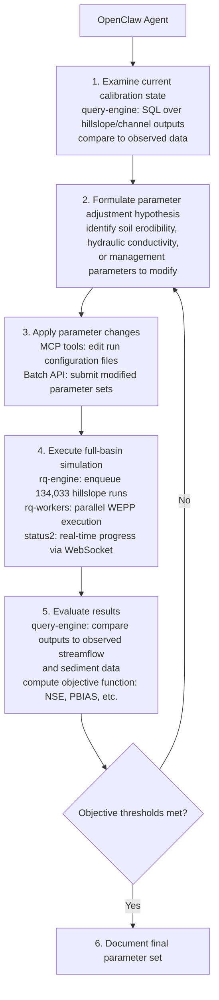

# WEPPcloud Architecture Overview — St. Joe Basin

**Date:** April 2026
**Project:** I-CREWS / St. Joe River Basin Watershed Modeling
**Context:** Compute infrastructure planning for AI-driven basin calibration

---

## Runtime Architecture

```
  OPERATORS                  WEPPCLOUD CONTAINER STACK              COMPUTE / STORAGE
 ─────────────              ───────────────────────────            ───────────────────

 ┌─────────────┐            ┌───────────────────────┐
 │    Human    │            │  Flask App            │
 │  Web Browser│──HTTP────▶ │  UI · Auth · NoDb     │
 └─────────────┘  /JWT      └───────────┬───────────┘
                    │                   │
                    │       ┌───────────┴───────────┐
                    ├─────▶ │  rq-engine (FastAPI)  │           ┌───────────────────┐
                    │       │  Job API              │──────────▶│  rq-worker pool   │
                    │       └───────────────────────┘  Redis    │                   │
                    │                                  job      │  WEPP Simulation  │
                    │       ┌───────────────────────┐  dispatch │  Climate · Soils  │
                    ├─────▶ │  query-engine         │           │  Roads · Batch    │
                    │       │  Analytics · MCP API  │           └────────┬──────────┘
                    │       └───────────────────────┘                    │
                    │                                                    │ read/write
                    │       ┌───────────────────────┐                    │
 ┌─────────────┐    ├─────▶ │  browse (Starlette)   │           ┌────────┴──────────┐
 │  AI Agent   │    │       │  Run Explorer         │──────────▶│  Local Storage    │
 │  OpenClaw   │──HTTP      └───────────────────────┘           │  Run Data         │
 └─────────────┘  /JWT                                          │  WEPP I/O         │
                                                                │  /wc1/runs/       │
                                                                └───────────────────┘
```

---

## Service Topology

The platform runs as a Docker Compose stack with 20+ containers behind a Caddy reverse proxy. The services relevant to calibration:

| Service | Runtime | Role |
|---------|---------|------|
| **weppcloud** (Flask) | Gunicorn, 4 workers | UI, authentication, NoDb state management, job enqueue |
| **rq-engine** (FastAPI) | Uvicorn | Job submission, polling, cancellation API |
| **query-engine** (Starlette) | Uvicorn | DuckDB analytics over run outputs, MCP API for AI agents |
| **browse** (Starlette) | Gunicorn + Uvicorn | Run output file explorer with diff support |
| **rq-worker** | RQ worker-pool | Executes WEPP simulations, climate processing, soil assignment |
| **rq-worker-batch** | RQ worker-pool | Dedicated queue for batch/calibration workloads |
| **status2** (Go) | Binary | Redis pub/sub → WebSocket fan-out for live job status |
| **redis** | Redis | Job queues (DB 9), NoDb cache (DB 13), distributed locks (DB 0), status channels (DB 2) |

Workers are stateless. They pull jobs from Redis, execute WEPP FORTRAN binaries against run data on local storage, and publish status updates back through Redis. Adding nodes adds workers — no application changes required.

---

## AI-Driven Calibration Workflow

Calibrating the St. Joe basin (134,033 hillslopes, 56 watersheds) requires iterative full-basin simulation runs. Each parameter adjustment must propagate through the entire channel network to evaluate watershed-scale effects. This is not feasible manually at this scale.

### Why brute-force parameter sweeps don't work

The naive approach to calibration is batch parameter sweeps: generate a grid of parameter combinations, submit them all as independent jobs, and pick the best result. This is the kind of workload that fits naturally on an HPC batch scheduler. It does not work here for two reasons:

**Combinatorial explosion.** WEPP calibration involves soil erodibility, hydraulic conductivity, effective saturated conductivity, rill spacing, critical shear, and management parameters — per soil type, per land use class, across 56 watersheds with heterogeneous geology. Even a coarse 5-value sweep across 8 parameters produces 390,625 combinations. Each combination requires a full-basin run of 134,033 hillslopes. The compute cost of exhaustive search is intractable at basin scale.

**Equifinality.** In watershed hydrology, many different parameter sets produce statistically indistinguishable fits to observed data (Beven, 2006). A brute-force sweep that minimizes an objective function (NSE, PBIAS) will return dozens or hundreds of "equally good" parameter sets with no basis for choosing among them. The resulting model is not calibrated — it is curve-fit without physical constraint.

Resolving equifinality requires an agent that can reason about intermediate outputs: Does the seasonal pattern of baseflow match? Are sediment peaks arriving at the right time relative to storm events? Is the snow accumulation/melt timing physically plausible for these elevations? These are diagnostic judgments that inform the next parameter adjustment. They cannot be encoded as a scalar objective function and batch-submitted.

This is why the calibration workflow is iterative and agent-driven rather than batch-submitted:

The calibration workflow:



Each iteration requires:
- **Sub-minute feedback** between the agent and the service stack (parameter submission, job status, result queries)
- **Persistent service availability** — the agent session runs for hours across many iterations
- **Live Redis connectivity** — job dispatch, status streaming, and NoDb state all flow through Redis
- **Local storage I/O** — each iteration reads and writes millions of small files (WEPP input/output per hillslope)

---

## AI Agent Integration

WEPPcloud is designed to be operated by both human users and autonomous AI agents. AI agents are first-class operators — they authenticate with scoped JWT tokens and interact with the same service APIs that human users do.

The planned agent operator is OpenClaw/Hermes pen-source autonomous AI assistant. Agent runs external to weppcloud on their own development box with sandboxed tool execution (bash, file I/O, HTTP), a skills system for domain-specific workflows, and multi-agent session routing. It connects to external services via HTTP and drives autonomous workflows without human intervention.

### How an OpenClaw agent operates WEPPcloud

An OpenClaw agent authenticates to the WEPPcloud stack via JWT and interacts with two service APIs:

**rq-engine (FastAPI)** — the operational interface:
- Submit batch simulation jobs across watersheds
- Poll job status and completion
- Cancel and re-submit runs with modified parameters

**query-engine (Starlette + MCP API)** — the analytical interface:
- Query the dataset catalog for a run (hillslope outputs, channel outputs, climate summaries)
- Execute DuckDB SQL against Parquet-formatted run results
- Validate queries before execution
- Retrieve prompt templates with embedded schema context

The agent uses rq-engine to act and query-engine to observe. The calibration loop is: observe results → formulate hypothesis → modify parameters → submit simulation → observe results → iterate.

---

## Infrastructure Requirements

The calibration workflow imposes specific infrastructure constraints that are inherent to the architecture:

| Requirement | Why |
|-------------|-----|
| **Persistent services** | Flask, rq-engine, query-engine, Redis, and status2 must be running continuously — agents interact with them over hours-long sessions |
| **Low-latency job dispatch** | Workers pull jobs from Redis immediately; no scheduler allocation delay |
| **Local storage** | WEPP I/O is millions of small files per basin run; network filesystems (NFS, Lustre) degrade severely under this pattern |
| **Unrestricted network** | Workers call external data APIs (Climate Engine, OpenTopography, PRISM) during execution |
| **Horizontal scaling** | More cores = more concurrent hillslope simulations = faster iteration cycles |

These are not preferences — they are consequences of a persistent, interactive modeling platform that serves both human operators and AI agents simultaneously.
