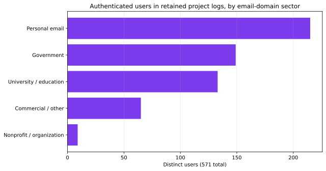
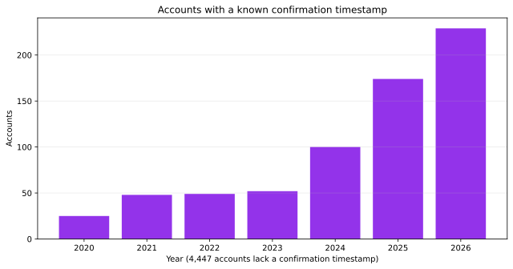
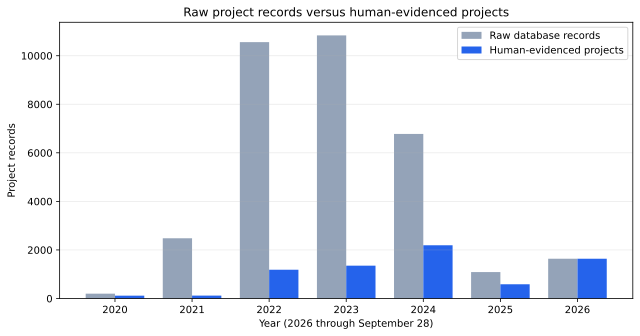
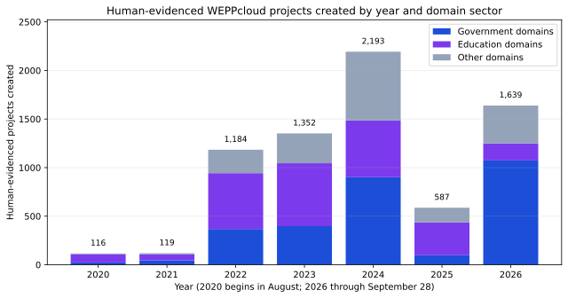
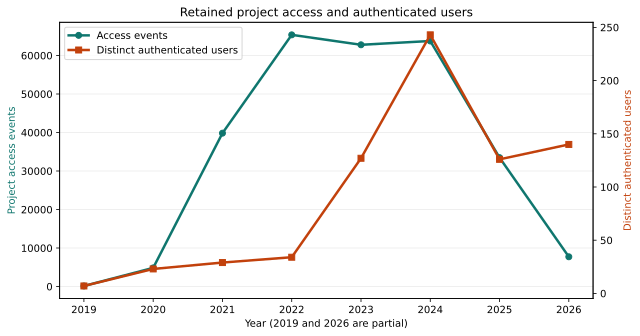
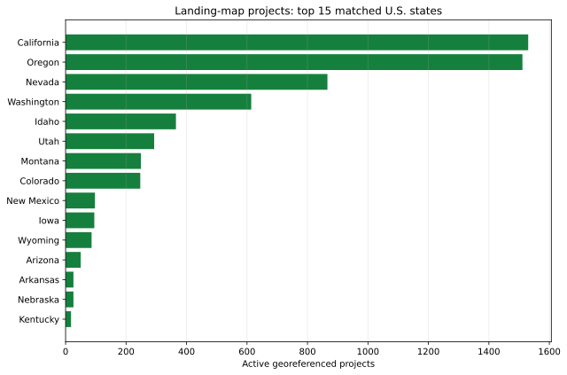
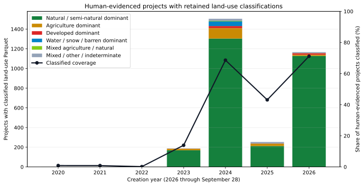

# WEPPcloud historical usage evidence

**Snapshot:** September 28, 2026  
**Production host:** `wepp1`  
**Method:** Read-only aggregation; no email addresses, IP addresses, or user-level
records were exported.

## Executive summary

The strongest defensible description of WEPPcloud's accumulated reach is:

- The database contains 33,580 raw project records. Of these, 25,210 ownerless
  records lack retained authenticated-use or modeled-artifact evidence, and
  another 1,180 owned records match a narrow registered interface-crawler sweep
  signature. These records should not be presented as user-created projects.
- A conservative series contains **7,190 human-evidenced projects**: projects
  with an authenticated owner or authenticated access in a retained dot log,
  after removing the cross-interface sweep signature.
- Retained per-project logs contain **277,935 project access events** across
  **10,307 distinct projects** from June 2019 through September 28, 2026.
- Those retained project logs identify **571 authenticated users**. Email-domain
  classification identifies 149 government and 133 university or education
  users, or **282 identified public-sector/education users (49.4%)**.
- The account registry contains **5,124 active account rows**, of which 4,942
  have a positive lifetime login counter. This is an administrative registry
  measure, not a count of people who used a model successfully. Legacy imports,
  missing confirmation dates, and probable low-quality registrations make the
  registry total less suitable than authenticated project activity for an
  external pitch.
- The landing-page atlas currently contains **6,410 active, georeferenced
  projects**. Of these, 6,235 match the bundled 50-state polygons and 175 are
  international, in a territory, offshore, or unmatched by the simplified
  boundaries.
- A throttled scan found a retained `landuse/landuse.parquet` classification for
  **3,116 of the 7,190 human-evidenced projects (43.3%)**. Of those retained
  summaries, 2,817 are natural/semi-natural dominant and 157 are agriculture
  dominant; this is a hillslope-class proxy, not proof of native vegetation.
- Retained project artifacts contain an inventory of **778,515 WEPP hillslope
  outputs** and **1,972 ash hillslope outputs**. These are inventory counts, not
  completed-execution counts.

There is no durable historical model-execution ledger. A project may be opened
many times and run many times; conversely, a project can be created without a
successful WEPP execution. Historical project and access totals must not be
relabeled as "model runs."

## Recommended pitch language

> Since 2020, WEPPcloud has accumulated more than 7,100 projects with direct
> evidence of authenticated ownership or use. Its retained activity history
> documents more than 277,000 project accesses by 571 authenticated users,
> including at least 282 users identifiable by email domain as government or
> education participants. The live project atlas currently displays more than
> 6,400 active georeferenced studies, with strong use across western U.S. states
> and additional international activity.

Add this qualification when discussing computational scale:

> Current retained projects contain approximately 778,000 hillslope-result
> artifacts. This measures the present modeled-hillslope inventory, not the
> number of repeated model executions over time.

## What each statistic means

| Measure | Meaning | Can repeat? | Historical completeness |
|---|---|---:|---|
| Registered account | A row in the WEPPcloud user table | No per account | Durable, but 4,447 rows lack a confirmation timestamp and legacy/import quality varies |
| Authenticated user | A distinct account email recorded while accessing a retained project | Counted once in a selected period | Only projects whose dot logs remain discoverable |
| Human-evidenced project | A project with an authenticated owner or retained authenticated access | One user can create many | Conservative; legitimate ownerless projects may be omitted |
| Raw project record | Any WEPPcloud database run row, including anonymous automation | Yes, including automated creation | Durable from August 2020 but contaminated before 2025 |
| Access event | One logged project-page load | Yes; reloads and repeat visits count | Retained dot logs begin in June 2019 but disappear with some deleted projects |
| Apache request | One HTTP request for a page, asset, API, health check, redirect, or error | Yes, often many per page | Partial archives; includes bots and cannot identify model success |
| Model execution | One successful invocation of WEPP or another model | Yes within one project | Not durably counted before an execution ledger exists |
| Hillslope inventory | Current hillslope rows/artifacts associated with retained projects | No repeated executions | Snapshot only; not a lifetime total |
| Landing-map point | An active project with a readable centroid | One per mapped project | Current snapshot, not historical atlas membership |

## Users and institutional reach

### Authenticated users in retained project logs

This is the most defensible sector view because every included identity appears
in a project access record.

| Email-domain sector | Distinct users | Share |
|---|---:|---:|
| Personal email provider | 215 | 37.7% |
| Government | 149 | 26.1% |
| University or education | 133 | 23.3% |
| Commercial or other | 65 | 11.4% |
| Nonprofit or organization | 9 | 1.6% |
| **Total** | **571** | **100%** |

Prominent identifiable domains include USDA (107 users), University of Idaho
student accounts (43), Washington State University (29), Bureau of Land
Management (14), University of Idaho (10), U.S. Geological Survey (9), and Iowa
State University (7). A personal email address can still belong to a government
or university participant, so the identified institutional counts are lower
bounds.

Classification is heuristic and based only on the domain suffix: `.gov`,
`.mil`, government country-domain forms, `.edu`, `.ac.*`, `.edu.*`, common
personal-mail providers, and `.org`. It does not infer an individual's employer.



### Account registry caveats

The registry has 5,124 active rows and 4,942 rows with a positive login counter,
but only 677 accounts have a confirmation timestamp. The other 4,447 lack that
date, largely preventing a complete registration-growth series. The registry
also contains consumer-mail and suspicious-looking domains. Use the registry
total as an administrative count, not as a verified audience count.



## Project history

PostgreSQL contains 33,580 raw project records, but ownership and retained
authentication evidence show heavy crawler contamination. Ownerless records
dominate the earlier spike. From September 2024 through February 2025,
registered crawler accounts also created 10–14 projects on the same day across
10–14 different interfaces, showing that ownership alone is not sufficient.

| Creation year | Raw records | Human-evidenced | Ownerless excluded | Interface sweeps excluded |
|---|---:|---:|---:|---:|
| 2020 (from August) | 200 | 116 | 84 | 0 |
| 2021 | 2,480 | 119 | 2,361 | 0 |
| 2022 | 10,559 | 1,184 | 9,375 | 0 |
| 2023 | 10,835 | 1,352 | 9,483 | 0 |
| 2024 | 6,777 | 2,193 | 3,907 | 677 |
| 2025 | 1,090 | 587 | 0 | 503 |
| 2026 (through September 28) | 1,639 | 1,639 | 0 | 0 |
| **Total** | **33,580** | **7,190** | **25,210** | **1,180** |

The human-evidenced criterion is `owner_id` present **or** an authenticated
identity present in the project's retained dot log, excluding an owner/day when
at least 10 projects cover at least 10 distinct configurations with at least 70%
configuration uniqueness. That narrow signature captures the observed crawler
pattern without removing concentrated single-workflow agency or training
campaigns. The series remains conservative: it may omit legitimate old anonymous
projects whose logs expired, and it does not claim every project ran WEPP.

The raw 2022–2024 spike should not be used as a workload or adoption claim. Its
ownerless records include robot-created and anonymous automation records, along
with any legitimate anonymous projects that cannot now be distinguished.



The human-evidenced series by itself is suitable for presentations where the
contaminated raw series would distract from the defensible adoption trend. The
stacked bars classify each project's owner or retained authenticated identity by
email domain: government, education, or other. Personal email addresses remain
in “other” even when the person may work for a public institution, so government
and education are lower-bound classifications.



Across all **raw** database project records, configuration-name bucketing yields:

| Configuration family | Project records |
|---|---:|
| Disturbed, fire, legacy, general, or unclassified | 27,985 |
| Europe locale/workflows | 2,041 |
| Australia locale/workflows | 1,705 |
| RHEM/rangeland | 1,048 |
| Revegetation | 801 |

These buckets describe the selected interface/configuration, not land ownership,
funding agency, or a clean agriculture-versus-forest classification.

## Access history and user evolution

The retained dot logs cover June 7, 2019 through September 28, 2026. Annual
counts are:

| Year | Access events | Projects accessed | Authenticated users | Projects first seen in retained logs |
|---|---:|---:|---:|---:|
| 2019 (partial) | 147 | 94 | 7 | 94 |
| 2020 | 4,842 | 1,225 | 23 | 1,211 |
| 2021 | 39,831 | 1,917 | 29 | 963 |
| 2022 | 65,367 | 1,549 | 34 | 206 |
| 2023 | 62,783 | 2,984 | 127 | 1,588 |
| 2024 | 63,764 | 4,856 | 243 | 3,362 |
| 2025 | 33,475 | 2,535 | 126 | 1,265 |
| 2026 (through September 28) | 7,726 | 1,812 | 140 | 1,618 |

The annual distinct-user values cannot be added because the same person can
appear in multiple years. The fall in access events after 2024 may reflect
front-end changes, retention/TTL deletion, workload changes, or a mixture of
these; it is not sufficient evidence of declining total use.



## What is on the landing-page map?

The production source file is:

```text
/geodata/weppcloud_runs/runid-locations.json
```

It is generated from dot logs and current project metadata by
`wepppy/weppcloud/_scripts/compile_dot_logs.py`. The web application serves it
through the landing-map routes, including `/weppcloud/run-locations.json`.

The atlas is not exclusively agricultural or forest projects. It includes any
currently discoverable WEPPcloud project with a readable centroid. The current
6,410 points comprise:

| Configuration family | Map points |
|---|---:|
| Disturbed, fire, legacy, general, or unclassified | 6,251 |
| Revegetation | 71 |
| Europe locale/workflows | 70 |
| Australia locale/workflows | 9 |
| RHEM/rangeland | 9 |

The broad first bucket includes many wildfire, forest-treatment, Tahoe legacy,
and general disturbed-land projects; configuration names alone cannot cleanly
separate agriculture from forestry.

The top matched states are California (1,530), Oregon (1,511), Nevada (866),
Washington (614), Idaho (365), Utah (293), Montana (249), and Colorado (247).
Those eight states account for 88.5% of current map points. Tahoe legacy and
Pacific Northwest campaigns materially influence this distribution.



## Agriculture versus natural/semi-natural land-cover proxy

A read-only, throttled production scan examined only the `key` and
`pct_coverage` columns in each available `landuse/landuse.parquet`. It considered
the same 7,190 human-evidenced projects used in the corrected creation series,
paused between files and after each batch, and exported aggregate counts only.
Known non-U.S./non-NLCD configurations were separated before storage access.

Of the 7,190 candidates, 3,116 (43.3%) had a supported, classifiable retained
Parquet file, 3,816 no longer had that file, 256 used an unsupported locale or
source, and 2 had no usable classification. The classified projects comprise:

| Dominant hillslope-class proxy | Projects | Share of classified |
|---|---:|---:|
| Natural or semi-natural dominant | 2,817 | 90.4% |
| Agriculture dominant | 157 | 5.0% |
| Developed dominant | 39 | 1.3% |
| Water, snow, or barren dominant | 48 | 1.5% |
| Mixed agriculture and natural | 6 | 0.2% |
| Mixed, other, or indeterminate | 49 | 1.6% |
| **Total classified** | **3,116** | **100%** |

Separately, 207 projects (6.6% of classified projects) have at least 10%
agricultural class coverage. Agriculture comprises legacy orchard/vineyard class
61, pasture/hay class 81, and cultivated-crop class 82. Natural/semi-natural
includes forest, shrub, herbaceous, wetland, and the WEPPcloud fire/treatment
classes. Developed and water/snow/barren classes remain separate.

This is not a pixel census. The Parquet summarizes dominant hillslope
assignments, so a small agricultural patch may not become a hillslope's selected
class. “Natural/semi-natural” must not be relabeled “native”: NLCD-derived class
labels cannot establish ecological nativeness, ownership, or project purpose.
The mixed/other/indeterminate bucket is deliberately broad because a small
number of historical summaries include incomplete or non-finite coverage values.

Retention varies sharply by creation year: only 1–2 files per year remain
classifiable for 2020–2022, compared with 188 in 2023, 1,505 in 2024, 253 in
2025, and 1,166 through September 28, 2026. Consequently, the chart is reliable
as a composition snapshot of retained artifacts, but its annual bars are not a
complete historical trend in land-cover demand.



## Historical sources on `wepp1`

| Source | Location | Useful evidence | Key limitation |
|---|---|---|---|
| User/project database | PostgreSQL used by WEPPcloud | Account totals, login counter, project creation/configuration | Incomplete account confirmation dates; no full login-event history |
| Per-project dot logs | `/geodata/wc1/runs/<prefix>/.<runid>` and legacy root | Project access identity, IP, timestamp | Deleted/undiscoverable logs are absent |
| Compiled access data | `/geodata/weppcloud_runs/access.csv` | Privacy-safe aggregation of retained dot logs | Same retention limitation; raw file contains PII |
| Landing-map data | `/geodata/weppcloud_runs/runid-locations.json` | Active georeferenced project snapshot | Not a historical map archive |
| Legacy counters | `/geodata/weppcloud_runs/runs_counter.json` and `run_counts.csv` | Current project/hillslope inventory compatibility | Hard-coded cutoff and artifact counts; not lifetime executions |
| Apache access archives | `/var/log/apache2/access.log*` | Partial web-request history from the former frontend | Bots, assets, APIs, redirects, gaps; not users or model runs |
| Security log | `/geodata/wc1/logs/weppcloud/security.log` | Exact authentication events from July 28, 2026 onward | Too recent for historical growth |
| Redis/RQ | Runtime queues and job metadata | Current/recent job state and failures | Not a durable historical execution ledger |

## What cannot be reconstructed reliably

- Exact lifetime successful WEPP hillslope execution count.
- Exact lifetime WATAR execution count.
- Repeated executions within old projects.
- Exact unique login users for periods before retained security logging.
- Complete registration growth for the 4,447 accounts without
  `confirmed_at`.
- A reliable agriculture-versus-forest split from configuration names alone.
- A complete historical map after projects were removed by TTL cleanup.

The active run-statistics ledger work package exists precisely to close the
execution-count gap. Until it is deployed, external materials should use
"project records," "project accesses," "authenticated users," and "current
hillslope-result inventory" as separate, explicitly named measures.

## Reproducible artifacts

- Machine-readable summaries are under [`data/`](data/).
- Presentation-ready CSV tables are under [`tables/`](tables/).
- PNG and SVG charts are under [`charts/`](charts/).
- [`build_charts.py`](build_charts.py) regenerates tables and charts without
  accessing PII.
