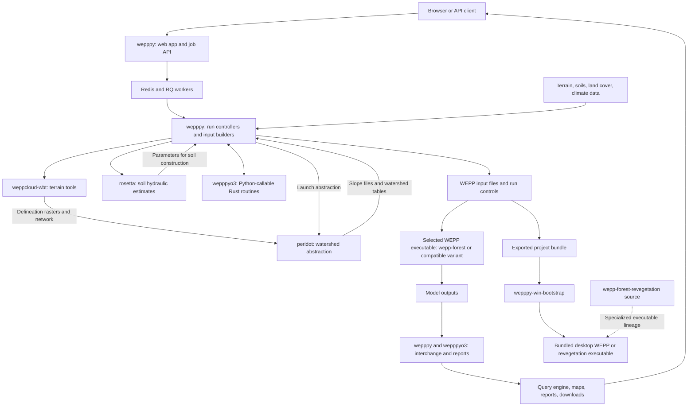

# WEPPcloud stack

> Draft based on the local repositories under `~/src`, inspected 2026-09-15.
> This is a source-level map, not a verification of the versions deployed on a server.

## Overview

WEPPcloud turns terrain, soil, vegetation, climate, and management data into
Water Erosion Prediction Project (WEPP) simulations and browsable results.
The stack combines a Python web application and workflow engine, Rust terrain
and data-processing components, a Python soil-property model, and Fortran
simulation executables. A separate bootstrap repository supports running
downloaded projects on a personal computer.

The eight repositories have different integration boundaries: Python imports,
command-line executables, generated files, and downloadable project bundles.
They are not eight independently deployed web services.

| Repository | Role | How WEPPcloud uses it |
| --- | --- | --- |
| `wepppy` | Application, workflow orchestration, input generation, execution wrappers, reports, and infrastructure | Hosts the web application and workers; coordinates the other components |
| `wepppyo3` | Rust routines exposed to Python through PyO3 | Imported by Python for native processing; current WEPPpy also requires its WEPP interchange API |
| `weppcloud-wbt` | WEPPcloud's WhiteboxTools fork for terrain processing and delineation | Python wrapper launches the compiled terrain tools |
| `peridot` | Converts delineated terrain into an explicit watershed graph and WEPP slope inputs | WEPPpy launches vendored command-line binaries and consumes their files |
| `rosetta` | Estimates soil hydraulic properties from soil measurements | Imported by the soil-building code |
| `wepp-forest` | Forest-oriented WEPP simulation source and releases | Compiled executables are vendored into WEPPpy and selected by the runner |
| `wepp-forest-revegetation` | Separate WEPP variant with vegetation-recovery and soil-conductivity behavior | Supplies a specialized model lineage; the desktop bootstrap explicitly supports a revegetation executable |
| `wepppy-win-bootstrap` | Downloads and executes prepared WEPPcloud projects locally | Consumes exported projects and runs bundled model binaries outside the server stack |

## Relationships at a glance

Arrows below describe calls or artifact transfers. The model boxes represent
compiled releases from the source repositories; workers do not compile Fortran
for each project.

WBT and Peridot are complementary stages. WBT determines drainage and terrain
partitions; Peridot turns those partitions into model elements and slope
profiles. Rosetta contributes soil parameters. WEPP performs the physical
simulation. WEPPpy coordinates those stages and exposes their results.

## Repository details

### wepppy — application and orchestration

`wepppy` is both the Python package and the repository containing much of the
surrounding WEPPcloud application stack.

- **Web interface:** Flask/Gunicorn routes, templates, JavaScript controllers,
  authentication, run controls, maps, and reports in `wepppy/weppcloud/`.
- **Run state:** NoDb controllers in `wepppy/nodb/` persist run configuration to
  files, coordinate mutations with locks, and use Redis for caching.
- **Background work:** `wepppy/rq/` executes long-running jobs. The FastAPI
  `rq-engine` provides job submission, status, and cancellation APIs.
- **Input construction:** terrain adapters, climate builders, soils, land cover,
  management files, and optional modules assemble a runnable model project.
- **Model execution:** the top-level `wepp_runner/` package writes run-control
  files and launches hillslope and watershed executables.
- **Results:** `wepppy/wepp/interchange/` coordinates native output conversion;
  the query engine uses DuckDB to query run artifacts such as Parquet files.
- **Operations:** `docker/`, `services/`, `wctl/`, and `scripts/` provide images,
  service definitions, telemetry, and deployment tooling.

Source entry points: [architecture](../ARCHITECTURE.md),
[NoDb concurrency contract](schemas/nodb-persistence-concurrency-contract.md),
[RQ dependency catalog](../wepppy/rq/job-dependencies-catalog.md), and
[WEPP runner](../wepp_runner/README.md).

### wepppyo3 — native routines called from Python

PyO3 exposes Rust functions as Python extension modules. This keeps native
processing within the Python workflow without launching a separate web service.

The inspected checkout contains four Cargo workspace members:

| Member | Responsibility visible in this checkout |
| --- | --- |
| `raster` | Shared raster implementation used by the native code |
| `raster_characteristics` | Raster summaries, including modal and median values within raster-defined regions |
| `cli_revision` | WEPP climate-file processing, exposed through `wepppyo3.climate` |
| `wepp_viz` | Native helpers for WEPP visualization |

Packaged extensions live under platform/Python-specific `release/` directories.
WEPPpy's Dockerfiles configure import paths for the Linux Python 3.12 release.

**Local checkout mismatch:** current WEPPpy additionally imports
`wepppyo3.wepp_interchange` and requires native interchange symbols. That module
is absent from the inspected sibling checkout, as are the `docs/module-registry.md`
and `docs/architecture-and-boundaries.md` files referenced by WEPPpy's architecture
guide. These local checkouts therefore do not, by themselves, establish a
compatible complete runtime. The broader native API is a requirement visible
in the WEPPpy consumer, not an implementation verified in this sibling snapshot.

Sources: [Cargo workspace](../../wepppyo3/Cargo.toml),
[packaged raster API](../../wepppyo3/release/linux/py312/wepppyo3/raster_characteristics/__init__.py),
[WEPP interchange contract](../wepppy/wepp/interchange/wepppyo3-interchange-spec.md),
[native import boundary](../wepppy/wepp/interchange/_rust_interchange.py), and
[startup preflight](../docker/wepppyo3-interchange-preflight.py).

### weppcloud-wbt — terrain and drainage delineation

This Rust fork of WhiteboxTools supplies WEPPcloud-specific hydrologic tools
alongside the underlying GIS and raster framework. The Python-facing
`WBT/whitebox_tools.py` wrapper invokes the compiled `whitebox_tools` executable.

Its responsibilities include DEM conditioning, flow directions, channel-network
construction and pruning, outlet discovery, watershed delineation, and
TOPAZ-style hillslope identifiers. Examples include `HillslopesTopaz`,
`FindOutlet`, `StreamJunctionIdentifier`, and `PruneStrahlerStreamOrder`.
These outputs feed Peridot and other WEPPpy terrain workflows.

WEPPpy's WBT adapter writes run-scoped artifacts under `dem/wbt/`, including
terrain, flow-direction, hillslope, and network products. WBT is one supported
delineation backend; some WEPPcloud workflows specifically require it, including
automatic outlet discovery and reuse of precomputed channel rasters.

Sources: [toolkit README](../../weppcloud-wbt/README.md),
[WEPPpy adapter](../wepppy/topo/wbt/wbt_topaz_emulator.py), and
[release/cutover guide](dev-notes/weppcloud-wbt-release-cutover.md).

### peridot — watershed graph and slope abstraction

Peridot is a Rust command-line application that consumes existing delineation
artifacts and represents channels, hillslopes, flowpaths, and optional field
intersections as an explicit graph. It derives the geometry used by WEPP.

Principal entry points are:

- `abstract_watershed` for TOPAZ `.ARC` inputs.
- `wbt_abstract_watershed` for WBT-derived inputs.
- `sub_fields_abstraction` for agricultural field/hillslope intersections.
- `trace_downslope_flowpath` and `subfield_channel_connectivity` for focused
  connectivity workflows.

The watershed stage emits `watershed/slope_files/`, `channels.parquet`,
`hillslopes.parquet`, `channels.geojson`, `network.txt`, and a generated
`README.md` manifest. Full flowpath tables and profiles are conditional outputs.
Representative-flowpath mode intentionally changes the abstraction strategy
and disables full flowpath export.

WEPPpy's runner invokes binaries in `wepppy/topo/peridot/bin/`, records process
output in `_peridot.log`, and performs downstream table/manifest processing.
The sibling Rust checkout is the development source; its presence alone does
not replace those vendored executables.

Sources: [Peridot overview](../../peridot/README.md),
[output contract](../../peridot/docs/contracts/watershed-output-contract.md), and
[WEPPpy runner](../wepppy/topo/peridot/peridot_runner.py).

### rosetta — soil hydraulic parameter estimation

Rosetta is a Python implementation of soil pedotransfer functions: it estimates
hydraulic properties from more commonly available measurements such as sand,
silt, clay, and bulk density. Outputs include soil-water retention parameters,
saturated hydraulic conductivity, and optional field-capacity and wilting-point
estimates.

WEPPpy's SSURGO builder imports `Rosetta2` and `Rosetta3`. It uses predictions
where the soil-building contract calls for estimation or replacement of invalid
water-content values. WEPPpy owns the selection rules, unit conversions,
validation, and final WEPP soil-file construction.

The repository includes neural-network/model data in `db/rosetta.duckdb` and
associated Parquet files. This is a bundled model-data store, separate from the
WEPPcloud account database and the per-run query engine. Docker image builds
install Rosetta as a Python package.

Sources: [Rosetta README](../../rosetta/README.md),
[SSURGO implementation](../wepppy/soils/ssurgo/ssurgo.py), and
[soil-building documentation](../wepppy/soils/README.md).

### wepp-forest — WEPP simulation engine

This repository contains the forest-oriented Fortran WEPP source, build tools,
release executables, and numerical regression fixtures. The model simulates
water balance, runoff, erosion, sediment transport, and watershed routing using
the input files prepared by WEPPpy.

The build supports watershed (`wepp`) and hillslope (`wepp_hill`) executables.
WEPPpy distributes selected releases under `wepp_runner/bin/`; the runner
resolves the configured executable and its hillslope companion. Release JSON
sidecars describe capabilities that affect run prompts and hillslope-pass
formats, including modern HBP support. Binary and input-format compatibility
is therefore part of the integration contract.

The source checkout and the server's selected release are separate identities.
Editing or building the sibling repository does not automatically change the
binary selected for a WEPPcloud run.

Sources: [model README](../../wepp-forest/README.md),
[runner implementation](../wepp_runner/wepp_runner.py), and
[prompt/capability contract](../wepp_runner/README.md#watershed-prompt-contracts-legacy-vs-modern-binaries).

### wepp-forest-revegetation — specialized model variant

This separate Fortran source tree contains changes associated with vegetation
recovery and its interaction with soil hydraulic behavior. In the inspected
source, soil format `9005` reads additional texture/conductivity fields;
`infpar.for` uses ground cover in conductivity calculations; and `grow.for`
contains revegetation-specific growth logic.

It occupies the simulation-engine layer. It is not a Python vegetation
preprocessor or a second model stage that always runs after `wepp-forest`.
Use depends on the selected executable and compatible prepared inputs.

The desktop bootstrap explicitly selects `bin/wepp_reveg.exe` with its
`--revegetation` option. The bootstrap README describes this workflow for
`9005` soils. The inspected sources do not establish that every server-side
revegetation run uses a binary built from this exact checkout, or that the
current forest and revegetation branches have identical fixes.

Sources: [build README](../../wepp-forest-revegetation/README.md),
[soil input reader](../../wepp-forest-revegetation/src/input.for),
[infiltration parameters](../../wepp-forest-revegetation/src/infpar.for), and
[growth code](../../wepp-forest-revegetation/src/grow.for).

### wepppy-win-bootstrap — local project execution

This repository provides download scripts, a Python project runner, supporting
input-preparation/post-processing scripts, and bundled WEPP executables.
Its main workflow is:

1. Download a prepared WEPPcloud project and extract it locally.
2. Read the project's existing `wepp/runs/` inputs and run-control files.
3. Execute hillslopes, in parallel by default, then the watershed simulation.
4. Optionally perform water-year calculations or explicit input preparation.

The runner selects `wepppy-win-bootstrap.exe` by default on Windows and supports
the revegetation executable. The repository also documents an Apple Silicon
workflow, and the runner has a macOS ARM64 binary selection path.

This extends WEPPcloud's prepared-project workflow to local compute. It does not
reproduce the web application, RQ services, or the whole geospatial preprocessing
environment. Reproducibility depends on preserving inputs and knowing which
desktop model executable ran them.

The similarly named **WEPPcloud Bootstrap** feature inside WEPPpy is a separate
Git-backed, server-side input-editing workflow. See its
[specification](weppcloud-bootstrap-spec.md).

Sources: [desktop README](../../wepppy-win-bootstrap/README.md) and
[project runner](../../wepppy-win-bootstrap/scripts/run_project.py).

## End-to-end data flow

| Stage | Main owner | Artifacts or interface passed forward |
| --- | --- | --- |
| Create/configure project | WEPPpy web app and NoDb | Run configuration, spatial extent, outlet, model/scenario settings |
| Acquire and prepare data | WEPPpy builders and data services | DEM, soil/land-cover rasters, climate data, management selections |
| Delineate terrain | WBT or another configured backend | Flow directions, channel network, hillslope/watershed rasters |
| Abstract watershed | Peridot, invoked by WEPPpy | Slope profiles, topology, hillslope/channel tables and manifest |
| Build model inputs | WEPPpy, Rosetta, selected native helpers | `.slp`, `.sol`, `.cli`, `.man`, routing and auxiliary inputs |
| Run hillslopes and watershed | WEPPpy runner and selected Fortran release | Hillslope pass files, water balance, runoff, erosion and routing outputs |
| Convert and publish results | WEPPpy and required wepppyo3 interchange | Parquet interchange, query catalogs, maps, reports and exports |
| Re-run locally, when requested | Windows bootstrap and bundled executable | Local simulation logs and model outputs from exported inputs |

The canonical server run root is `/wc1/runs/`, conventionally
`/wc1/runs/<first-two-runid-characters>/<runid>/`. A run contains persistent
configuration, intermediate data, model inputs, outputs, logs, and provenance.
Some runs include additional scenario or module directories.

Inputs, intermediate and failed-attempt artifacts, diagnostics, and final
results are project records. Their visibility and archive behavior follow the
[artifact observability standard](standards/artifact-observability-standard.md).

## Services surrounding the scientific components

The eight repositories sit within a larger service topology. The following
groups are visible in [development Compose](../docker/docker-compose.dev.yml);
deployment presets determine which services run on a particular host.

| Service/group | Purpose |
| --- | --- |
| Caddy | Reverse proxy and static-file delivery |
| `weppcloud` | Flask web application served by Gunicorn |
| `rq-engine`, RQ worker pools, scheduler, RQ dashboard | Job APIs, asynchronous execution, scheduling and job inspection |
| Redis | Queues, locks, run metadata, caches, sessions and status messaging |
| PostgreSQL and backup service | Relational application/account persistence and its backups; NoDb run state remains file-backed |
| `status`, `preflight` | Go services streaming status and readiness information to clients |
| `browse`, `download`, `dtale` | Run artifact browsing, downloads and tabular inspection |
| `query-engine` | DuckDB-backed run analytics and MCP/API access |
| `elevationquery`, `metquery`, `wmesque`, `wmesque2` | Elevation, meteorological and raster-data services |
| `weppcloudr` | R-based report-rendering service |
| `shape-converter` | Geospatial upload/conversion service |
| CAP, profile-playback, `fcgiwrap` | Challenge verification, recorded workflow playback, and CGI support |
| `webpush` | Optional Compose profile containing a placeholder service; no notification implementation is established by this definition |

Scientific data collections, climate generators, GDAL/PROJ, and optional model
integrations also sit outside the eight-repository list. This document maps the
requested repositories and their service context; the Compose files and module
contracts carry the exhaustive configuration for each deployment.

## Packaging and deployment relationships

- **Development layout:** sibling repositories under `~/src` correspond to
  `/workdir/...` paths in the Linux development environment. Development Compose
  mounts `rosetta`, `peridot`, `weppcloud-wbt`, and `wepppyo3` alongside WEPPpy.
  A mount alone does not prove an import or executable resolves to that checkout.
- **Native Python and WBT releases:** Dockerfiles configure Python paths for
  WBT's wrapper and the packaged wepppyo3 extensions. Image-vendored copies and
  development mounts have different resolution paths.
- **Rosetta:** Dockerfiles install its package and bundled model data into the
  Python environment; a sibling source mount is distinct from that installation.
- **Peridot and WEPP:** the inspected WEPPpy runners resolve executables from
  WEPPpy's own vendored `bin/` directories. Their source repositories are build
  inputs and provenance references, not mandatory per-job source checkouts.
- **Desktop bootstrap:** ships its own executables and runs independently of
  server containers after downloading the necessary project files.

`wepp.cloud` production uses Docker Compose through the installed `wctl` preset
and [deployment script](../scripts/deploy-production.sh). `openwepp.org` uses
Kubernetes. Use the relevant deployment documentation to resolve a host's actual
topology and release; the developer's sibling checkout versions are not a
deployment manifest.

Packaging sources: [development image](../docker/Dockerfile.dev),
[production image](../docker/Dockerfile), and
[infrastructure knowledgebase](infrastructure/README.md).

## Licensing

The table records declarations found in the inspected local checkouts. A
repository-level license and a license attached to individual source files have
different scopes. This inventory does not assign a single license to the full
stack or extend repository declarations to bundled dependencies, datasets, or
precompiled executables with separate provenance.

The licensing inventory also includes the sibling `topaz` terrain-processing
and `jimf-cligen532` climate-generator repositories.

| Repository | Declared license | Evidence and scope |
| --- | --- | --- |
| `wepppy` | BSD 3-Clause (`BSD-3-Clause`) | Root [license.txt](../license.txt); copyright University of Idaho, 2018 |
| `wepppyo3` | BSD 3-Clause (`BSD-3-Clause`) | Root [LICENSE](../../wepppyo3/LICENSE); copyright WEPP in the Woods, 2023 |
| `peridot` | MIT (`MIT`) | Root [LICENSE](../../peridot/LICENSE); copyright Roger Lew, 2026; [Cargo.toml](../../peridot/Cargo.toml) also declares MIT. The README preserves separate terms for bundled third-party components |
| `weppcloud-wbt` | MIT (`MIT`) | Root [LICENSE.txt](../../weppcloud-wbt/LICENSE.txt) names John Lindsay for core WBT/tools and Roger Lew for WEPPcloud tools/amendments; [Python package metadata](../../weppcloud-wbt/pyproject.toml) also declares MIT |
| `rosetta` | GNU GPL version 2 or later (`GPL-2.0-or-later`) | Root [license.txt](../../rosetta/license.txt) explicitly permits version 2 or any later version; the README's shorter “GNU GPL V2” description omits that qualifier |
| `wepp-forest` | No repository-level license declaration found; `CC0-1.0` on five rewritten routines | SPDX headers declare CC0 in [imppol.f90](../../wepp-forest/src/imppol.f90), [imppow.f90](../../wepp-forest/src/imppow.f90), [impris.f90](../../wepp-forest/src/impris.f90), [impsvb.f90](../../wepp-forest/src/impsvb.f90), and [impsvd.f90](../../wepp-forest/src/impsvd.f90); these are file-level declarations |
| `wepp-forest-revegetation` | No repository-level license declaration found | Source includes Numerical Recipes Software copyright notices in `imppol.for`, `imppow.for`, `impris.for`, `impsvb.for`, and [impsvd.for](../../wepp-forest-revegetation/src/impsvd.for); the forest repository's CC0 rewrite declarations do not describe these separate files |
| `wepppy-win-bootstrap` | MIT (`MIT`) | Root [LICENSE](../../wepppy-win-bootstrap/LICENSE); copyright University of Idaho, 2026. The README applies MIT to repository-authored code and preserves separate terms/notices for bundled third-party code, executables, and datasets |
| `topaz` | No repository-level license declaration found | No license file found; [README](../../topaz/README.md) credits Jurgen D. Garbrecht as author and Roger Lew as repository maintainer without declaring a license |
| `jimf-cligen532` | No repository-level license declaration found | [README](../../jimf-cligen532/README.md) attributes source and executables to Jim Frankenberger at USDA-ARS without declaring a license; [cligen.f](../../jimf-cligen532/cligen532/cligen.f) describes its ACM chi-square code as public domain, a component-specific statement |

“No repository-level license declaration found” describes the inspection result,
not a public-domain designation. Copyright notices are recorded separately from
explicit license grants. The table covers these ten repositories' declarations,
not a transitive dependency license audit.

MIT declarations were added at the repository owner's request and pushed in
Peridot commit `6eaa326` and Windows bootstrap commit `c7f93be`, with the bootstrap
copyright holder corrected to University of Idaho in commit `75a8c04`. These licensing
updates supersede the absence of declarations in the initial inspection below;
they do not relicense bundled third-party components.

## Inspection provenance and remaining verification

The draft was prepared from these local HEAD revisions and their working trees.
Revisions identify the inspected source baseline, not the provenance of every
precompiled binary stored within it. Existing unrelated WEPPpy working-tree
changes were present during inspection.

| Repository under `~/src` | HEAD inspected |
| --- | --- |
| `wepppy` | `e8edf2030dba` |
| `wepppyo3` | `86981caec87d` |
| `peridot` | `8343b8fd1bb7` |
| `weppcloud-wbt` | `314d15d68344` |
| `rosetta` | `2aea4acd0529` |
| `wepp-forest` | `2444b521210d` |
| `wepp-forest-revegetation` | `6139c922b86c` |
| `wepppy-win-bootstrap` | `e849b192ba98` |
| `topaz` (licensing inventory) | `116607fc1185` |
| `jimf-cligen532` (licensing inventory) | `c8cac87739f6` |

Before using this as a deployed-version inventory, resolve the wepppyo3
checkout/API mismatch and record the deployed images, native import locations,
and selected model/Peridot binary provenance. No builds, model simulations, or
live-server checks were performed for this documentation draft.

Links to sibling repositories use the requested `~/src` layout. They work in
that local layout; they are not portable cross-repository links in a standalone
WEPPpy checkout or its GitHub documentation view.
