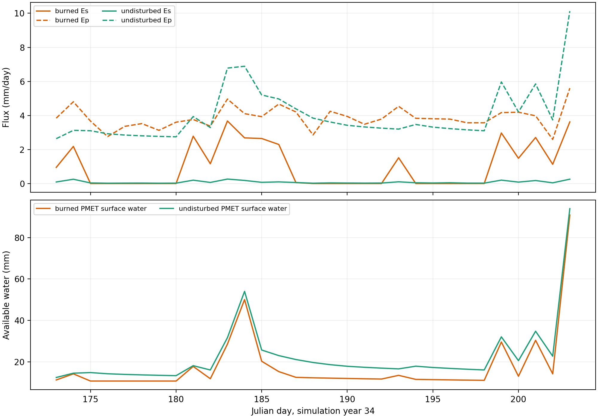

# Stevens Canyon antecedent PMET state

## Caption

Area-weighted burned and undisturbed plant transpiration (`Ep`), realized soil
evaporation (`Es`), and PMET evaporative-layer available water for simulation
year 34, Julian days 173–203. H49-H61 are weighted by contributing area above
reach 173.

## Interpretation

Burned `Es` repeatedly activates after wetting events, while undisturbed `Es`
remains near zero and its atmospheric flux is predominantly plant-side. The
lower panel shows that burned PMET surface water is generally lower between
wetting events even though the paired climate is identical. The large day-203
water increase is storm wetting; it occurs too late to explain the antecedent
surface-saturation difference.

## Limitations

The PMET surface-water term represents water available to the evaporation
calculation in the upper 0.1 m, including same-day wetting. It is not identical
to the layer 1–3 saturation metric from `H*.grph.dat`. Lines are area-weighted
model states, not field observations.

## Provenance

Generated by [`run_event_attribution.py`](run_event_attribution.py) using the
study-only instrumented `wepp_hill` binary and production-derived hillslope
fixtures. The same-binary observation-off parity check passed.
