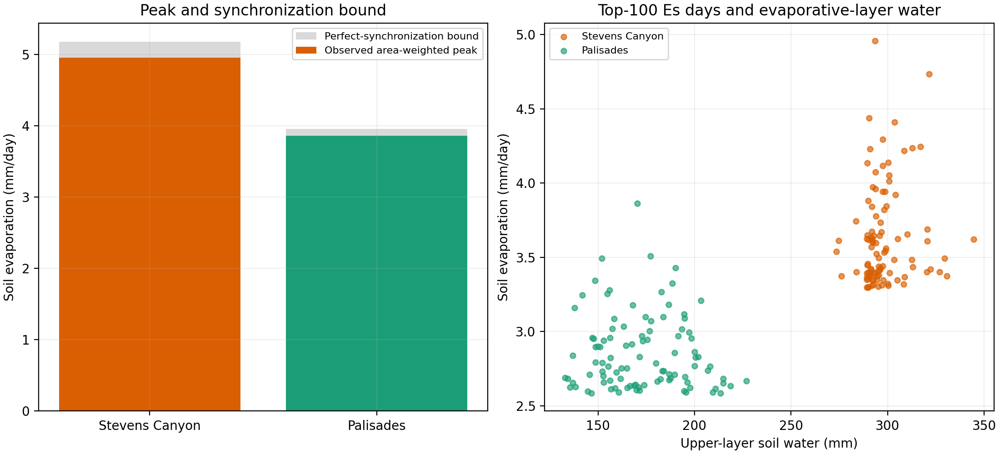

# Peak soil-evaporation counterfactual

## Caption

Observed burned-PMET area-weighted peak `Es` and the exact upper bound obtained by placing every hillslope's own maximum on one day (left); realized `Es` versus upper evaporative-layer water on each site's 100 largest area-weighted `Es` days (right).

## Interpretation

The gap between each paired bar is the maximum peak increase available from spatial synchronization alone. The scatter tests whether large Stevens values require water to remain available in WEPP's upper evaporative layer. It does not independently swap atmospheric forcing and water state, which co-evolve in a continuous simulation.

## Limitations

The synchronization bar is an intentionally impossible upper bound, not a predicted watershed response. Cross-site differences combine climate, soils, vegetation, and record length unless a controlled model intervention separates them. Absolute upper-layer soil-water values are also site-specific because soil profiles and capacities differ; the right panel establishes separation, not interchangeable relative wetness.

## Provenance

Generated by `run_counterfactual.py` with `wepp_260803_hill`; all Palisades runs retained the production `wepp_ui.txt` and PMET sidecars.
