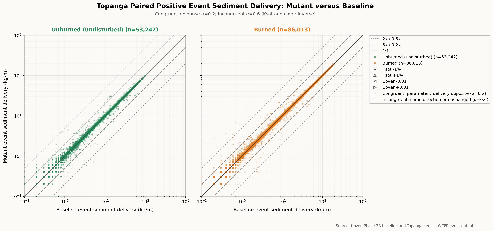

# Topanga Mutant versus Baseline Event Sediment Delivery

## Figure Caption

Mutant event sediment delivery versus baseline event sediment delivery for
139,255 paired-positive Topanga event rows. Both axes are logarithmic and use
kg/m, WEPP's `Sed.Del` event-output field. This is sediment delivered at the
hillslope outlet per unit width, not gross hillslope detachment. Unburned
(green) and burned (orange) hillslopes are shown on separate left and right
axes with identical scales, preventing either stratum from masking the other.
Hollow triangle orientation identifies the mutation: downward and upward triangles
are Ksat -1% and +1%, respectively; leftward and rightward triangles are paired
cover -0.01 and +0.01, respectively. The solid reference is 1:1, dashed
references are 0.5x and 2x, and dotted references are 0.2x and 5x.

Marker opacity follows an inverse-response rule. Increasing either Ksat or
cover is expected to reduce sediment delivery, while decreasing either
parameter is expected to increase delivery. Opposite-direction parameter and
delivery changes are labeled congruent and plotted at opacity 0.2.
Same-direction or exactly unchanged delivery responses are labeled
incongruent and plotted at opacity 0.6.

## Interpretation

Event sediment delivery is strongly concentrated near the 1:1 line. Only 271
rows (0.195% of the plotted population) lie outside the 0.5x-2x band, and 55
rows (0.039%) lie outside the 0.2x-5x band. Ksat mutations account for 245 of
the 271 twofold-tail rows (90.4%) and 49 of the 55 fivefold-tail rows (89.1%).
The distant erosion-response population is therefore small, but—like the
peak-flow extreme population—is overwhelmingly associated with Ksat rather
than cover mutations.

The opacity classification requires caution here. Overall, 53,811 rows
(38.6%) are congruent: 17,627 of 69,520 Ksat rows (25.4%) and 36,184 of 69,735
cover rows (51.9%). However, WEPP writes `Sed.Del` to the retained event files
at 0.1 kg/m precision. Consequently, 76,398 rows (54.9%) are exact printed
ties and are assigned to the incongruent display class. The prominent dark
1:1 spine largely reflects output quantization and should not be interpreted
as evidence that most underlying responses have exactly zero slope.

The burned population supplies 86,013 plotted rows and the unburned population
53,242. Burned hillslopes account for 163 of the 271 twofold-tail rows and 35
of the 55 fivefold-tail rows. The visual spread widens toward small sediment
delivery, where rounding to 0.1 kg/m produces coarse relative ratios and
visible horizontal and vertical steps. Tail interpretation is therefore more
credible at moderate and large delivery than near the lower plotting limit.
The separated panels show nearly identical twofold-tail prevalence: 0.203% for
unburned rows and 0.190% for burned rows. Neither stratum's material tail was
being hidden by the other.

## Event-Presence Accounting

The event-date pairing produced 225,654 rows before the positive-delivery
filter. Of these, 139,255 have positive delivery in both runs, 505 have
positive baseline delivery only, 516 have positive mutant delivery only, and
85,378 have positive delivery in neither run. The one-sided and zero-delivery
rows cannot be placed on logarithmic axes and are not shown, but they remain
part of the accounting rather than being silently discarded.

## Interpretation Limits

These percentages describe event rows, not independent hillslopes, mutation
trials, storms, or watersheds. Event sediment delivery combines detachment,
deposition, and hillslope transport; it should not be read as a direct measure
of gross erosion everywhere on the slope. The baseline files come from the
frozen Phase 2A diagnostic evidence and the mutant files from the frozen
Topanga census evidence. Both use the same WEPP diagnostic build and study
configuration, but the sediment-delivery comparison is derived from retained
WEPP event files rather than from the peak-flow event-pair ledger itself.

## Provenance

The figure is generated by
[`plot_mutant_vs_baseline_erosion.py`](plot_mutant_vs_baseline_erosion.py).
The script reads the frozen Phase 2A baseline `.ebe.dat` files and the frozen
Topanga census mutant `.ebe.dat` files under plan
`b575fde4a28cf85f1d28e0dfff305472b5419fd9b3639d39dc437600617080de`.
It pairs records by scenario, hillslope, mutation, calendar year, and day of
year, and records the sediment field, units, positive-event filter, reference
lines, scenario colors, marker mapping, opacity classification, and excluded
event-presence counts.
