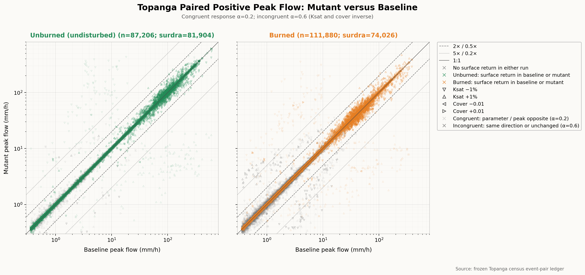

# Topanga Mutant versus Baseline Peak Flow

## Figure Caption

Mutant peak flow versus baseline peak flow for 199,086 paired-positive Topanga
event rows. Both axes are logarithmic and use mm/h. The plotted population
requires a baseline peak of at least `1e-7 m/s` and a positive mutant peak.
Unburned and burned hillslopes are shown on separate left and right axes with
identical scales, preventing either stratum from masking the other. A pair is
classified as having surface return when `surdra_realized_m` is positive in
either its baseline or mutant run. Those pairs are green in the unburned panel
and orange in the burned panel; pairs with no surface return in either run are
gray. Hollow triangle orientation identifies the mutation: downward and
upward triangles are Ksat -1% and +1%, respectively; leftward and rightward
triangles are paired cover -0.01 and +0.01, respectively. The solid reference
is 1:1, dashed references are 0.5x and 2x, and dotted references are 0.2x and
5x.

Marker opacity encodes directional agreement with the ordinary surface-runoff
expectation. Higher Ksat increases infiltration capacity, and higher cover
generally promotes infiltration, interception, and surface resistance; both
are therefore expected to reduce surface-runoff peak flow. A response is
**congruent** when either parameter and peak flow move in opposite directions;
these markers use opacity 0.2. A response is **incongruent** when parameter and
peak move in the same direction or the peak is exactly unchanged; these
markers use opacity 0.6.

## Extended Interpretation

The primary population forms a dense spine near 1:1, showing that most event
magnitudes remain close to their baselines under the deliberately small
mutations. Against that spine, a sparse but visually distinct population moves
far from parity. The marker grammar makes the family attribution clear: Ksat
triangles dominate both the upper and lower extreme branches, whereas paired
cover mutations are comparatively rare there.

The opacity encoding adds a second result. Under the corrected inverse rule,
127,665 of 199,086 plotted event rows (64.1%) are congruent. Directional
agreement is especially strong for Ksat: 87.4% of Ksat event rows move in the
expected direction. Cover differs, with only 39.2% congruent event rows.

| Population | Congruent | Incongruent | Congruent share |
|---|---:|---:|---:|
| Overall | 127,665 | 71,421 | 64.1% |
| Ksat | 90,033 | 13,012 | 87.4% |
| Cover | 37,632 | 58,409 | 39.2% |
| Burned | 79,336 | 32,544 | 70.9% |
| Unburned | 48,329 | 38,877 | 55.4% |

The extreme tail is small in prevalence but strongly structured. Only 989
event rows (0.50% of the plotted population) lie outside the 0.5x-2x band, but
907 of those 989 rows (91.7%) are Ksat mutations. Farther out, 604 rows (0.30%)
lie outside the 0.2x-5x band; 555 of those 604 rows (91.9%) are Ksat mutations.
Congruent responses account for 79.0% and 83.8% of those two tails,
respectively.

The separated panels show that the extreme branches occur in both strata.
The twofold-tail rate is 0.393% for unburned rows and 0.577% for burned rows;
the fivefold-tail rates are 0.280% and 0.322%, respectively. Burned conditions
have the higher tail prevalence, but the unburned extreme population is not an
overplotting artifact.

The surface-return partition is not a complete partition of the extreme tail.
Surface return occurs in 81,904 of 87,206 unburned rows and 74,026 of 111,880
burned rows. It occurs in 567 of the 989 twofold-tail rows and 420 of the 604
fivefold-tail rows. Thus, surface return is present in much of the anomalous
population, especially the far tail, but 422 twofold-tail rows and 184
fivefold-tail rows occur without positive `surdra` in either paired run. The
burned panel contains most of this no-return tail. The figure therefore argues
against treating the `surdra` timing pathway as the sole cause of every extreme
response.

This combination tells a sharper story than outlier prevalence alone. Small
Ksat perturbations are associated with most of the extreme peak-flow
departures, but those departures usually have the hydrologically expected
sign: decreasing Ksat raises peak flow, while increasing Ksat lowers it. The
surprise is therefore the magnitude and apparent separation of the response,
not primarily a reversed Ksat direction. Cover perturbations produce a higher
share of directionally incongruent event rows, but they do not dominate the
conspicuous tail population.

## Interpretation Limits

These counts describe event rows, not independent hillslopes or mutation
trials. A single trial contributes many events, so the percentages must not be
read as the fraction of hillslopes exhibiting a behavior. Directional
congruence also does not establish that the response magnitude is physically
reasonable. The plot is a screening view: it does not establish that every
extreme response is an implementation defect, identify a causal solver
transition, or support a channel or watershed-outlet claim. Trial-level
aggregation, adaptive bracketing, frozen-event replay, and mechanism
classification remain necessary to adjudicate the extreme Ksat population.

## Provenance

The figure is generated by
[`plot_mutant_vs_baseline.py`](plot_mutant_vs_baseline.py) from the frozen
Topanga census `event-pairs.parquet` ledger under plan
`b575fde4a28cf85f1d28e0dfff305472b5419fd9b3639d39dc437600617080de`.
The plotting script records the source path, positive-event filter, units,
reference lines, surface-return classification and colors, marker mapping, and
opacity classification.
