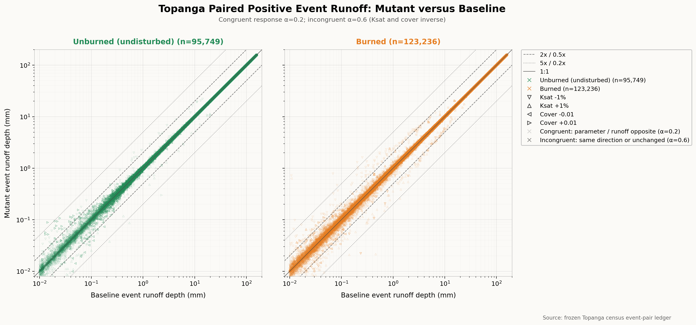

# Topanga Mutant versus Baseline Event Runoff

## Figure Caption

Mutant event runoff depth versus baseline event runoff depth for 218,985
paired-positive Topanga event rows. Both axes are logarithmic and use mm. The
plotted population requires baseline runoff of at least `1e-5 m` (`0.01 mm`)
and positive mutant runoff. Unburned (green) and burned (orange) hillslopes are
shown on separate left and right axes with identical scales, preventing either
stratum from masking the other. Hollow triangle orientation identifies the
mutation: downward and upward triangles are Ksat -1% and +1%, respectively;
leftward and rightward triangles are paired cover -0.01 and +0.01,
respectively. The solid reference is 1:1, dashed references are 0.5x and 2x,
and dotted references are 0.2x and 5x.

Marker opacity uses the same inverse-response rule as the peak-flow figure.
Increasing either Ksat or cover is expected to reduce runoff; decreasing
either parameter is expected to increase runoff. Opposite-direction parameter
and runoff changes are labeled congruent and plotted at opacity 0.2.
Same-direction or exactly unchanged runoff responses are labeled incongruent
and plotted at opacity 0.6.

## Interpretation

Event runoff is much more tightly concentrated around the 1:1 line than peak
flow. Only 451 rows (0.21% of the plotted population) lie outside the 0.5x-2x
band, and only 36 rows (0.016%) lie outside the 0.2x-5x band. Ksat accounts for
366 of the 451 twofold-tail rows (81.2%) and 26 of the 36 fivefold-tail rows
(72.2%).

Separate panels confirm tight runoff control in both strata. The twofold-tail
rate is 0.127% for unburned rows and 0.267% for burned rows; fivefold departures
remain rare at 0.014% and 0.019%, respectively.

The ordinary directional response is particularly strong for Ksat. Overall,
146,131 of 218,985 rows (66.7%) are congruent. Ksat is congruent in 111,359 of
113,242 rows (98.3%), whereas cover is congruent in 34,772 of 105,743 rows
(32.9%). Burned and unburned congruent shares are 74.5% and 56.8%,
respectively. Exactly unchanged runoff is assigned to the incongruent display
class; only 110 rows are exact ties.

The contrast with the peak-flow artifact is the principal result. Event runoff
volume is overwhelmingly stable and directionally ordinary under the small
Ksat probes, while peak-flow magnitude contains a much larger and more
structured extreme population. This supports the interpretation that the main
Topanga concern lies in how runoff is assigned a subdaily shape and peak, not
in a comparable instability of total event runoff depth.

## Interpretation Limits

These percentages describe event rows, not independent hillslopes, mutation
trials, storms, or watersheds. The positive-runoff figure excludes events
below the baseline runoff floor and events without positive mutant runoff;
event-presence changes remain in the complete census ledger and candidate
screen. Directional congruence does not by itself validate runoff magnitude or
mechanism.

## Provenance

The figure is generated by
[`plot_mutant_vs_baseline_runoff.py`](plot_mutant_vs_baseline_runoff.py) from
the frozen Topanga census `event-pairs.parquet` ledger under plan
`b575fde4a28cf85f1d28e0dfff305472b5419fd9b3639d39dc437600617080de`.
The script records the source path, positive-event filter, units, reference
lines, scenario colors, marker mapping, and opacity classification.
