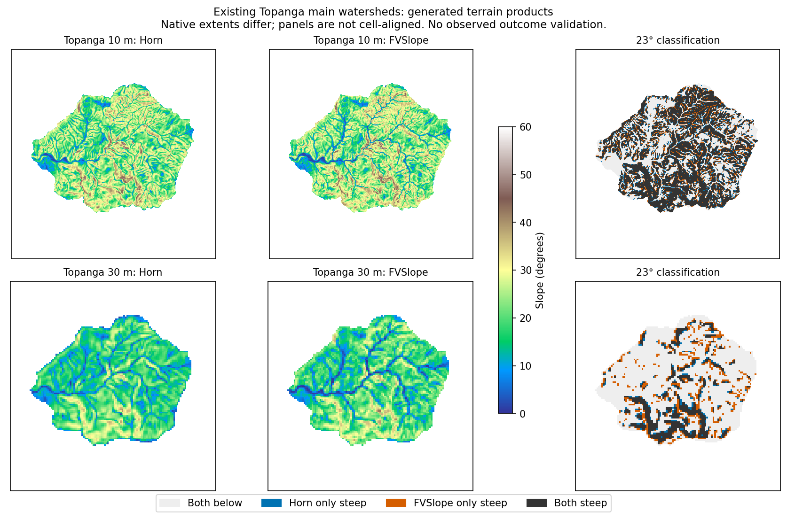

# Three-site slope/SBS method sensitivity

Completed 2026-09-09 UTC with rebuilt owned binary SHA-256
`6647d55c2d8d28680addd16adc4d9d406857a7ccb394cd4260a2d61d7d8ffc42`.
Full commands, source hashes, GDAL version and scalar-engine hash are in
[terrain provenance](terrain_provenance.json). Generated rasters remain in
`/tmp/staley-panel-delivery`; reproduce with WBT `tools/staley_slope_sbs_study.py`.

## Domain, SBS and comparison design

Use only the six existing main project masks/outlets from
`test_fixtures/staley_m3_resolution`. All 66 original fixture files are unchanged.
No SBS-named TIFF was present in the six source run trees or terrain fixture
inventory. No real SBS was acquired and Arizona dNBR was not treated as SBS.
[Source inventory](source_inventory.json) records runs and original outlet data.

SBS is explicitly synthetic: at each projected cell center, class is
`(floor(x/210 m) + floor(y/330 m)) mod 4`. This coordinate-anchored field is the
same at both resolutions, sampled on their native grids; 0/1/2/3 represent
unburned/low/moderate/high. It isolates spatial intersections without claiming
observed burning. Every method is first compared on the identical raw grid,
mask, synthetic SBS and common slope support. The existing D8 pointer is held
fixed for FVSlope; raw versus conditioned DEM is a separate comparison.
Existing WEPP preparation uses `FVSlope(dem=relief, units=ratio)` at
`wepppy/topo/wbt/wbt_topaz_emulator.py`; this study explicitly requests degrees.

## Same-grid raw terrain results

| Site | Grid | Horn T | FVSlope T | FV threshold crossings | Florinsky T | Florinsky crossings |
| --- | --- | --- | --- | --- | --- | --- |
| moscow_mountain | 10 m | 0.104926 | 0.105678 | 5433 | 0.113173 | 1668 |
| moscow_mountain | 30 m | 0.043264 | 0.059967 | 536 | 0.058187 | 232 |
| topanga | 10 m | 0.271951 | 0.287317 | 7152 | 0.283451 | 1724 |
| topanga | 30 m | 0.102671 | 0.139119 | 815 | 0.120895 | 275 |
| az_ponderosa | 10 m | 0.071166 | 0.072092 | 7923 | 0.074281 | 1788 |
| az_ponderosa | 30 m | 0.043306 | 0.050165 | 1163 | 0.046873 | 289 |

All basin cells had slope and SBS support for all panel methods. Hence U=0 and
point T exists for every panel row. Partial-support behavior is demonstrated
separately by the analytical suite; panel completeness is not a coverage gate.
See [48 method rows](terrain_results.csv), [36 paired comparisons](method_comparisons.csv)
and [conditioning contrasts](conditioning.csv). Conditioning changes 0–11
Horn threshold classifications per watershed. Estimator choice changes many
more cells here; this does not establish a universal conditioning bound.

The GDAL 3.10.1 Horn comparator has zero basin threshold crossings relative to
owned Horn in these six fixtures (raw and conditioned). Maximum basin slope
error is 0.00149127 degrees. The installed GDAL implementation reads floating
terrain through float32 working buffers and performs the weighted sums in that
type before assigning double derivatives; see the pinned
[GDAL source](https://github.com/OSGeo/gdal/blob/v3.10.1/apps/gdaldem_lib.cpp#L1258).
A read-only Float64 conversion of Moscow DEM produced the same GDAL result,
confirming that changing source storage alone does not remove this difference.
The study uses an explicit float32 cancellation/rounding bound for this
comparator, not a relaxed threshold rule. The independent f64 analytical oracle
had maximum slope error 6.96e-13 degrees on 3,230 cells. Full-DEM Moscow
comparison includes three GDAL threshold crossings outside the basin; they do
not enter T. No general bitwise GDAL parity is claimed.

## Neighborhood and directional characterization

Analytical CLI planes span six azimuths and flat/below/exact/above-threshold
surfaces. At a representable exact cutoff the intersection is inclusive. Nominal
23-degree rotated planes may straddle the cutoff through f64 representation;
all recorded boundary cases are preserved in [analytical evidence](analytical_validation.json).
Classification always uses the unrounded gradient, not serialized/display slope.
A 45-degree surface with a westward routed receiver gives 35.26439 degrees
FVSlope, demonstrating the directional component rather than surface magnitude.

The independently calculated complete 3×3 example `1 2 3 / 4 5 6 / 7 8 9`
on a 1 m grid agrees with Horn. Removing its upper-right corner leaves seven
valid neighbors: the [published Esri rule](https://pro.arcgis.com/en/pro-app/3.5/tool-reference/spatial-analyst/how-slope-works.htm)
reweights the remaining side samples and still returns slope; strict Horn
returns unavailable. This is a formula comparison, not an executed ArcGIS
binary. Missing center, outer edges, and fewer valid neighbors remain unknown;
no legacy null-to-zero replacement is adopted. GDAL's gap behavior is not
assumed interchangeable with Esri reweighting.

## Native 10/30 m basin contrasts

These are native-basin contrasts, not pixel subtraction or isolated resolution
effects: project extents, sampled elevations, masks, synthetic field samples
and resolved outlet positions differ. No re-delineation or raster resampling
was performed. Existing outlet separations are 16.371 m (Moscow), 17.909 m
(Topanga), and 6.971 m (Arizona); original coordinates are in the source inventory.

| Site | Area 10 m (m²) | Area 30 m (m²) | Horn T 10 m | Horn T 30 m |
| --- | --- | --- | --- | --- |
| moscow_mountain | 6644700 | 6573600 | 0.104926 | 0.043264 |
| topanga | 4991700 | 4987800 | 0.271951 | 0.102671 |
| az_ponderosa | 22985800 | 22964400 | 0.071166 | 0.043306 |

[Native contrasts](native_resolution.csv) do not authorize an M1 resolution gate,
calibration equivalence claim or universal resolution acceptance.

## Probability scenarios and performance

[432 scenarios](probability_scenarios.csv) use the existing WEPPpy scalar M1
engine unchanged, with explicit synthetic F=0.5, S=0.25, rainfall accumulations
5/10/20 mm and durations 15/30/60 minutes. These are accumulation/duration
scenarios, not silently converted intensities. Maximum absolute method scenario
probability difference is 0.0302811 (Topanga 30 m, raw FVSlope versus Horn,
60 minutes, 20 mm). A reviewer independently recomputed the logistic results.
There is no recalibration, probability-bound publication, or predictive-accuracy
claim. A missing point T would retain unavailable probability.

The 12 Horn/intersection/summary CLI runs took 0.0289–0.4461 seconds wall time,
with peak process RSS 17.96–92.49 MiB on this host. These include input preflight,
fingerprinting, raster I/O and publication. [Timings](timings.csv) pin every
command; they do not extrapolate to the 10-million-cell resource ceiling.
Terrain differentiation and intersection remain owned Rust; Python creates
labeled fixtures, reads results and computes tabular/scalar summaries.

The inspected products retain native georeferencing, full-DEM slope, basin-only
intersection/support, exact count/area identities and completion markers.
The backend and both bindings are implemented locally. Production prepared SBS,
NoDb/UI/RQ orchestration, K and dNBR composition and deployment remain successors.
