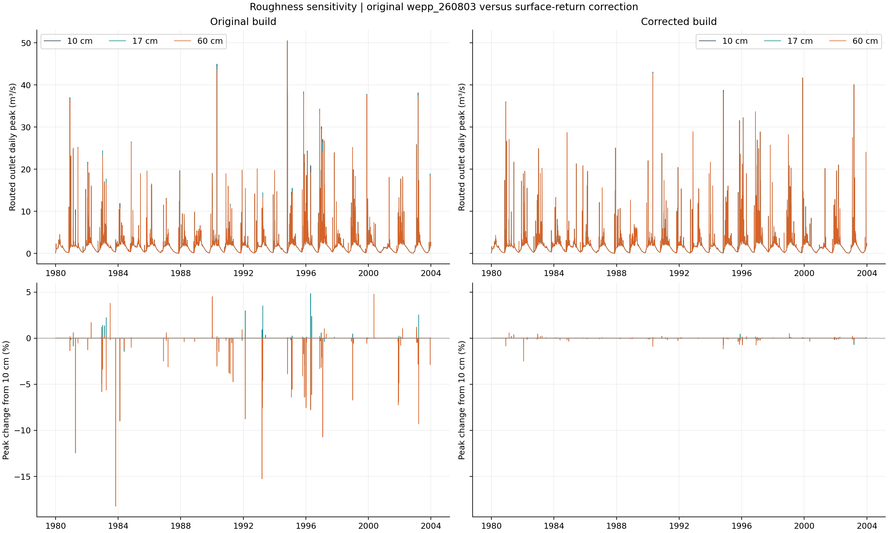
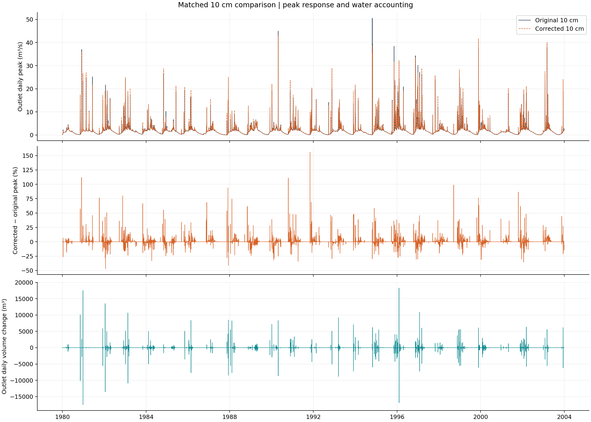
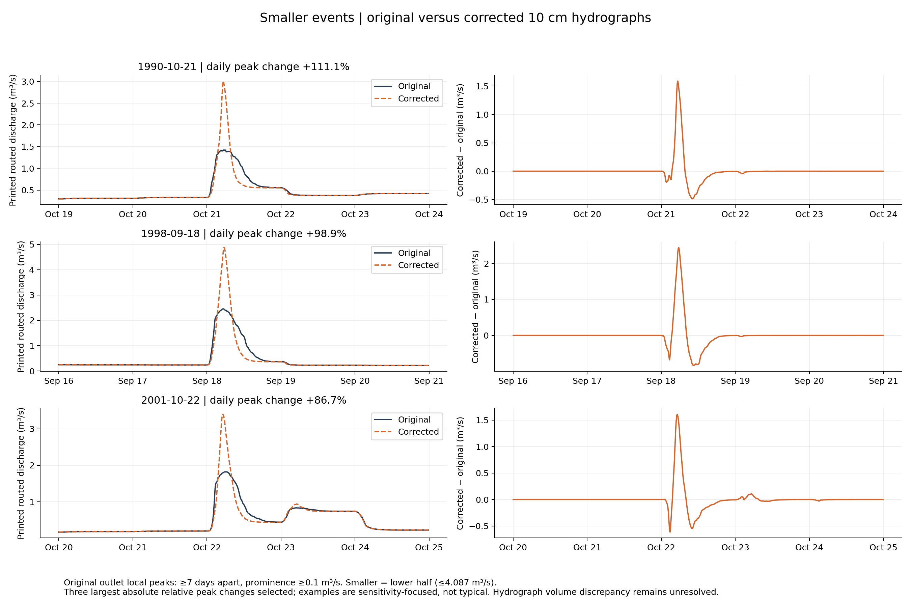
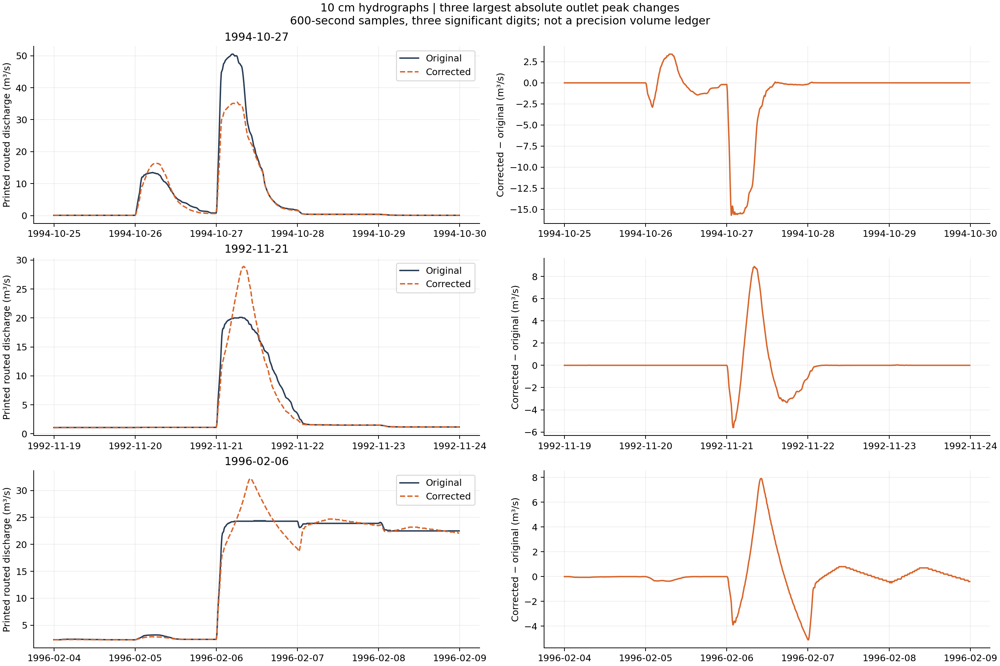

# Original WEPP roughness sensitivity and surface return comparison

The original `wepp_260803` build has substantially larger extreme outlet-peak responses to roughness than the corrected build on warming-championship. The corrected 10 cm run preserves long-term water yield closely, but changes many peaks and increases the discrepancy between the printed routed hydrograph integral and the outlet volume ledger. This supports the intended separation of return-water volume from peak assignment, not an unconditional validation of the corrected hydrograph.

All 2,596 model executions and the input-isolation, output-mode and artifact-integrity checks passed. All 6,059 output hashes per lane were independently reread and verified. No production run, default or binary was changed. See the [validation review](validation-review.md) for the distinction between completed research and unresolved hydrograph validation.

## Roughness sensitivity

These are daily outlet-peak changes relative to the same build's 10 cm run, over all 8,766 days in 1980–2003. They are not changes in the single largest peak of the simulation.

| Build | Roughness | Minimum daily peak change | Maximum daily peak change | Days changing by more than 1% |
| --- | --- | ---: | ---: | ---: |
| Original | 17 cm | −18.2345% | +4.8352% | 26 |
| Corrected | 17 cm | −1.5996% | +0.4515% | 2 |
| Original | 60 cm | −18.2345% | +4.7757% | 61 |
| Corrected | 60 cm | −2.5049% | +0.5672% | 3 |

The largest original relative reduction occurs on November 6, 1983: 1.36176 m³/s at 10 cm versus 1.11345 m³/s at both 17 and 60 cm. Identical reductions at those two roughness values are consistent with crossing a calculation threshold, but event-level tracing would be needed to confirm that mechanism for this particular day.

Long-term outlet-volume sensitivity is essentially unchanged between builds: about −0.01098% at 17 cm and −0.02106% at 60 cm. Increasing roughness does not uniformly reduce peaks. Original-build maximum daily peaks are 50.50288, 50.47683 and 50.53258 m³/s for 10, 17 and 60 cm respectively.

## Matched 10 cm validation

The executable input files match exactly across builds. The original release sources also match the retained unpatched source tree after normalizing the build system's sizing-include swap. The corrected source changes are confined to the surface-return estimator, its IRS integration and build registration.

At the hillslope level, only 106 of 7,573,824 daily runoff-volume records differ at printed precision, with a maximum absolute difference of 0.1 m³. Their aggregate difference is approximately −0.162 m³. In contrast, 392,667 hillslope peak records change. H352 on January 31, 1995 retains 4,077 m³ of runoff while its peak changes from 4.0447 to 0.10625 m³/s. Other peaks increase; the correction is not simply a peak-reduction rule.

Rebuilt totalwatsed streamflow differs by approximately +0.305 m³ across the full simulation, out of 1.2677 billion m³. The largest daily streamflow-depth difference is 0.0000113 mm. Lateral flow and baseflow are also nearly unchanged.

At the routed outlet, 2,356 daily peaks differ by more than 1%, with departures from −46.97% to +156.00%. There are 1,930 lower peaks, 2,417 higher peaks and 4,419 unchanged peaks at printed precision. The maximum daily peak anywhere in the record changes from 50.50288 to 43.06409 m³/s; these maxima occur on different dates. On the original maximum's date, October 27, 1994, the corrected peak is 35.45196 m³/s.

The 24-year outlet-volume ledger differs by only −4.25 m³ out of 1.2723 billion m³. This does not mean daily routed volumes are identical: 44 days differ by more than 1%, daily changes range from −8.62% to +2.57%, and the largest absolute daily difference is 18,273.74 m³. Channel routing and storage redistribute water across daily boundaries.

Smaller-event examples also show substantial changes between builds. Using the lower half of original local outlet peaks (at most 4.087 m³/s, with peaks at least seven days apart and prominence at least 0.1 m³/s), the three most responsive non-overlapping examples increase by 111.1%, 98.9% and 86.7%. These are deliberately selected sensitivity examples, not typical events. Their narrower, higher corrected hydrographs illustrate why daily totalwatsed curves cannot validate within-day rate assignment.

## Unresolved hydrograph validation concern

The printed 600-second routed-discharge integral is lower than the outlet volume ledger in both builds:

| 10 cm build | Integral shortfall | Shortfall relative to ledger | Conservative printing-rounding bound |
| --- | ---: | ---: | ---: |
| Original | 5,888,826 m³ | 0.4628% | 2,879,069 m³ |
| Corrected | 16,810,196 m³ | 1.3212% | 2,878,691 m³ |

Both discrepancies exceed the maximum cumulative error from rounding each positive discharge sample to three significant digits. The shortfall increases by approximately 10.92 million m³ in the corrected run. Neither curve has been rescaled to hide the discrepancy.

The five-day October 25–29, 1994 window is more concerning than the whole-record percentage suggests. Its volume ledger is 2,539,873.62 m³ originally and 2,539,873.33 m³ with the correction, but the printed hydrograph integrates to 2,518,796.22 and 2,075,129.58 m³ respectively. The deficit grows from 0.83% to 18.30%. Therefore the lower corrected peak on October 27 cannot yet be counted as a validated improvement in the hydrograph. Other selected events have smaller deficits or a small surplus; see the [event-volume checks](comparison/selected-event-volume-check.json). This is an observed output inconsistency, not proof that the soil-water balance lost the missing volume.

The original and corrected 10 cm PASS outputs also retain two H670 events with positive runoff volume and a reported zero peak: November 20–21, 1985 (Julian days 324–325), with 22.775 and 19.581 m³. These are shared anomalies, not newly introduced by the patch.

The ledger results support preservation of water yield. They do not establish volume closure of the routed hydrograph. Investigating the relationship between routed discharge samples and the channel volume ledger remains necessary before declaring the correction fully validated for hydrograph use. This comparison makes no deployment or release-approval claim.

## Evidence and reproducibility

See [methods](methods.md), [comparison summary](comparison/summary.json), [hydrograph volume checks](comparison/hydrograph-volume-check.json), and [source audit](evidence/source-audit.json). The three hydrograph windows are selected by largest absolute paired outlet-peak change, separated by more than seven days, rather than by the direction of the change. Raw outputs remain on forest at `/workdir/warming-rrinit-legacy-20261006`; corrected reference outputs remain unchanged at `/workdir/warming-rrinit-20261006`.
