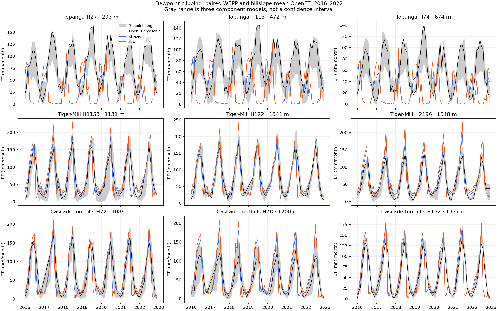
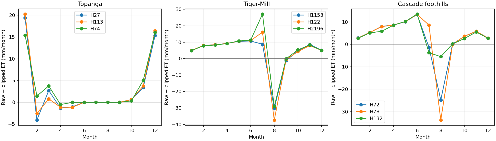

# Dewpoint clipping and OpenET: nine-hillslope study

Completed 2026-10-08. **Recommendation: retain existing clipping and defer a
general user-facing disable option.** This screening study finds a consistent
monthly ET advantage for the existing policy. It does not establish a physical
requirement for dewpoint to exceed Tmin, or resolve Anurag's original rationale.
Production clients, defaults and UI were not changed.

## Results

Nine hillslopes, three watersheds, 18 paired WEPP runs, and 36 OpenET polygon
series cover the common 2016–2022 assessment period. All 3,024 OpenET monthly
values are present and finite. Clipping gives lower monthly MAE and RMSE in
**36/36 site–product comparisons**: all nine sites against the ensemble,
eeMETRIC, PT-JPL and SSEBop. The same result holds in months with maximum
modeled snow water equivalent <=1 mm in both arms. Against the ensemble,
clipping gives lower monthly MAE in all **63/63 site–year comparisons**.
These are repeated, correlated comparisons, not independent replications or
statistical significance tests.

| Watershed (three hillslopes each) | Unclipped annual ET increase | Relative increase | Ensemble monthly MAE, clipped → unclipped |
| --- | --- | --- | --- |
| Topanga shrubland | 35–41 mm/year | 12.5–17.8% | 59.1 → 63.6 mm/month |
| Tiger-Mill forest | 48–69 mm/year | 5.5–9.0% | 17.4 → 25.1 mm/month |
| Cascade foothill forest | 35–48 mm/year | 4.9–7.8% | 22.3 → 28.1 mm/month |

MAE entries are unweighted means across the three selected hillslopes, not
watershed area-weighted estimates. See [per-site metrics](comparison-metrics.csv),
[annual comparisons](annual-comparison.csv), [paired effects](paired-summary.csv)
and [machine-readable counts](conclusions.json).

The gray band spans three component models; it is not a confidence interval and
does not cover all six OpenET models. Full-resolution [SVG](monthly-et.svg).

## Why the monthly result differs from annual-total intuition

At Topanga, removing clipping moves annual ET closer to OpenET while increasing
ET mostly in winter, when the model already often exceeds satellite ET. Summer
model ET remains near zero while OpenET remains high. Annual bias alone therefore
gives the wrong impression of improvement in seasonal agreement.

In the forests, higher cool-season and early growing-season ET is followed by
lower August ET, consistent with earlier depletion of modeled soil water.
Unclipped August ET falls by roughly 25–37 mm/month at five forest hillslopes;
the higher-elevation Cascade site falls by about 6 mm/month. The daily paired
outputs demonstrate the response; attributing every change to a single process
would require further internal flux diagnostics.

Full-resolution [SVG](seasonal-effect.svg). Across the forest sites, mean soil
water decreases by 14–24 mm and snow cover exceeding 1 mm SWE lasts about
5–10 additional days/year. Lateral flow decreases by 31–64 mm/year. Topanga
deep drainage decreases by 25–26 mm/year. Surface runoff changes are smaller
and not uniformly negative. These are hillslope outputs; no watershed routing
or sediment-validation claim is made.

## Experimental controls and provenance

Selection preceded model execution: dominant cover 52 at Topanga, cover 42 in
the forests, area >=27,000 m2, and nearest eligible hillslopes to the 20th,
50th and 80th elevation quantiles. Actual selected areas are 4.05–12.51 ha,
approximately 45–139 30 m pixels before raster masking. Geodesic polygon areas
agree with model areas within 0.07%; see [spatial support](spatial-support.csv).

| Watershed | WEPP hillslope IDs | Elevations | Full model history |
| --- | --- | --- | --- |
| Topanga | 27, 113, 74 | 293, 472, 674 m | 1980–2024 |
| Tiger-Mill | 1153, 122, 2196 | 1131, 1341, 1548 m | 2000–2024 |
| Cascade foothills | 72, 78, 132 | 1088, 1200, 1337 m | 1986–2022 |

Topanga uses its archived **undisturbed** scenario. Other sites use their existing
forest inputs. These managements are prescribed representations; detailed
historical disturbance and canopy trajectories were not reconstructed. Both arms
receive the same initial state and complete historical forcing, providing at
least 16 years before the comparison period. Historical dewpoint differs during
spinup as well as assessment: this measures the sustained policy effect.

Raw dewpoint is reconstructed from retained GridMET average temperature and
average relative humidity using the existing MetPy calculation. Reapplying
`max(raw Td, source Tmin)` matches archived source dewpoint **exactly**, and its
0.1 C representation matches every baseline CLI record. Every non-dewpoint
climate token, climate header, management, soil, slope and ancillary input is
identical across each pair. No parameter tuning or new climate generation occurs.
"Raw" means the unclipped GridMET-derived estimate, not a direct dewpoint
measurement or PRISM dewpoint.

Both arms use vendored `wepp_260803_hill`, source
`f24c957e3633898e0fd4cbbea5ae08c781f29dba`, SHA-256
`86ef065c8d8c6c1e644db40c022c7c850701c0c174d3c622dfa28f1d6da122e7`.
The binary is common across sites, rather than mixing their historical executable
versions. All 234,498 daily output rows reconcile to their input calendars;
terminal success, finite output and unchanged source-input hashes pass.
No negative reported ET or surface runoff occurs in the assessment period.
See [manifest](manifest.json), [execution records](executions.json),
[validation](validation.json) and [environment](environment.json).

## ET accounting and data-quality limitations

Reported model ET is `Ep + Es + Er`. Source inspection at the pinned revision
shows `swu.for:107–202` includes evaporated canopy interception in Ep. The PMET
path includes residue interception in Es; Er is zero in every selected output.
Adding canopy interception again would double count it. The separately named
snow sublimation diagnostic `etm` is not in standard water-balance output; we do
not claim a separately verified total snow-atmosphere flux. The secondary
low-snow screen reduces that comparability issue but does not exclude every
possible intraday snow event.

Over 2016–2022, precipitation minus reported ET, surface runoff, lateral flow,
deep drainage and soil-plus-snow storage change leaves 0.22–1.45 mm/year across
the 18 cases. This is a useful accounting check, not proof that the residual is
entirely sublimation; interception storage, output rounding and model processes
also matter.

Clipping acts at the **source climate point before spatial temperature
adjustments**. Consequently many baseline hillslope days already have Td below
their local Tmin. Small Td-above-local-Tmax exceptions also occur, including
exceptions that persist in the raw arm. The archived forcing includes a local
Tmin/Tmax inversions on four dates at each of Tiger-Mill H122 and H2196
(eight hillslope-days per arm), while the retained source point has none.
For example, H2196 on 2018-10-06 has Tmin 4.0 C and Tmax 3.5 C.
These inputs were preserved in both arms and are explicitly retained in
[quality counts](climate-quality.csv) and [flagged dates](climate-quality-events.csv).
An option's implementation must specify where in the spatial preparation chain
it acts; "Td >= Tmin" is not an accurate description of all current final files.
A post hoc [sensitivity check](climate-quality-sensitivity.csv) excludes each
site's months with any flagged temperature/dewpoint ordering issue in either
arm. Clipping still gives lower MAE/RMSE in all 36 comparisons (78–84 retained
months/site). This screen does not remove any subsequent soil/snow-state effects
of those input days and does not replace the full-period primary comparison.

## Interpreting OpenET

Official OpenET API v2.1 polygon means in mm were retrieved on 2026-10-08, for
each exact hillslope polygon and each of four products. Requests, returned
monthly bodies and timing are retained in [openet](openet/). All series contain
84 unique monthly records. The API requires a FeatureCollection for this use;
the rejected single-Feature probe is retained. Successful requests took
1.5–139 seconds (median 2.2 seconds). Cached request identities allow reuse.
The version and retrieval date are pinned; the API does not expose per-pixel
historical revisions in these responses.

Topanga ensemble ET is 688–929 mm/year versus modeled precipitation of
460–516 mm/year. This discrepancy warrants investigation of satellite bias,
footprint mixing, deep rooting or unmodeled water access. It does not identify
which source is wrong, and annual ET can exceed precipitation when other water
sources or storage depletion matter. It is insufficient evidence for using
dewpoint as a calibration knob.

OpenET documents positive forest bias and an ensemble monthly scaling factor
of about 1.20–1.25. As a sensitivity check, dividing forest ensemble ET by either
factor still favors clipping in all 12 site–factor comparisons for monthly MAE,
RMSE and low-snow MAE. These published factors are broad diagnostics, not local
calibration coefficients. See [sensitivity results](ensemble-bias-sensitivity.csv)
and [OpenET's accuracy guidance](https://etdata.org/accuracy-known-issues/).

OpenET products share inputs and methods, and GridMET meteorology is not
independent of the model forcing. Four products and seven years do not turn
three watershed climates into many independent validation sites. This study
does not cover Daymet, PRISM-derived dewpoint, humid eastern CONUS, cropland,
different ET parameterizations, or other WEPP builds. Better agreement may
reflect compensation for the existing parameterization rather than a more
accurate humidity estimate.

## Decision and follow-up

Retain Anurag's existing policy in the planned PRISM integration, preserve raw
source dewpoint in acquisition/cache artifacts, and record the applied floor
separately. Defer a general user-facing disable switch: this study provides no
ET-performance advantage for one. If a research-only advanced option is later
requested, keep clipping enabled by default and label unclipped forcing as a
sensitivity treatment. Require a separate implementation contract and ADR.

Before revisiting the default, obtain Anurag's parameterization rationale and
extend paired evidence to Daymet/PRISM humidity, contrasting climates and
flux-tower ET or observed snow/runoff where available. Separately investigate
the existing spatial temperature consistency exceptions. Those are follow-up
questions, not changes made by this study.

## Reproduce and inspect

From `/home/workdir/wepppy`, use
`.venv/bin/python docs/work-packages/20261008_dewpoint_openet/artifacts/study.py`
with phases `prepare`, `run`, `probe`, `openet`, `verify`, `analyze`.
Preparation refuses to overwrite frozen inputs; `run` reuses completed cases
and `openet` reuses matching requests. Verify does not require the API key.
Only authenticated API phases read `~/openet.key`; credentials are excluded
from all artifacts.

The [fixture archive](fixtures.tar.gz) and its [hash](fixtures-archive.json)
preserve standalone model inputs. Three retained forcing parquet files preserve
humidity and derived raw dewpoint. Full raw run outputs and logs are at
`/home/workdir/wepppy-scratch/dewpoint-openet-20261008`, with output hashes in
the execution records. These are standalone scientific fixtures, not cloned
WEPPcloud projects or deployment acceptance tests.
