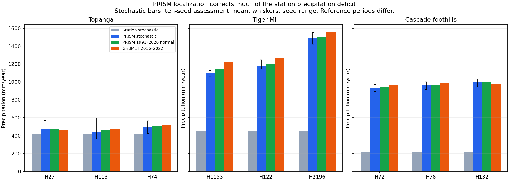
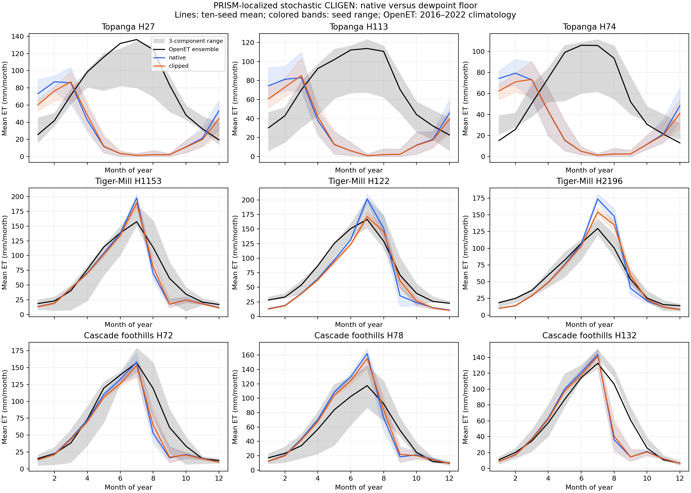

# PRISM-localized stochastic experiment: results

Completed 2026-10-08. All 180 paired WEPP cases passed artifact validation, covering 2,344,980 daily water-balance rows. PRISM localization corrected most of the forest precipitation deficit and substantially improved forest seasonal ET agreement. Dewpoint clipping still improves seasonal-cycle RMSE, but usually worsens annual ET bias. Production behavior and UI remain unchanged.

## Design and data

The same nine hillslopes, frozen vegetation/soil/slope/control inputs, pinned CLIGEN and WEPP executables, and seeds 1001–1010 were used as in the [station-only baseline](../../20261008_stochastic_dewpoint/artifacts/results.md). Each hill now receives its own parameter file and ten stochastic climates: 90 climates and 180 native/clipped WEPP cases. Native versus clipped inputs differ only in daily `Td = max(Td, Tmin)`, throughout the original 25–45-year history. Assessment uses seven synthetic years per seed after at least 16 spinup years. Year labels are bookkeeping; synthetic weather is not paired against individual observed years.

Monthly precipitation, Tmin and Tmax normals were retrieved from the public PRISM bulk API at the nearest native 800 m cell. The CSV explicitly identifies Norm91m and 1991–2020, consistent with the [official normals description](https://prism.nacse.org/normals/). Raw dewpoint normals were also retained for diagnostics, but were not used to change the generation parameters. All nine cells returned 12 months and an annual row. The downloaded January precipitation raster is M4; all nine raster samples match the bulk values within 0.0051 mm. The normals raster and daily raster have slightly different affine precision; the nine row/column identities are unchanged. Source coordinates were transformed from WGS84 to NAD83 with the installed PROJ operation and recorded. No interpolation or nearest-valid substitution was used.

The production `par_mod` function executed directly with cached normals, stopping explicitly after its real parameter-file writer. Its default wet-day adjustment, precipitation floor, formatter, and probability handling were retained; `adjust_mx_pt5=False`. Only precipitation mean, wet-day probabilities, Tmin mean and Tmax mean changed. Station dewpoint, radiation, wind, precipitation variability, storm intensity and station header metadata remain unchanged. This is the established P/T localization method, not a fully localized multivariable stochastic climate model. It evaluates nearest-cell input acquisition rather than the production client's default cubic normal sampling.

The 36 archived OpenET series from 2016–2022 were reused without network calls or credential access. Metrics compare 12 monthly climatology means and distributions within each calendar month. There are 70 synthetic values versus seven observed values per calendar month. Seed ranges and comparison counts are descriptive, not independent replications or significance tests.

## Precipitation

Annual precipitation in mm/year below is the ten-seed synthetic assessment mean; GridMET is the original 2016–2022 hillslope forcing. PRISM normals cover 1991–2020, so differences can reflect reference period as well as datasets and spatial support.

| Hillslope | Station stochastic | PRISM stochastic | PRISM normal | GridMET |
|---|---:|---:|---:|---:|
| Topanga H27 | 420 | 473 | 475 | 460 |
| Topanga H113 | 420 | 439 | 464 | 469 |
| Topanga H74 | 420 | 495 | 508 | 516 |
| Tiger-Mill H1153 | 454 | 1101 | 1140 | 1224 |
| Tiger-Mill H122 | 454 | 1178 | 1196 | 1271 |
| Tiger-Mill H2196 | 454 | 1489 | 1497 | 1561 |
| Cascade foothills H72 | 217 | 934 | 939 | 964 |
| Cascade foothills H78 | 217 | 962 | 969 | 985 |
| Cascade foothills H132 | 217 | 995 | 996 | 979 |

All nine sites moved closer to the GridMET assessment mean. Forest precipitation rose from 22–37% of GridMET to 90–102%. Across the full generated histories, ten-seed mean precipitation is within −2.4% to +1.4% of the PRISM monthly-sum target. The assessment window ranges from −5.3% to +0.2% of PRISM; seven-year samples have appreciable seed variation. Fixed-width parameter rounding gives implied annual means within about 1.2% of the targets. Full-record pooled monthly temperature means differ from the requested normals by at most 0.30°C for Tmin and 0.39°C for Tmax.

## ET and dewpoint treatment

For the clipped arm, ensemble seasonal-cycle RMSE fell from 47.5–73.4 to 13.9–23.7 mm/month at the six forest hillslopes. Native forest RMSE also fell, from 48.9–73.9 to 20.1–25.0. Both precipitation and temperature changed, so the ET improvement cannot be attributed to precipitation alone. Topanga remains poorly matched: clipped ensemble RMSE is 61.8–78.7 mm/month, with modeled winter/spring ET and almost no summer ET versus the observed summer peak.

Within the PRISM-localized experiment, clipping improves:

- Seasonal-cycle RMSE: 36/36 pooled site–product comparisons; 357/360 seedwise comparisons.
- Seasonal-cycle MAE: 31/36 pooled; 318/360 seedwise.
- Mean within-month distribution distance: 34/36 pooled; 339/360 seedwise.
- Absolute annual ET bias: only 6/36 pooled comparisons, including 2/9 for the ensemble.

The five pooled MAE exceptions are Tiger-Mill H122/SSEBop; Cascade H132/PTJPL; and Cascade H72/Ensemble, PTJPL and SSEBop. Distribution-distance exceptions are H122/SSEBop and H72/SSEBop. These exceptions matter: clipping is not uniformly better under every metric or product.

| Watershed | Native ET, mm/year | Mean clipping change, mm/year | Range across hill–seed pairs |
|---|---:|---:|---:|
| Topanga | 383.0 | −26.0 | −43.9 to −7.9 |
| Tiger-Mill | 740.6 | −14.6 | −34.8 to −4.0 |
| Cascade foothills | 645.6 | −7.4 | −11.9 to −4.7 |

Annual ET declines in all 90 pairs. Mean soil water increases by 2.6, 6.9 and 4.1 mm, respectively; drainage and lateral flow generally increase. Mean annual snow-day reductions are 0.01, 0.25 and 0.60 days. Clipping affects about 86%, 30% and 35% of assessment days, with all-day mean dewpoint increases of 4.00, 0.83 and 0.64°C. No assessment days have Tmin above Tmax or native Td above Tmax.

The figure explains why annual and seasonal conclusions differ. At Topanga, clipping lowers winter ET but does not fix missing summer ET. At forest sites it often reduces the summer peak and redistributes some water toward later months. A smaller seasonal peak error can coexist with a larger annual deficit. Model ET is `Ep + Es + Er`; this includes the canopy/residue terms represented by those outputs, but does not independently establish a complete snow-atmosphere flux accounting.

## Quality and sensitivity

CLIGEN reports unmet random-deviate quality targets in 69/90 generated climates despite returning zero and emitting complete finite records: 545 precipitation-amount, 425 dewpoint and 354 time-to-peak targets, 1,324 total. Every declared seed was retained. This is a conditional model sensitivity experiment, not certification that all generated weather passed CLIGEN's statistical criteria.

Twenty-one climates have no final quality diagnostic, spanning seven hillslopes. In that restricted subset, clipping improves pooled RMSE in 28/28 site–product comparisons, MAE in 23/28 and distribution distance in 26/28. Topanga H27 and H113 have no diagnostic-free seeds. Subset selection is a sensitivity check, not replacement of the registered population.

Exploratory forest ensemble sensitivity dividing reference ET by 1.20 or 1.25 retains the RMSE and distribution-distance preference at all six forest sites; MAE also prefers clipping at all six. These divisors illustrate the [reported forest high-bias concern](https://etdata.org/accuracy-known-issues/), not validated local corrections. OpenET products are uncertain and share meteorological inputs; they are not four independent truths.

Retained station humidity remains a substantive limitation. Full-record generated monthly dewpoint averages exceed PRISM dewpoint normals by about 1.2–3.4°C at the forest hillslopes before adding a floor, while Topanga biases are about −0.2 to +0.4°C. Localization did not recalibrate dewpoint variability or its correlations. Some cells also differ markedly in elevation from their hillslope, notably Topanga H74 (444 m grid versus 674 m hill). Nearest-cell normals are a reproducible spatial match, not exact terrain equivalence.

PRISM bulk metadata does not expose an immutable revision identity for every sampled grid. January precipitation grid parity establishes that sample's consistency only; it does not prove all variables and months came from one atomic revision. The retained CSV checksum is the reproducible input for this experiment.

## Interpretation and next decision

PRISM localization is viable and corrects the main station-climate mismatch. It is a much better forcing baseline for the forest dewpoint study. Clipping remains a useful sensitivity treatment and improves seasonal RMSE consistently, but this experiment does not support making it a universal stochastic requirement: annual bias often worsens, station humidity remains geographically mismatched, and generator quality diagnostics persist.

Retain native stochastic production behavior and the existing observed-forcing clipping policy. A user-facing stochastic clipping switch is not implemented or established as necessary by this experiment. If another research treatment is pursued, localize monthly dewpoint to the already-retained PRISM dewpoint normals and evaluate native/floored variants before choosing a general policy; that would be a separately declared humidity change, not a reinterpretation of these results. Investigate Topanga's water access, vegetation/rooting, spatial support and ET seasonality independently of a dewpoint toggle.

## Reproduction and retained evidence

From the repository root, run `PYTHONPATH=. .venv/bin/python docs/work-packages/20261008_prism_stochastic_dewpoint/artifacts/study.py` with `prepare`, `run`, `verify`, and `analyze` in order, in a fresh study directory for prepare. `acquire.py` validates the retained normals and January grid. `compare_baselines.py` compares both climate and ET baselines; `sensitivity.py` computes forest reference-bias sensitivity; `independent_check.py` recomputes 792 metric rows by explicit monthly means and empirical-CDF integration. Prepare refuses to overwrite a frozen manifest; run resumes verified completion records.

The independent metric calculation agrees within 2.85e−14. All 88 indexed artifacts in the two prior studies remain unchanged. Native/clipped non-dewpoint tokens, every nonclimate fixture, complete calendars, finite water outputs, precipitation readback, output hashes and successful WEPP terminal messages passed. A repeated CLIGEN seed reproduced the exact climate bytes; all 90 daily-value series are distinct. Both figures were visually inspected. These are standalone scientific runs, not production deployment validation.

Raw model outputs reside at `/home/workdir/wepppy-scratch/prism-stochastic-dewpoint-20261008`. The package retains input normals, extraction provenance, localized parameters and logs, compressed generated climates, executable metadata, execution/output hashes, validation records, comparison tables and figures. The downloaded January raster archive remains in that scratch directory with its checksum recorded. Closed prior studies and source projects were not modified.
