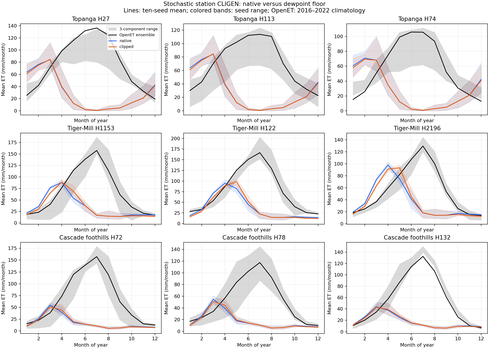

# Stochastic CLIGEN dewpoint floor: same nine hillslopes

Completed 2026-10-08. Adding a dewpoint floor modestly improves seasonal OpenET
agreement in this **existing-station baseline**, but the station climates are
poor matches for the forest sites. Retain native stochastic production behavior
for now. Keep the clipping treatment in the research harness; localize the
stochastic climate and investigate generator diagnostics before deciding on a
general user-facing option or a new default.

## Findings

All 180 paired WEPP cases completed: nine hillslopes, ten seeds, two treatments.
The 30 station/seed climates have distinct daily values and an exact same-seed
replay passes. All 2,344,980 daily water-balance rows pass calendar, finite-value,
precipitation readback and paired-input checks. There were no modeled negative
ET values, and generated assessment weather has no Tmin-above-Tmax or
Td-above-Tmax days.

For each hillslope, pool 70 synthetic years and compare month-of-year statistics
with the seven observed OpenET years. Across nine hillslopes and four products:

| Measure | Comparisons improved by clipping |
| --- | --- |
| RMSE of the 12-month mean ET cycle | 36/36 |
| MAE of the 12-month mean ET cycle | 35/36 |
| Mean within-month ET distribution distance | 36/36 |

By individual seed, the corresponding counts are 360/360, 347/360 and 359/360.
These correlated comparisons are descriptive counts, not independent significance
tests. The pooled MAE exception is Cascade H72 against PT-JPL: 59.379 mm/month
native versus 59.419 clipped, a difference of only 0.040 mm/month.

Against the ensemble, pooled cycle MAE improves by approximately 0.5–2.3
mm/month across sites. The remaining cycle MAE is 32–65 mm/month: the dewpoint
treatment does not resolve the dominant seasonal discrepancies.

| Watershed | Native annual ET, mean across sites/seeds | Mean clipped − native ET | Range of paired annual ET changes |
| --- | --- | --- | --- |
| Topanga | 352.8 mm/year | −4.75 mm/year | −9.12 to −0.75 mm/year |
| Tiger-Mill | 429.9 mm/year | −8.10 mm/year | −12.28 to −3.13 mm/year |
| Cascade foothills | 211.1 mm/year | −0.42 mm/year | −1.07 to −0.04 mm/year |

Each range covers 30 site–seed pairs. Averages are unweighted site averages,
not area-weighted watershed estimates. Clipping lowers annual ET in all 90
pairs. Mean soil water increases by 0.56, 6.84 and 1.52 mm respectively.
Mean annual deep drainage increases by 3.54, 4.60 and 0.24 mm; lateral flow
increases by 0.59, 3.36 and 0.08 mm. Mean snow-cover duration above 1 mm SWE
decreases by 0.07, 0.78 and 0.34 days/year. These station climates generate
much less snow than the prior local GridMET climates.

[Full-resolution SVG](seasonal-et.svg). Colored bands show the range of the
ten seed-specific mean cycles, not confidence intervals. Gray spans eeMETRIC,
PT-JPL and SSEBop mean cycles; the black line is the OpenET ensemble.

## Station suitability dominates observational interpretation

The experiment uses the same hillslopes, model inputs and existing station
parameter files as the preceding projects. It does **not** localize those
station parameterizations to each hillslope's GridMET climatology. That choice
was declared before generation, following the optional question to the user.

| Station / project | Generated precipitation | Prior local GridMET precipitation | Station/local ratio |
| --- | --- | --- | --- |
| Canoga Park / Topanga | 420 mm/year | 460–516 mm/year | 0.81–0.91 |
| Walla Walla / Tiger-Mill | 454 mm/year | 1,224–1,561 mm/year | 0.29–0.37 |
| Wenatchee / Cascade foothills | 217 mm/year | 964–985 mm/year | 0.22–0.23 |

Station maximum temperatures are also warmer than local GridMET by roughly
4–6 C annually, and minimum temperatures differ. Full values are retained in
[station-site-mismatch.csv](station-site-mismatch.csv). The native station
climates are historical parameterizations, while OpenET covers recent years;
neither spatial nor temporal climate equivalence is established.

The forest simulations are strongly water-limited: native annual ET consumes
nearly all generated annual precipitation. Raising dewpoint reduces atmospheric
demand, conserves some water earlier in the season and shifts ET later, modestly
improving the seasonal match. That response is consistent with the paired ET
and soil-water outputs, but cannot establish that the clipped humidity is more
physically accurate. The large summer ET shortfall remains.

## Treatment and experimental controls

Native means the untouched daily output from the pinned CLIGEN binary.
Clipped means `Td = max(native Td, native Tmin)` at written 0.1 C precision.
No observed daily forcing, temperature localization, rainfall adjustment or
humidity correction is inserted. The treatment acts throughout spinup and
assessment. Every other climate token and all management, soil, slope and
ancillary parameter hashes remain identical within each pair.

The same three climates are shared among each watershed's three hillslopes.
Seeds are 1001–1010; none were selected or replaced based on outcomes. Histories
remain 1980–2024, 2000–2024 and 1986–2022, preserving original run controls and
management lengths. Assess synthetic labels 2016–2022 after at least 16 years
of spinup. Those labels do not imply reconstruction of observed weather.

Clipping affects approximately 59%, 81% and 77% of generated assessment days
at Topanga, Tiger-Mill and Cascade stations. Mean dewpoint increases over all
days are 1.46, 3.58 and 3.55 C. Mean diagnostic vapor-pressure deficit decreases
by about 0.098, 0.270 and 0.265 kPa, calculated from the emitted temperatures
using the WEPP PMET saturation-pressure expression. See
[humidity-summary.csv](humidity-summary.csv) and
[climate-quality.csv](climate-quality.csv).

WEPP is the previous study's `wepp_260803_hill`, SHA-256
`86ef065c8d8c6c1e644db40c022c7c850701c0c174d3c622dfa28f1d6da122e7`.
CLIGEN is vendored `5.323-k10.1`, SHA-256
`119ba1de5bc48757901224c8d6e91022a91bf255a45043a98579199e681aaddc`.
Complete binary/source metadata, input hashes and generation commands are in
[manifest.json](manifest.json). The common WEPP ET accounting remains Ep+Es+Er;
the preceding source audit's unreported snow-flux limitation still applies.

## Generator diagnostics

CLIGEN emits full, finite calendars but reports **454 unmet internal random-
deviate quality targets across 26 of 30 realizations**: 181 precipitation amount,
155 time-to-peak and 118 dewpoint messages. These are final target-exhaustion
diagnostics, not merely intermediate rejected draws. Existing generator behavior
continues writing daily output after those messages. This study neither changes
its thresholds nor certifies its statistical quality.

All declared seeds are retained to avoid selecting weather based on outcomes.
Logs and [generation-quality.json](generation-quality.json) preserve the issue.
Four Walla Walla realizations (1001, 1002, 1003, 1010) have no such diagnostics.
Pooling that limited subset still favors clipping in 12/12 cycle-RMSE and
distribution comparisons and 11/12 cycle-MAE comparisons; see
[diagnostic-free-metrics.csv](diagnostic-free-metrics.csv). There is no analogous
diagnostic-free Topanga or Cascade subset in the declared seeds.

An initial parser rejected CLIGEN's terminal blank line after complete daily
records. The parser was corrected to accept terminal whitespace; the six
already-produced files and logs were preserved. No weather values changed.
The first six generation process-status sidecars were not retained by the initial
script; the manifest marks that limitation. Daily completeness, hashes and one
separate exact regeneration remain directly verified.

## Comparison methods and scope

For each arm, site and seed, average monthly ET over seven synthetic years.
Compare those 12 month-of-year means with OpenET's 2016–2022 monthly means.
Repeat after pooling all ten seeds. For the distribution comparison, calculate
`scipy.stats.wasserstein_distance` separately within each calendar month and
average the 12 distances; its units are mm. This uses empirical distributions
rather than matching synthetic storms to observed dates.

The prior study's 36 complete polygon series are reused unchanged, with their
CSV hash recorded. No additional OpenET requests or credential reads occur.
OpenET products and neighboring hillslopes are correlated, station sampling is
limited, and satellite ET is uncertain. This study does not validate runoff or
snow against independent measurements. Its seasonal-cycle metrics differ from
the prior observed-weather study's calendar-month metrics and must not be
compared as though they were the same score.

## Recommendation and follow-up

The floor is executable and produces a repeatable, mostly favorable seasonal
response in these station-driven experiments. The effect is modest and does
not justify a default change. Retain the research treatment and native stochastic
production default; defer a general UI control until a location-matched study
and review of the CLIGEN diagnostics establish stronger evidence.

The next experiment should localize stochastic parameters to the same hillslope
climate, declare the dewpoint treatment's position in that preparation chain,
and preserve paired seeds. That is a separate climate parameterization experiment,
not a hidden alteration of this registered station baseline. No production
defaults, UI, model executables or source projects were changed here.

## Reproducibility and artifacts

Run `.venv/bin/python
docs/work-packages/20261008_stochastic_dewpoint/artifacts/study.py` from the repo
root with `prepare`, `run`, `verify` and `analyze`. Preparation refuses to overwrite
a frozen manifest; completed cases are reused and failures remain visible.
Source scientific fixtures and OpenET evidence come from the immutable preceding
package. [Generated climates](generated-climates.tar.gz) retain all 30 station/seed
files, station copies and generation logs. Full WEPP outputs and execution logs
remain at `/home/workdir/wepppy-scratch/stochastic-dewpoint-20261008` with hashes
in [executions.json](executions.json).

Inspect [monthly output](wepp-monthly.csv), [paired effects](paired-effects.csv),
[all comparison metrics](comparison-metrics.csv), [validation](validation.json)
and [summary counts](conclusions.json). The scripts and evidence are standalone
scientific artifacts, not deployment validation or a shipped clipping option.
