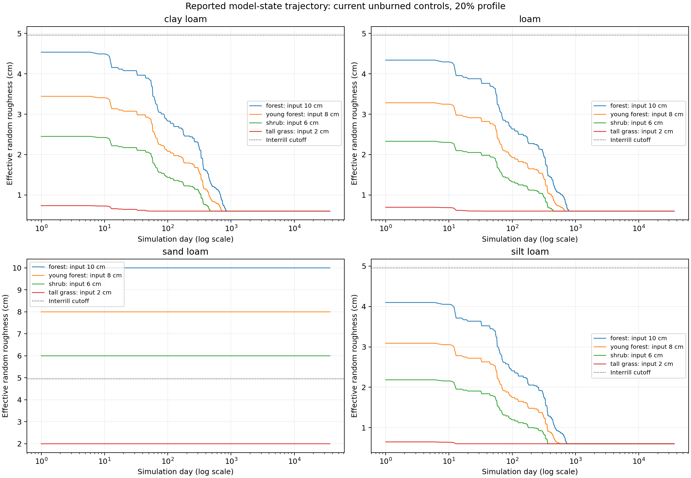
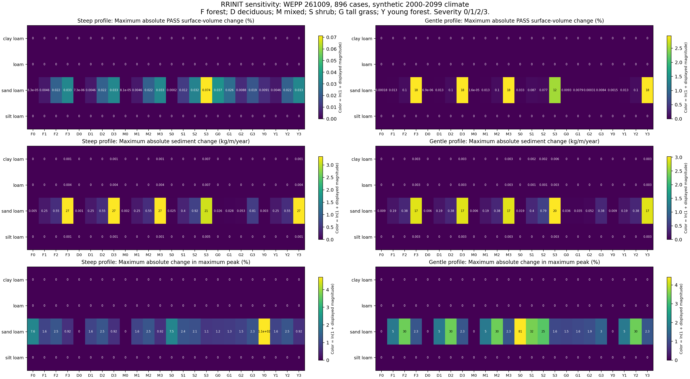

# RRINIT Sensitivity Study: WEPP 261009

Historical study: subsequent targeted adoption of low-severity forest 6 cm is
recorded in [ADR-0083](../../adrs/ADR-0083-low-severity-forest-initial-random-roughness.md).
Original study inputs, results and statements of then-unchanged defaults below
are retained; they are not an inventory of the newly adopted default.

2026-10-09 UTC. Completed the authorized bounded study and added young forest
to the canonical Disturbed matrix. Production management defaults, lookup
values, WEPP source and release binaries are unchanged. No deployment occurred.

## Decision Summary

Subsequent targeted assessment: [low-severity forest 4 -> 6 cm](low-forest-4v6-results.md).
The canonical matrix shows negligible runoff impact and unchanged rankings,
but a persistent sandy-loam sediment reduction. This is separate from the
blanket-reduction question evaluated below; production defaults remain unchanged.

Do not make a blanket rrinit reduction from these results alone. The response
is strongly dependent on the modeled soil state. Three canonical soil profiles
lose their initial roughness; the sandy-loam fixture retains it and shows large,
persistent sediment effects and, on the gentler profile, substantial runoff
effects. Smaller rrinit values do not remove the remaining runoff/sediment rank
inversions. Ranking alone is therefore not a sound tuning objective.

The sensible next decision is whether a specific lower roughness candidate is
physically appropriate for the intended soils and surface definition, followed
by limited real-watershed checks. Do not silently change the soil roughness-decay
logic at the same time, and do not compensate by tuning other parameters.

## Canonical Harness Changes

- Six vegetation types: forest, deciduous forest, mixed forest, shrub, tall
  grass and young forest. Four textures and four severity states give 96 cases.
- Existing IDs 1-80 are unchanged; young forest uses 81-96. Burned young forest
  uses the generic forest severity templates, matching the normal remapper.
- Tests explicitly stage hourly/snow/ET context from repository fixtures and
  default to wepp_261009; the production application default is not changed.
- PASS peak analysis uses the paired native legacy/v3 reader. Malformed EBE
  records and duplicate dates fail rather than silently disappear.
- Reports preserve one-sided events and provide full-record water/sediment
  totals separately from matched-event comparisons. Directional rankings are
  diagnostics, not labels of physical correctness.

## Necessary Climate Correction

The old committed test_climate.cli was not a valid 100-year hourly forcing:
it held 2,192 daily rows from 2020-2025 despite its 100-year header, and its last
22 dewpoints were NaN. The first unmutated hourly baseline trapped in EVAPPM.
An isolated observer replay recorded EVP_U035_TDPT on 2025 day 344 with NaN.
The original fixture, failed run and evidence remain preserved; no model guard
or rrinit adjustment was used to get past that failure.

A separate finite synthetic climate was generated from the same committed
McKenzie Bridge station parameters with the committed CLIGEN binary and fixed
seed 26109. The final period is 2000-2099: 36,525 daily records and mean annual
precipitation 1,205.406 mm. No observed gaps were filled. The generated climate
and provenance sidecar are repository fixture files, and independent regeneration
is byte-identical. Finiteness and full calendar coverage now fail before simulation.

An initial synthetic year-1-to-100 prototype exposed the legacy model's extra
centurial-day behavior. It is retained separately, not combined with this study.
The final real-calendar window avoids that ambiguity without changing model
code. A first proposed seed exceeded the CLI's allowed range and was rejected
before generation; 26109 was the sole legal seed used, not selected for outcomes.

The earlier 80-case analysis remains explicitly historical, not validation of
the current release or complete forcing period.

## Executed Matrix

The grid uses four textures, six vegetation types, unburned/low/moderate/high
conditions, and two slope profiles. Each cell uses its current rrinit plus
0.006, 0.010, 0.020 and 0.040 m, removing duplicate values within the cell.

**896 runs completed, zero failures in the final grid:** 192 current-default
controls and 704 non-reference trials. The sixteen preflight sentinels are
included in that count, not additional population runs. Every run completed
100 simulation years and supplied 36,525 validated daily PASS and SOIL records.

The original variable profile is 87.9 m long, width 102.4 m, and mean grade
38.5602%. Its 201.6836 field is aspect, not slope length. The second profile
keeps length/width/aspect but uses a uniform 20% grade. Only rrinit changes
within a class/texture/profile comparison; rhinit and all other management,
soil and weather inputs remain fixed. Prepared managements are reparsed, and
restoring rrinit must reproduce the original serialized management exactly.

This reuses the harness's template and soil-lookup preparation. It is not a
claim that every custom NoDb override or regional mapping was exercised.
Forest-family burned aliases are repeated labeled cells, not independent
physical replications. Prescribed fire is not included in this matrix.

## Effective Roughness Is the Main Finding



These are reported model states, not field measurements. For the current
unburned forest control, maximum reported effective roughness is 4.536 cm in
clay loam, 4.339 cm in loam and approximately 4.10 cm in silt loam, already below
the approximately 4.96 cm interrill cutoff. These profiles subsequently reach
the 0.6 cm floor. Their long-period runoff and peak maxima are unchanged at
reported precision across the rrinit trials; sediment differences are small
and almost entirely initial-period effects.

The sandy-loam fixture retains its assigned roughness. Thus current forest,
young forest and shrub controls remain above the interrill cutoff throughout
the run, while the lower trials do not. This split is consistent with the
bulk-density-guarded roughness-decay path identified in static analysis. It is
not a demonstrated rule for all field soils with those texture names.

| Fixture | Non-reference trials | Changed printed runoff total | Changed printed sediment total | Largest sediment difference over 100 years, kg/m |
| --- | ---: | ---: | ---: | ---: |
| Clay loam | 176 | 0 | 48 | 0.7 |
| Loam | 176 | 0 | 48 | 0.7 |
| Sand loam | 176 | 136 | 172 | 2,721.1 |
| Silt loam | 176 | 0 | 36 | 0.5 |

## Response Magnitudes



Cells show the maximum absolute change across tested roughness levels relative
to the current class-specific control. Runoff percentage uses full-record PASS
surface volume; sediment uses annualized EBE delivery. Colors use ln(1+magnitude)
with separate scales, while cell labels show the original values. Zero means
no difference at the retained report precision, not a universal zero sensitivity.

Representative consequential cases:

| Condition and change | Current | Trial | Interpretation |
| --- | ---: | ---: | --- |
| Sandy loam, high-severity forest, 20% slope, rrinit 6 to 0.6 cm: PASS surface volume, m3/100yr | 330,952.5 | 390,164.3 | +17.89% |
| Same case: EBE runoff depth, mm/100yr | 36,878.1 | 43,551.7 | +18.10%; a separate reported measure |
| Same case: sediment delivery, kg/m/100yr | 891.4 | 2,591.6 | About 2.91 times the control |
| Sandy loam, high-severity forest, steep profile, rrinit 6 to 0.6 cm: sediment, kg/m/100yr | 3,540.1 | 6,261.2 | +2,721.1 kg/m, about +76.9% |
| Sandy loam, unburned young forest, steep profile, rrinit 8 to 0.6 cm: maximum peak, m3/s | 0.018970 | 0.039714 | +109.35% |

Whole-record maxima do not capture every event change. In the high-severity
shrub/sandy-loam/20% case, one synthetic event (2066 day 188) changes from
0.092852 to 0.163270 m3/s, while the century's maximum changes only from
0.30553 to 0.31039 m3/s. That trial has 715 peak-event dates not present in its
control and 154 control-only dates. All one-sided counts are retained, without
inventing zero-valued paired events.

Runoff is not total routed streamflow. In the high-severity forest/20% example,
recorded PASS lateral flow decreases from 403,299.7 to 381,369.3 m3 while surface
flow increases; the sum of surface, lateral, drain and recorded baseflow rises
about 5.05%, not 17.89%. This component sum is not a totalwatsed or watershed
outlet validation. No watershed simulation was performed in this study.

Nor do the reported water measures close exactly. Using nominal slope area,
PASS surface volume minus EBE depth-equivalent volume changes from -985.8 to
-1,842.8 m3 in that example, a further -857.0 m3 over 100 years. The discrepancy
is disclosed consistently, not repaired or used as a zero-residual gate.

## Severity Rankings

Weak ordering here means unburned <= low <= moderate <= high, allowing exact
ties in the retained output values. Each count covers 48 labeled
profile/texture/vegetation combinations, not independent watersheds.

| Roughness policy | Runoff ordered | PASS sediment ordered | Maximum peak ordered |
| --- | ---: | ---: | ---: |
| Current class-specific values | 47/48 | 47/48 | 31/48 |
| Uniform 0.6 cm | 47/48 | 47/48 | 35/48 |
| Uniform 1 cm | 47/48 | 47/48 | 35/48 |
| Uniform 2 cm | 47/48 | 47/48 | 35/48 |
| Uniform 4 cm | 47/48 | 47/48 | 35/48 |

The current runoff exception is steep-profile sandy-loam tall grass: moderate
runoff is slightly below low severity. The sediment exception is gentle-profile
sandy-loam tall grass: low-severity PASS sediment is slightly below unburned.
Lowering roughness does not remove these exceptions. Peak ordering improves in
four labeled combinations but remains non-monotonic in thirteen. These are
diagnostics for interpretation, not mandates to tune rrinit until every rank passes.

## Validation and Limits

- Canonical matrix: 99 tests passed (96 simulations plus three completion checks).
- Fast matrix/reader/climate/route checks: 14 passed.
- Final fixture-preflight/young-forest check: one passed.
- Final study: 896/896 complete, finite parsed outputs, no duplicate daily keys.
- All study contrasts use the same frozen host binary and runtime, with recorded
  input/output hashes. Released hillslope SHA:
  37d8deaf7a4c78e83104db4d896db3ee10b77a5f5d3f3abe5ad718390e2cc228.
- Three selected host repeats reproduce all eight output files exactly, including
  a canonical-input replay and the strongest runoff-response control/trial pair.

Container canonical controls are not bitwise identical to host study controls.
The host and container libm/libgfortran hashes differ; a specific numerical cause
was not isolated. Maximum full-record differences over the 96 comparable
controls are approximately 0.00395% PASS surface volume, 0.00313% EBE runoff and
0.078% printed sediment; record maximum peaks are unchanged at printed precision.
These results are not mixed into RR contrasts. No universal cross-runtime
convergence or model rewrite was imposed.

The full unrelated WEPPpy suite was not rerun for this test/research-only change.
The historical climate failed before mutation and is recorded separately, not
counted as a failed rrinit trial. The two figures were visually checked. This is
one fixed synthetic climate, four soil profiles and two slopes, not observational
validation or a full post-fire recovery study. The generalization limits matter
before selecting new defaults.

## Evidence and Reproduction

Raw study: /wc1/holdouts/rrinit-261009-sensitivity-20261009.
Canonical final run: /wc1/holdouts/rrinit-canonical-261009-final-20261009.
Historical input-failure and year-1 prototype paths are recorded in the setup
artifacts. Compact results, annual data, rankings, case receipts and figures are
under [artifacts/sensitivity](artifacts/sensitivity). Large generated files stay
outside git. All source fixtures or their deterministic generators are included
in the repository changes; no private run is required as a gate.

From the WEPPpy root, using the local venv for research scripts:

```bash
python tests/disturbed/generate_climate_fixture.py
wctl run-pytest tests/disturbed/test_disturbed_matrix.py
wctl run-pytest tests/disturbed/test_matrix_contracts.py tests/disturbed/test_route_coefficients.py
python docs/work-packages/20261009_rrinit_parameter_review/run_sensitivity.py prepare
python docs/work-packages/20261009_rrinit_parameter_review/run_sensitivity.py sentinels
python docs/work-packages/20261009_rrinit_parameter_review/run_sensitivity.py execute
python docs/work-packages/20261009_rrinit_parameter_review/analyze_sensitivity.py
```

Study directories are creation-guarded. Do not overwrite this completed evidence.
No parameter ADR selecting replacement defaults is issued by this study.
