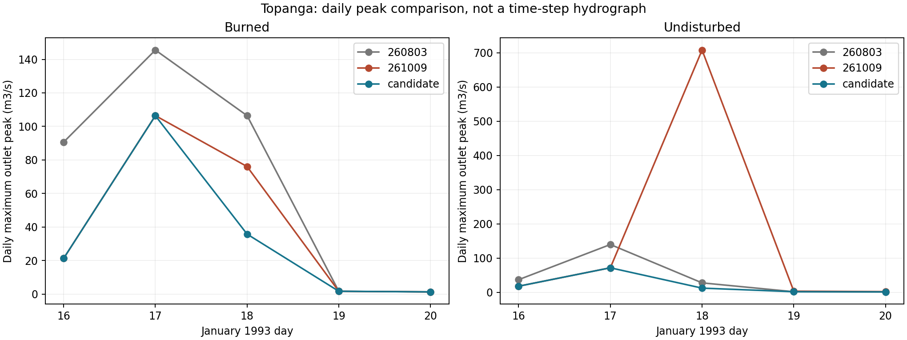

# CHRQIN Normalization Candidate Results

## Decision

Subsequent decision, 2026-10-10: Roger explicitly approved promotion as
wepp_261010 after the follow-up studies. This supersedes the hold below;
the historical assessment and all event-level findings remain intact.
See [ADR-0084](../../adrs/ADR-0084-chrqin-source-normalization-release.md).

The bounded correction removes the January 18, 1993 source-inflation defect.
Retain the candidate, but **hold hydrological acceptance and promotion for
Roger's review**. The same arithmetic defect also affects ordinary channel
sources. Correcting it changes some burned-event peaks and sediment delivery
substantially, despite effectively unchanged full-record runoff volume.
These departures are not automatically degradation: legacy parity cannot
justify incorrect normalization. They are nevertheless material to design
flows and event sediment and cannot be dismissed by aggregate agreement.

No second candidate, release, vendoring or deployment was performed.

Follow-up [mutation and disturbed-ranking studies](hillslope-studies.md)
confirm unchanged hillslope outputs: 1368 mutation study cases plus ten
neutrality controls, and 96 canonical disturbed cases per build. Fresh
scatterplots and ranking reports are retained there. This does not resolve
the ordinary channel-event consequences discussed below.

The subsequent [Cedar water verification](cedar-results.md) adds 1728 fresh
hillslope runs and paired 24-year watersheds: totalwatsed matches 261009
exactly; sampled outlet volume is +0.001008% versus 260803 and -0.049858%
versus 261009. The accounting gap is slightly smaller than 260803's but larger
than 261009's. This supports Cedar water preservation, not closure or acceptance
of the Rattlesnake sediment changes below.

## Correction and Provenance

The sole model change is in `src/chrqin.for`: subtract the time-zero sample
from the normalization sum only when `nt0=0`. With `nt0=1`, the first real
sample must remain in the denominator because it is also added to the source.
The [mechanism record](mechanism-findings.md) preserves the observer-neutral
trace and unchanged-routine reproduction. Classification: `BUG_FIXED` for
sample accounting; `REQUIRES_SCIENCE_REVIEW` for broader watershed acceptance.
MIXPEAK, hourly return estimation, source support, routing timestep, carry,
parameters, interfaces and release metadata are unchanged.

Source base is `692c225e672844c71114bbdda851625616ebbba9`, plus the working-tree
correction, on `wepp_260430_negmeltfix_comparator`. Both binaries were built
with system gfortran 13.3 in separate build directories. Their full hashes
are in [build.json](artifacts/candidate/build.json).

An initial parallel build requesting watershed and hillslope targets in one
directory raced their shared include-profile switches. The watershed binary
incorrectly had the 45-hillslope profile and rejected these projects. That
attempt is retained under `/wc1/holdouts/chrqin-normalization-candidate-20261009`
and is not valid hydrological evidence. Separate builds, verified sizing
profiles and entirely fresh hillslope regeneration produced the accepted
`-v2` lane. No build-system repair was added.

All four candidate watershed runs completed: Topanga burned/undisturbed,
1980-2024, and Rattlesnake burned/undisturbed, 100 synthetic years. All 714
hillslopes were regenerated with the paired candidate build. Topanga's 568
raw PASS files are byte-identical to retained release controls. Rattlesnake's
146 PASS comparisons preserve selected hydrological fields and all checked
sediment fields (`tdet`, `tdep`, `sedcon_1..5`) exactly. No cross-build PASS
swapping was used. Physical project inputs remain unchanged.

## Target Event

January 18, 1993 outlet results:

| Scenario | Build | Volume (m3) | Peak (m3/s) | Outlet sediment (kg) |
| --- | --- | ---: | ---: | ---: |
| Burned | 260803 | 213215.02 | 106.42034 | 212686.55 |
| Burned | 261009 | 213282.16 | 76.03957 | 222187.20 |
| Burned | Candidate | 213281.84 | 35.72905 | 223117.84 |
| Undisturbed | 260803 | 219667.84 | 27.85154 | 39192.88 |
| Undisturbed | 261009 | 218608.19 | 707.63910 | 26789.54 |
| Undisturbed | Candidate | 219692.70 | 12.50683 | 27201.02 |

Candidate undisturbed volume is +0.0113% relative to 260803. Its peak occurs
at 1800 seconds, versus 1200 seconds in 261009. The correction removes the
manufactured source pulse; a lower outlet peak alone was not the diagnosis.

## Full-Record Consequences

Signed changes in total reported outlet quantities:

| Case | Volume vs 260803 (%) | Sediment vs 260803 (%) | Volume vs 261009 (%) | Sediment vs 261009 (%) |
| --- | ---: | ---: | ---: | ---: |
| Topanga burned | -0.000051 | +1.30014 | -0.00000043 | +0.02344 |
| Topanga undisturbed | -0.000050 | -0.61171 | -0.00000048 | +0.01776 |
| Rattlesnake burned | -0.00000020 | +0.49250 | 0 | +0.34599 |
| Rattlesnake undisturbed | +0.00000010 | +1.98547 | 0 | +0.00000066 |

Annual volume changes versus 261009 remain within approximately 0.000012%.
Annual sediment is less stable: Rattlesnake burned year 41 increases 19.746%,
and year 89 decreases 13.837%. Topanga burned annual changes range from
-7.906% to +5.849%; undisturbed from -0.02968% to +0.08563%.
Full daily comparisons and descriptive fit statistics are retained in
[comparisons.csv](artifacts/candidate/comparisons.csv), with
[annual totals](artifacts/candidate/annual.csv). They are not acceptance gates.

Peak-change frequency relative to 261009 (printed-output precision):

| Case | Changed days | Increased | Decreased | Reductions >10% / >25% / >50% |
| --- | ---: | ---: | ---: | --- |
| Topanga burned | 1598 | 308 | 1290 | 167 / 60 / 11 |
| Topanga undisturbed | 503 | 124 | 379 | 18 / 10 / 3 |
| Rattlesnake burned | 2982 | 132 | 2850 | 215 / 36 / 2 |
| Rattlesnake undisturbed | 1 | 0 | 1 | 0 / 0 / 0 |

These bins describe frequency, not materiality thresholds. No case gains or
loses positive-peak days. Largest peak increases are 0.01417, 0.00098 and
0.00105 m3/s in the first three cases; the fourth has no increase.

## Ordinary Events Requiring Review

Rattlesnake burned synthetic year 40, May 15 changes from **44.54780 to
20.21181 m3/s (-54.6%)**, while volume changes only 28250.79 to 28250.22 m3.
Both released versions have the same original values. All 12 EVENT SRC3
records that date have `active=0`: this is a legacy source-path consequence,
not confined to active mixed-return packets. This flag alone is not proof
of physically zero return. The record maximum changes from 44.54780 to
34.97400 m3/s, now on year 36 July 22. Other large reductions include year 2
July 16 (33.81378 to 14.61523) and year 66 July 13 (28.58797 to 16.86444).

Sediment consequences are not uniformly downward:

| Rattlesnake burned event | Released sediment (kg), both versions | Candidate (kg) | Change (kg) |
| --- | ---: | ---: | ---: |
| Year 41 May 28 | 140954.78 | 621811.88 | +480857.10 |
| Year 89 June 6 | 438143.62 | 99119.68 | -339023.94 |

The first event's volume is effectively unchanged (40047.15 to 40047.14 m3)
and peak decreases 7.25780 to 6.61237 m3/s. The second retains 37481.00 m3
and peak decreases 18.44079 to 15.96193 m3/s. Identical hillslope sediment
inputs localize these differences downstream; the specific within-channel
transport/storage interaction has not been isolated. Neither event-level
acceptability nor an adjacent-storm redistribution explanation is established.
See [largest departures](artifacts/candidate/largest-event-changes.csv).

The printed average annual hillslope soil loss is unchanged versus 261009.
Rattlesnake burned average annual total channel soil loss changes 61.0 to
61.1 tonne/year and outlet sediment 1705.0 to 1710.9 tonne/year. These report
summaries do not erase the individual-event changes or establish a gross
sediment budget. All four cases are in
[loss-summaries.csv](artifacts/candidate/loss-summaries.csv).

## Timing and Design Flows

Peak times change on 154 Topanga burned days, 18 undisturbed days, 184
Rattlesnake burned days and zero undisturbed days relative to 261009.
Largest shifts are 35400, 5400, 14400 and zero seconds respectively; median
all-day shifts are zero. The largest Topanga shift concerns a tiny peak
(0.00095 to 0.00098 m3/s on December 11, 2006). Rattlesnake's largest shift
is year 40 May 16: 0.06462 to 0.05933 m3/s, 15600 to 1200 seconds.
Thus maximum timing shifts require event context, not an automatic threshold.
Detailed paired values are in [timing.csv](artifacts/candidate/timing.csv).

Full-record CTA/Gringorten peak return levels, 261009 to candidate (m3/s):

| Case | 2-year | 5-year |
| --- | --- | --- |
| Topanga burned | 168.93411 -> 161.09906 | 218.13734 -> 214.04485 |
| Topanga undisturbed | 118.84573 -> 111.09779 | 170.68329 -> 163.90913 |
| Rattlesnake burned | 9.84958 -> 9.52914 | 15.34344 -> 13.99882 |
| Rattlesnake undisturbed | 0.31603 unchanged | 0.39897 unchanged |

Synthetic Rattlesnake dates are model years, not observed calendar years.
The existing duplicate year-100 December-22 date is preserved by record order;
no deduplication or climate repair was performed.

## Validation and Limits

- Red/green: six failures before repair; 45 focused checks pass afterward.
- Maintained Forest suite: `python -m pytest tests -q`, 163 passed.
- Both correct-profile host smokes and all 12 committed watchlist cases pass.
- Both ELF interpreters are `/lib64/ld-linux-x86-64.so.2`.
- Bare `python -m pytest -q` fails collection in archived experiment modules
  (missing dependencies/files and duplicate module names). It did not pass.
- Candidate output selection is peak-only. Daily ledger, annual totals,
  peak magnitude/time and sediment were compared; no fresh candidate full
  timestep hydrograph or integral-versus-ledger audit was captured. Do not
  infer universal closure, recession parity or absence of subdaily pulses.
- Known short-support/flat-branch representation limitations remain outside
  this repair. No comprehensive conservation requirement was introduced.

The unit regressions use committed captured operands, not private resources.
These watershed replays are supplementary evidence, not mandatory private
fixture gates. Scripts `candidate_replay.py` and `analyze_candidate.py`, hashed
[receipts and metrics](artifacts/candidate/manifest.json), and the Forest
incident preserve provenance. Promotion remains held pending review of the
ordinary-event consequences above, rather than automatically adding patches.
