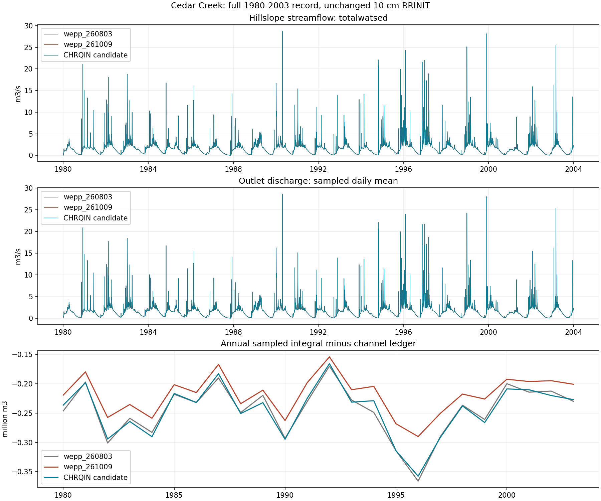
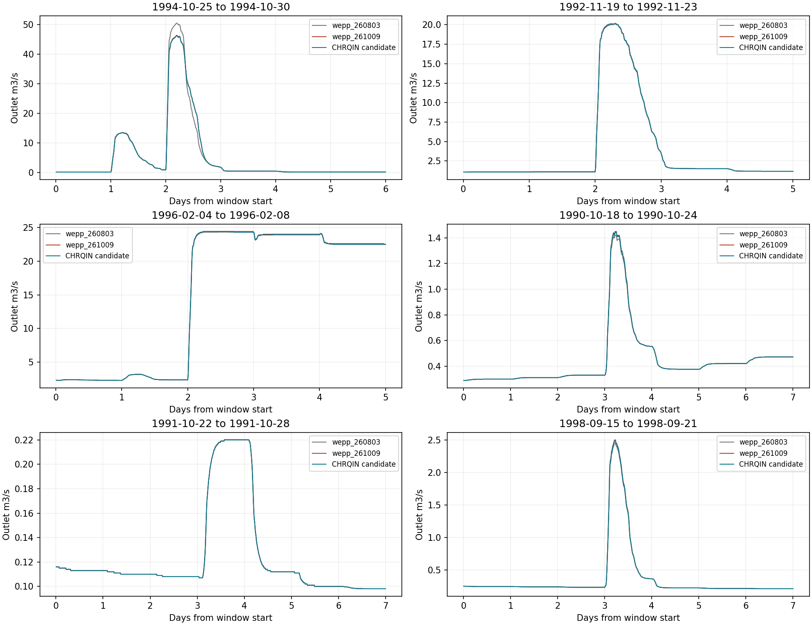
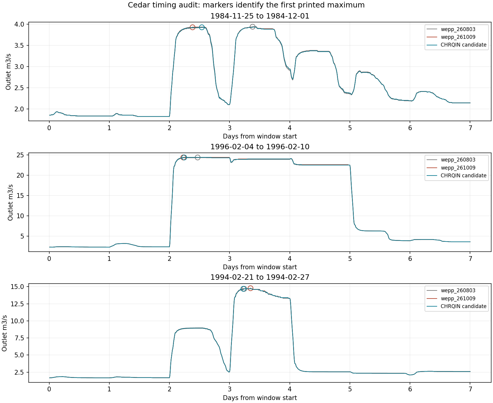

# Cedar Hillslope Yield and Channel Discharge

2026-10-10. Paired full-record verification of the unreleased CHRQIN
normalization candidate on Marta's Cedar Creek (`warming-championship`) project.
**Complete:** both 24-year watershed runs and all 1728 fresh hillslope
simulations succeeded. All 6048 hillslope output files match between candidate
and release, and their freshly computed totalwatsed streamflow is identical.
Cedar supports water-yield preservation and no material routed-water degradation
relative to `wepp_260803` within this comparison. This is not field calibration,
a proof of physical closure, or resolution of the separate Rattlesnake sediment
consequences. No release or deployment is recommended solely from this check.

## Full-Record Results

Volumes are m3, over the complete 1980-2003 record:

| Measure | wepp_260803 | wepp_261009 | CHRQIN candidate |
| --- | ---: | ---: | ---: |
| Totalwatsed hillslope streamflow | 1,267,735,665.289 | 1,267,735,665.682 | 1,267,735,665.682 |
| Reported channel outlet volume | 1,272,337,716.46 | 1,272,337,716.29 | 1,272,337,711.84 |
| Sampled routed outlet volume | 1,266,448,890.30 | 1,267,093,408.92 | 1,266,461,659.92 |
| Sampled integral minus channel ledger | -5,888,826.16 | -5,244,307.37 | -5,876,051.92 |
| Sum of absolute daily integral-ledger gaps | 6,441,305.44 | 5,849,097.91 | 6,380,525.06 |
| Largest sampled peak, m3/s | 50.50 | 46.40 | 46.20 |

Relative to 260803, hillslope yield changes only **+0.393 m3**; the largest
daily difference is 0.217 m3. Candidate yield matches 261009 exactly on every
day. The channel ledger changes -4.62 m3 relative to 260803 and -4.45 m3
relative to 261009.

The sampled outlet integral changes **+12,769.62 m3 (+0.001008%) versus
260803**, and **-631,749.00 m3 (-0.049858%) versus 261009**. Annual sampled
volume differences range -0.02413% to +0.04228% against 260803, and -0.08420%
to -0.03010% against 261009. Thus the repair's incremental effect is a small
systematic reduction relative to 261009, not simply redistribution across
midnight. It does not reduce hillslope water production.

The signed integral-ledger gap is 12,774.24 m3 smaller in magnitude than
260803's; the absolute daily gaps sum to 0.944% less. However, both measures
are worse than 261009: signed gap magnitude increases 631,744.55 m3 and
absolute daily gaps increase 9.086%. The source-accounting correction removes
much of the apparent gap improvement seen in that release. Do not present
this as restored conservation or claim the residual is explained by timing.
The remaining 4.602 million m3 difference between channel ledger and hillslope
yield also persists. These distinct legacy discrepancies are disclosed, not
additional repair scope.



## Events and Timing

Retained October 25-30, 1994 window versus 260803:

- Sampled volume +4524.18 m3 (+0.179%); peak 50.5 to 46.2 m3/s.
- First sampled peak time unchanged; flow centroid +20.82 minutes.
- October 28 volume +220.20 m3 (+0.573%); its integral-ledger gap improves
  from -7260.18 to -7172.74 m3. The earlier large midnight-recession enlargement
  is not reintroduced in this retained control.
- Whole-window gap improves from -22441.69 to -17918.33 m3, but is worse
  than 261009's -10929.95 m3. Incremental candidate volume versus 261009 is
  -0.275%, peak change -0.2 m3/s and centroid shift +0.47 minutes.

Across the 322 baseline-selected seven-day screening windows, volume changes
range **-0.154% to +0.619%** versus 260803; centroid changes range -4.38 to
+20.78 minutes. Relative to 261009, window volumes range -0.374% to unchanged
and centroid changes -1.26 to +2.44 minutes. These ranges describe this
pre-existing screen, not a newly invented acceptance tolerance.

The largest baseline-relative daily volume increase is 6720 m3 on February
7, 1996, from 2,061,960 to 2,068,680 m3. The largest incremental reduction
versus 261009 is 6900 m3 on February 8, 1996, from 1,959,780 to 1,952,880 m3.
The retained 1991 smaller-event window is unchanged; the 1990 and 1998 windows
change +0.355% and +0.619% in volume versus 260803, with centroid changes
-2.23 and -0.76 minutes. The larger percentage differences therefore occur
in smaller windows, while the largest absolute departures remain small
fractions of large-event delivery.



First-maximum timing needs qualification. The screen includes a -1220-minute
shift relative to 260803 during November 25-December 1, 1984, but the peak
changes only 3.94 to 3.93 m3/s and the centroid shifts -0.68 minutes. Candidate
equal maxima span November 27 12:50 through November 28 10:40; the baseline's
slightly higher maximum is on the latter day. This is selection between
near-equal crests, not evidence of a 20-hour hydrograph translation.

Similarly, the retained February 1996 window's first maximum moves -320
minutes versus 260803, while its centroid shifts -0.29 minutes. Both printed
maxima are 24.4 m3/s; the baseline has 11 tied samples and the candidate 66.
Relative to 261009 the maximum first-peak shift in the screen is +220 minutes
in the November 1984 window, with a centroid shift of only +0.005 minutes.
The [timing audit](artifacts/cedar/timing-audit.json) preserves maxima counts,
first/last equal maxima and all selected values; these timing limitations
must remain visible when interpreting precise peak times.



## Breadth and Limits

At printed resolution, 3348 days have a changed discharge sample versus
261009. Daily peaks decrease on 1038 days and increase on none. Of 1,262,304
samples, 67080 decrease and 182 increase; the largest incremental changes
are -0.20 and +0.01 m3/s. There are no new positive samples on previously
zero-flow samples. These counts do not prove the absence of every possible
recession-shape change or certify every isolated storm boundary.

Across 2909 all-OFE dry-weather days, sampled-volume change is -1679.04 m3
relative to 260803 and -1701.60 m3 relative to 261009. Full-record daily-volume
NSE/KGE/R2 versus 260803 are 0.999996/0.999013/0.999997; subdaily NSE is
0.999318. These are supporting descriptions, not the basis for dismissing
the event or accounting findings above.

The practical assessment rests on unchanged hillslope supply, negligible
ledger changes, small annual/event-volume departures, retained smaller-event
behavior and examined timing ambiguities. The accounting measures are not
materially worse than the 260803 baseline at full-record scale, although
individual days and some annual discrepancies do worsen and remain in the
tables. This check is about water; it does not replace the separate review
of channel sediment consequences.

All fresh conversions accept 7,573,824 PASS records and 16,690,464 WAT records
per build with zero rejected records. Channel data contain the expected
8766 x 144 finite, nonnegative samples, and date/precipitation coverage agrees
across all three comparisons. Both model runs complete all 24 years.

See [summary and provenance](artifacts/cedar/summary.json),
[annual results](artifacts/cedar/annual.csv), [event screen](artifacts/cedar/events.csv),
[largest daily departures](artifacts/cedar/largest-daily-departures.csv) and
[artifact hashes](artifacts/cedar/manifest.json). All three plots were visually
checked. No new physical implementation was made for this validation.

## Design and Definitions

Use the original frozen 10 cm RRINIT inputs, 864 hillslopes, 371 channels and
all 8766 days of 1980-2003. Candidate and released `wepp_261009` each receive
fresh hillslope simulations and their own same-build PASS files. There is no
cross-build PASS reuse. Retained `wepp_260803` output is the historical
behavioral baseline; its 6056-file historical and observer parity audits both
pass. No live project input, parameter, default or binary is changed.

The watershed outlet is WEPP element 1235, channel ordinal 371. The only
diagnostic input change from the frozen project is channel-output selector
1 to 3, retaining the original 600-second interval and outlet selection.
This enables the full outlet series; it is not a routing change.

Three quantities must remain distinct:

- **Totalwatsed hillslope streamflow:** daily hillslope-derived yield computed
  by standard `totalwatsed3` from freshly converted PASS and WAT. Depth times
  contributing area divided by 1000 gives m3. It is not routed outlet flow.
- **Channel volume ledger:** the daily outlet water volume reported in
  watershed EBE. This is not independently integrated discharge.
- **Sampled routed volume:** sum of the 144 printed positive-time outlet
  discharge samples times 600 seconds. Samples belong to their printed
  simulation day, including its 86400-second endpoint. This preserves the
  previous comparison convention; it is not exact continuous integration.

The integral-minus-ledger discrepancy is retained, not required to be zero.
Annual and daily values, selected event windows and the largest departures
are reviewed alongside totals. NSE, KGE and R2 are supporting descriptions,
not acceptance thresholds. The seven-day event screen retains the previous
260803 selection (daily-mean peak prominence 0.1 m3/s, minimum spacing seven
days, +/-3-day windows); it is not a claim to identify all complete storms.

## Reproduction and Evidence

From WEPPpy:

```bash
.venv/bin/python docs/work-packages/20261009_topanga_jan1993_outlier/run_cedar_candidate.py
.venv/bin/python docs/work-packages/20261009_topanga_jan1993_outlier/analyze_cedar_candidate.py
.venv/bin/python docs/work-packages/20261009_topanga_jan1993_outlier/analyze_cedar_candidate.py --timing-audit
```

The raw root is `/wc1/holdouts/chrqin-cedar-20261010`; output directories are
creation-guarded. The source snapshot is
`/workdir/warming-rrinit-20261006/snapshot`. Original inputs are checked before
use and again after both runs. Both lanes use the same installed native reader
and standard totalwatsed implementation with unchanged groundwater options
(initial storage zero, baseflow coefficient 0.04/day, deep seepage zero).

The candidate is the previously tested binary pair: watershed SHA256
`0eb062812786064b230091ac0144f7502bc225964ea982dd76ebfc68abc6b76d`, hillslope
`219be50ac94a7ffa01589eb22251586caea53d5e856f7af0feaea2c12fa6433a`.
The released pair is watershed
`e1b1c244107216ca9edf4ccbaeb8d390e98440418d87beac2d5153b98191c7cc`, hillslope
`37d8deaf7a4c78e83104db4d896db3ee10b77a5f5d3f3abe5ad718390e2cc228`.

This is supplementary watershed validation, not a mandatory private-resource
gate. No new physical correction, release, vendoring or deployment is included.

An initial supplemental timing-audit invocation failed because pandas treated
`first` as a method rather than a column. Explicit column indexing fixed the
analysis-only error; its failed log is retained. Primary analysis and model
runs were unaffected, and the corrected timing audit completed successfully.
