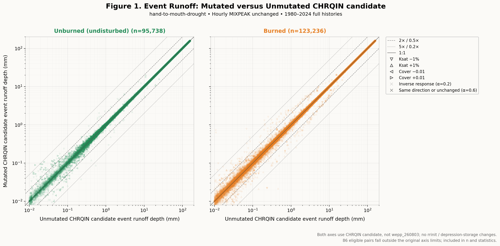
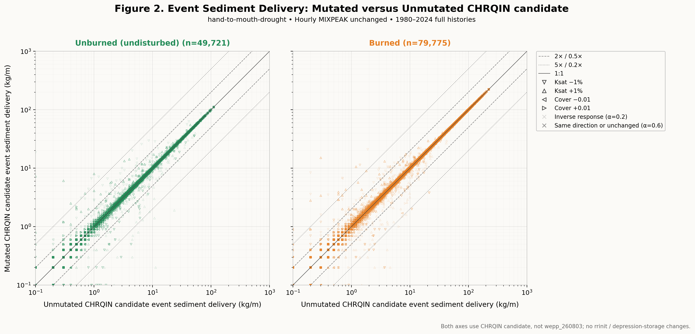
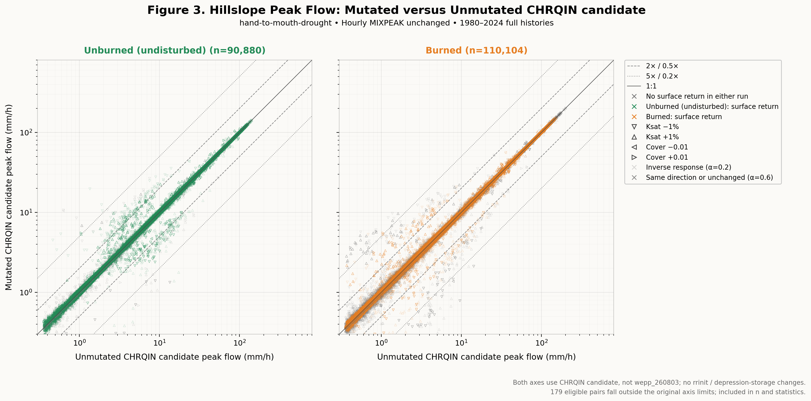

# Candidate Mutation and Disturbed Ranking Studies

2026-10-10. Requested validation of the unreleased CHRQIN normalization
candidate. **Complete: no hillslope changes detected relative to wepp_261009.**
All 1368 mutation study cases, ten additional observer controls and 96 canonical
disturbed simulations per build completed successfully. Both mutation ledgers
are exactly identical to the release ledgers, including file hashes. All
standard outputs match for all 1378 mutation executions and all 96 paired
disturbed cases (768 output files per build).

## Results

The mutation ledger contains 225658 rows: 225042 paired events, 320
unmutated-only events and 296 mutated-only events. Runoff, peak and sediment
sensitivity, including existing nonlinear departures, are unchanged.

| Figure | Metric | Eligible pairs | Beyond twofold guides | Beyond fivefold guides | Outside axes |
| --- | --- | ---: | ---: | ---: | ---: |
| 1 | Runoff depth | 218974 | 453 | 34 | 86 |
| 2 | Hillslope sediment delivery | 129496 | 329 | 72 | 0 |
| 3 | Hillslope peak flow | 200984 | 966 | 209 | 179 |

Disturbed full-record severity ordering (unburned <= low <= moderate <= high)
is identical in both builds:

| Metric | Ordered soil/vegetation combinations |
| --- | ---: |
| Cumulative surface runoff | 23 of 24 |
| Delivered hillslope sediment | 24 of 24 |
| Largest event peak | 18 of 24 |

Existing exceptions remain: sandy-loam tall grass for runoff; the four
clay-loam forest types, clay-loam tall grass and sandy-loam tall grass for
maximum peak. No new ranking reversal is introduced. Sandy-loam mature forest
retains mean annual runoff 92.7, 119.8, 121.3 and 376.4 mm and maximum peaks
0.020084, 0.170380, 0.173370 and 0.313510 m3/s across the severity sequence.

Full event-directionality tables are in the
[candidate ranking report](artifacts/hillslope-studies/disturbed/candidate-rankings.md)
and [paired release report](artifacts/hillslope-studies/disturbed/release-rankings.md).
The [ranking CSV](artifacts/hillslope-studies/disturbed/rankings.csv) and
[case metrics](artifacts/hillslope-studies/disturbed/cases.csv) retain all values.
Every daily PASS series has 36525 records covering 2000-2099; native parsed
numeric values are finite and date keys are unique. The physical-input audit
checks 486 files: only the 96 generated soil build-date comments differ.
Execution logs also differ in recorded paths and binary identities, as expected.

### Figure 1: Runoff



Both events must be present, unmutated runoff at least 0.01 mm, and mutated
runoff positive. The original 0.008-200 mm axes omit 86 eligible points from
view, not from statistics.

### Figure 2: Erosion Metric



Both printed deliveries must be positive. There are also 540 unmutated-positive-only
and 583 mutated-positive-only records, retained separately. The original EBE
0.1 kg/m precision creates the visible steps; this is delivered hillslope
sediment, not gross soil detachment.

### Figure 3: Peak Flow



Both events must be present, unmutated peak at least 0.36 mm/h, and mutated
peak positive. The original 0.3-800 mm/h axes omit 179 eligible points from
view, not from statistics. Color denotes surface return in at least one run;
gray denotes no surface return in either. All three figures were visually
checked for labeling, legends and clipping.

## Validation and Disposition

- 1368 study cases pass report readback; ten uninstrumented H106 controls
  match the observer's seven standard output files byte-for-byte.
- The observer changes only IRS output instrumentation. Reversing its patch
  restores the candidate source exactly. No physical source change was made
  for these studies.
- 1378 candidate executions match the prior release's standard outputs;
  event and sediment ledgers each contain 225658 rows and match exactly.
- Each disturbed build passes 99 tests (96 simulations and three completion
  checks). Separate matrix/route contracts pass 16 tests; mutation analysis
  and rendering checks pass nine. Only existing dependency deprecations appear.
- The current published disturbed report and historical mutation reports
  remain unchanged. Candidate evidence has a separate
  [manifest](artifacts/hillslope-studies/manifest.json).

This closes the requested hillslope checks. It supports isolation of the
CHRQIN repair to the channel path, not acceptance of every channel consequence.
The previously documented Rattlesnake event-level peak and sediment changes
still require review; no release, vendoring or deployment follows.

## Scope

These are hillslope studies, not routed-watershed studies. CHRQIN's correction
changes channel-source normalization; MIXPEAK, hillslope erosion inputs and
parameterization are unchanged. Hillslope parity is therefore expected, but
must be demonstrated with freshly generated outputs. Passing these studies
does not adjudicate the ordinary-event channel consequences documented in
[candidate results](candidate-results.md), or authorize release or deployment.

The frozen candidate hillslope SHA256 is
`219be50ac94a7ffa01589eb22251586caea53d5e856f7af0feaea2c12fa6433a`.
The reference is the published `wepp_261009` hillslope binary,
`37d8deaf7a4c78e83104db4d896db3ee10b77a5f5d3f3abe5ad718390e2cc228`.

## Mutation Design

Reuse the released-build study's frozen inputs: 140 hillslopes in each of the
burned and undisturbed scenarios, full 1980-2024 histories, 280 unmutated
controls and 1088 eligible mutations. Conductivity changes by factors 0.99
and 1.01; paired initial interrill/rill cover changes by -0.01 and +0.01.
The 32 original exclusions remain excluded; no clipped substitute is added.
All nonmutated inputs, including original roughness, are retained.

Both axes in Figures 1-3 use the candidate: unmutated versus mutated inputs,
not candidate versus `wepp_260803`. Output-only IRS instrumentation records
full-precision runoff and peak; sediment uses the original EBE hillslope
delivery metric (kg/m), not gross detachment or channel export. Two H106
controls and eight H106 mutations also run without instrumentation to check
observer neutrality. Missing events remain missing, not zero-filled.

The inherited twofold/fivefold guides and plotting filters are descriptive,
not newly introduced pass/fail thresholds. The same event can occur under
multiple mutations, so plot rows are not independent storms.

## Disturbed Design

Fresh paired runs in the same `weppcloud` container cover 96 combinations per
build: four soils, four severities and six vegetation types, including young
forest. Use the committed 100-year McKenzie climate and canonical steep
profile. The adopted low-severity forest roughness is 6 cm. Each build gets
its own generated inputs and output directory. This deliberately uses current
defaults, whereas the mutation study preserves its historical frozen design.

Compare standard outputs byte-for-byte, then parse full-record runoff,
delivered sediment and maximum peak, check daily record coverage and generate
the canonical event-ranking tables. Weak ordering allows ties; ranking
exceptions are findings, not automatic physical defects. The published
`tests/disturbed/analysis_results_current.md` is not overwritten by an
unreleased candidate report.

## Reproduction

From WEPPpy, using the existing Forest mutation helpers:

```bash
.venv/bin/python docs/work-packages/20261009_topanga_jan1993_outlier/run_candidate_mutation.py prepare
.venv/bin/python docs/work-packages/20261009_topanga_jan1993_outlier/run_candidate_mutation.py execute
wctl exec weppcloud env WEPP_DISTURBED_BINARY=/wc1/holdouts/chrqin-normalization-candidate-20261009-v2/wepp_hill python -m pytest tests/disturbed/test_disturbed_matrix.py -q --basetemp=/wc1/holdouts/chrqin-disturbed-candidate-20261010
wctl exec weppcloud env WEPP_DISTURBED_BINARY=wepp_261009 python -m pytest tests/disturbed/test_disturbed_matrix.py -q --basetemp=/wc1/holdouts/chrqin-disturbed-release-20261010
.venv/bin/python docs/work-packages/20261009_topanga_jan1993_outlier/analyze_hillslope_studies.py matrix
.venv/bin/python docs/work-packages/20261009_topanga_jan1993_outlier/analyze_hillslope_studies.py matrix-inputs
.venv/bin/python docs/work-packages/20261009_topanga_jan1993_outlier/analyze_hillslope_studies.py mutation
.venv/bin/python docs/work-packages/20261009_topanga_jan1993_outlier/analyze_hillslope_studies.py manifest
```

Use new output roots for a repeat. Mutation preparation and archival directories
are creation-guarded; pytest's `--basetemp` is destructive to an existing root,
so never reuse the recorded study directories for a fresh test invocation.
The raw mutation root is `/wc1/holdouts/chrqin-mutation-20261010`.
External mutation inputs are supplementary research resources, not mandatory
release gates. The canonical disturbed inputs are committed repository fixtures.
