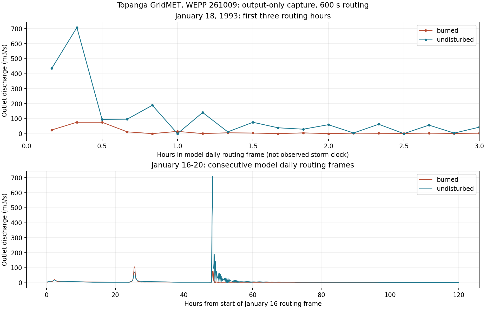

# Output-Only Replay Capture

2026-10-10 UTC. Roger authorized paired output-only replay after the opening
readback. The event remains an outlier under investigation, not a diagnosed
defect. No physics, parameter, routing timestep or binary change is made.

## Method and Provenance

The original text hillslope PASS files had been removed after interchange.
Therefore the replay first regenerated all 284 hillslopes in each scenario
from the original prepared inputs. Both isolated trees preserve the parent/Omni
relative layout, including the undisturbed references to parent climate and
slope files. No live project was executed or modified.

The replay uses the WEPPcloud container runtime and frozen release executables:

- Watershed `wepp_261009`, SHA256
  `e1b1c244107216ca9edf4ccbaeb8d390e98440418d87beac2d5153b98191c7cc`.
- Hillslope `wepp_261009_hill`, SHA256
  `37d8deaf7a4c78e83104db4d896db3ee10b77a5f5d3f3abe5ad718390e2cc228`.

All 568 hillslope regenerations match retained PASS records exactly for event
type, year, Julian day, duration, time of concentration, alpha, runoff depth,
surface volume, lateral volume and published peak. This is a selected-field
semantic comparison, not a byte comparison with the deleted original text
PASS. The downstream watershed controls test the complete regenerated inputs.

Both peak-only watershed controls reproduce all 45 years of frozen outlet EBE
year/month/day, runoff volume, peak discharge and sediment yield exactly,
including January 18, 1993. No warm start is fabricated and no event-only
cold start is used.

Each full-series lane changes only the first token of `chan.inp`, from output
mode 1 to mode 3. The configured timestep stays 600 s, baseflow option stays
0, and the sole selected output element stays Topaz 412 (channel 128). Static
inspection of `wshinp.for`, `wshchr.for` and `wshdrv.for` found the selector
changes the output branch, with both modes retaining the same positive-output
control conditions. The paired generated outputs provide the actual observer
neutrality check rather than relying on this source inspection alone.

## Capture Status

Completed: 568 same-build hillslope regenerations and four 45-year watershed
runs, with successful completion and no physical-input changes. Both controls
match the frozen EBE results exactly. In each scenario, all 292 comparable
files other than `chan.out` are byte-identical between modes 1 and 3. These
include the 284 PASS inputs and eight watershed output files. The live source
run directories also retain their original file hashes.

Each full-series lane contains 2,366,928 samples: 144 per day for all 16,437
days. Every day's maximum at the channel file's printed precision matches
the peak-only control. Core watershed runtimes were approximately 270.5 and
264.4 seconds for burned/undisturbed controls, and 280.5 and 268.3 seconds
for their full-series counterparts. This establishes observer neutrality for
these runs, not physical validation of the outlier.

## Observed Event Shape



January 18 begins with a pronounced undisturbed pulse, followed by uneven
rebounds rather than a smooth decline. It is not merely a lone high printed
sample. Both scenarios show some irregularity, much larger in the undisturbed
case. The full window also shows that January 16-17 have quite different,
less irregular outlet responses.

| Routing time, s | Burned discharge, m3/s | Undisturbed discharge, m3/s |
| ---: | ---: | ---: |
| 600 | 24.4 | 435 |
| 1200 | 76.0 | 708 |
| 1800 | 76.0 | 95.1 |
| 2400 | 11.9 | 96.3 |
| 3000 | 0 | 189 |
| 3600 | 14.9 | 0 |
| 4200 | 0.427 | 141 |
| 4800 | 5.49 | 11.6 |
| 5400 | 3.91 | 75.6 |
| 6000 | 0 | 38.9 |
| 6600 | 5.00 | 29.5 |
| 7200 | 0.121 | 59.6 |

The precise control EBE maxima remain 76.03957 m3/s burned and 707.63910 m3/s
undisturbed; the daily volumes remain 213,282.16 and 218,608.19 m3. Rounded
burned series samples tie at 1200 and 1800 seconds, while the precise peak-only
control locates its maximum at 1800 seconds. There are no negative printed
samples on January 18 in either scenario; printed zeros and rebounds remain
part of the evidence, not values to smooth away.

## Disposition

The output-only replay is complete and observer-neutral. The outlier is
reproducible, and the irregular early pulse is now directly observable.
Its cause is not established. Oscillatory sampled behavior makes source
reconstruction and routing response useful hypotheses to investigate, but
does not by itself identify a defective routine or exclude hydrological inputs.

The next bounded question is where this shape first appears: already in the
outlet's incoming reconstructed sources/upstream channels, or within the
outlet routing response. A narrowly selected upstream/source trace would
separate those possibilities. That is a new diagnostic step, not performed
here. No timestep experiment, source modification, conservation repair,
parameter adjustment or release decision follows automatically from this capture.

## Interpretation Boundary

The full-series file prints discharge with three significant digits. The
precise 707.6391 m3/s EBE peak will appear as approximately 708 in that file.
Plot lines connect model samples; they are not an independently calculated
continuous hydrograph. Time coordinates refer to the model daily routing
frame, not an observed storm clock. A sampled curve may help distinguish an
isolated high sample from a sustained pulse but cannot alone assign its cause.

The opening question is unchanged: distinguish plausible modeled source/state
and timing effects from reporting or numerical explanations. No requirement
for universal event ranking, zero legacy accounting residual or a new routing
architecture is introduced by this capture.

## Artifacts and Commands

Full working trees, PASS files, raw outputs and transcripts are retained under
`/wc1/holdouts/topanga-jan1993-output-replay-20261009`. Small receipts, selected
series and plots are retained under this package's `artifacts/output-replay`.
These generated external working trees are not mandatory repository quality
gates. The original comparison snapshots remain unchanged.

Commands run from WEPPpy, via its container wrapper:

```bash
wctl run-python docs/work-packages/20261009_topanga_jan1993_outlier/output_replay.py prepare
wctl run-python docs/work-packages/20261009_topanga_jan1993_outlier/output_replay.py hills
wctl run-python docs/work-packages/20261009_topanga_jan1993_outlier/output_replay.py watersheds
.venv/bin/python docs/work-packages/20261009_topanga_jan1993_outlier/analyze_replay.py
```

Preparation refuses to overwrite the retained tree. Do not rerun these commands
over completed evidence. Any later experiment needs a separately named lane
and explicit scope; this output-only replay does not authorize a patch campaign.
