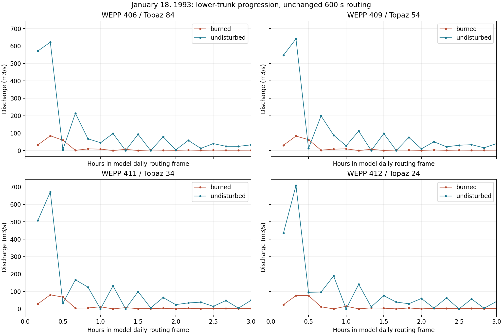

# Lower-Network Trace Findings

2026-10-10 UTC. Continued investigation of an event outlier, not a presumed
defect. Two additional output-only 1980-2024 replays selected nine nearby
channels in each scenario. Binary, PASS inputs, physical parameters and the
600-second routing interval remain unchanged.

## What This Establishes

The large undisturbed pulse is already present at WEPP element 406 before
reaching the final outlet reaches. It is not created solely at the outlet.
Its peak then increases through 409, 411 and 412, whereas the burned peak
decreases over the same sequence. The neighboring small branches do not
contain a comparable large pulse.

This localizes the inquiry to the incoming branches and routing state at 406.
It does not yet establish where the large pulse first forms in the whole
watershed or whether its origin is physical, source reconstruction, numerical
response, or an interaction among those mechanisms.

## Identifier Correction

The raw channel `Elmt_ID` and the selector in `chan.inp` use WEPP element IDs.
Element 412 is channel ordinal 128 and maps to **Topaz 24**, not Topaz 412.
Earlier notes incorrectly called the selected WEPP element a Topaz identifier.
The selected outlet and all numeric results were correct. The mapping is
verified from `watershed/channels.parquet` and retained in the new selection
artifact. Historical output-capture CSVs are not rewritten: their `topaz_id`
column contains the raw WEPP element ID. New trace artifacts use `wepp_id`.

## Selected Network

Topology comes from the existing `pw0.str`, whose reader defines hill left,
right and top, followed by channel left, right and top. Channels 404-412 are
nine of the watershed's 128 channels, not a watershed-wide instrumentation run.

| WEPP element | Topaz | Upstream channels, WEPP IDs | Direct hillslopes, WEPP IDs | Length, m |
| ---: | ---: | --- | --- | ---: |
| 404 | 104 | none | 16, 17, 15 | 84.85 |
| 405 | 94 | none | 13, 14, 12 | 217.28 |
| 406 | 84 | 402, 403 | 11 | 30.00 |
| 407 | 74 | none | 10 | 30.00 |
| 408 | 64 | 404, 405 | none | 30.00 |
| 409 | 54 | 406, 407 | 8, 9 | 114.85 |
| 410 | 44 | none | 6, 7, 5 | 911.54 |
| 411 | 34 | 408, 409 | 3, 4 | 247.28 |
| 412 | 24 | 410, 411 | 1, 2 | 439.71 |

## January 18 Results

The table uses precise per-channel EBE peaks. Plot values use the channel
series' three-significant-digit output, as in the previous capture.

| WEPP element | Burned peak, m3/s | Undisturbed peak, m3/s | Burned daily volume, m3 | Undisturbed daily volume, m3 |
| ---: | ---: | ---: | ---: | ---: |
| 404 | 0.26199 | 0.02643 | 820.28 | 783.23 |
| 405 | 0.17233 | 0.03388 | 935.59 | 976.58 |
| 406 | 84.46509 | 621.86023 | 203,764.55 | 209,826.89 |
| 407 | 0.02317 | 0.02317 | 455.30 | 455.30 |
| 408 | 0.40823 | 0.06159 | 1,756.05 | 1,760.02 |
| 409 | 82.99258 | 641.33514 | 204,556.81 | 210,559.03 |
| 410 | 1.76640 | 0.06467 | 3,945.81 | 3,686.12 |
| 411 | 80.59008 | 670.85620 | 207,593.38 | 213,426.34 |
| 412 | 76.03957 | 707.63910 | 213,282.16 | 218,608.19 |



From 406 to 412, the undisturbed peak increases 13.79%, while the burned peak
decreases 9.98%. These are comparisons of local maxima, not a claim that the
entire difference is a single isolated routing coefficient effect. Tributary
and local contributions remain part of the modeled downstream system.

At 406, the first undisturbed samples are approximately 571, 622, 4.56 and
214 m3/s at 600, 1200, 1800 and 2400 seconds. The irregular pulse therefore
exists at the upstream edge of this selected lower-trunk sequence. At the
outlet the corresponding samples are 435, 708, 95.1 and 96.3 m3/s.

The outlet's direct hillslopes 1 and 2 have identical published PASS surface
volumes and peaks in the two scenarios on this date. Hillslope 11, the direct
side source at 406, also has identical published values: 30.029 m3 surface
volume and 0.001460 m3/s peak. These facts make a simple explanation based
only on those direct hillslope peak scalars unconvincing. They do not provide
a complete time-resolved inlet budget or establish an upper bound on the
implemented source reconstruction.

## What Remains Open

Channels 402 and 403, the incoming channels at 406, were outside this selected
output set. Thus the earliest observed large pulse is at 406, not necessarily
the first location where it is generated. Their time-step outputs, together
with the starting state and reconstructed side source of 406, are the next
specific missing observations.

Static inspection of `src/wshchr.for` shows that the Muskingum-Cunge recurrence
combines current/prior upstream and prior local values, and clips the final
channel output below an epsilon to zero. It can therefore be relevant to
the observed rebounds and zeros. The coefficients and pre-clipping state for
this event have not been measured, so this is a hypothesis, not a demonstrated
defect or a reason to change timestep/parameters. Several selected reaches
are short, but short length alone does not establish instability.

No rerun with a different timestep, numerical guard, source patch or routing
reconstruction was performed. The next bounded step is to inspect the inputs
to 406 before deciding whether further downstream instrumentation is useful.

## Observer Checks and Evidence

The original whole-file audit correctly noticed that `ebe_pw0.txt` changed,
but its initial expectation was too narrow: adding output channels also adds
EBE rows through `sedout.for`. Both model runs completed successfully. The
initial failed audit transcript is preserved; no model run was repeated to
resolve this reporting-schema difference.

The completed partition-aware audit verifies, for each scenario:

- 290 comparable files are byte-identical to the peak-only control, excluding
  the three intentionally expanded reports: `chan.out`, `chanwb.out` and EBE.
- All 16,437 outlet EBE rows and all 16,437 outlet ledger rows are exactly
  identical to their control rows, not merely close within a tolerance.
- All 2,366,928 outlet time-series rows are exactly identical to the earlier
  outlet-only full-series capture.

Expanded output is therefore observer-neutral for these checked products.
This is an evidence-quality check, not validation of the peak's physical cause.

The new artifacts retain January 10-24 series (38,880 samples), 270 channel
event rows, 270 ledger rows, topology/mapping, hashes and observer-audit receipts
under `artifacts/upstream-trace/`. Full raw traces remain in the isolated
`upstream/` lane under `/wc1/holdouts/topanga-jan1993-output-replay-20261009`.
No mandatory test depends on that external working tree.

Recorded commands, from WEPPpy:

```bash
wctl run-python docs/work-packages/20261009_topanga_jan1993_outlier/upstream_trace.py run
wctl run-python docs/work-packages/20261009_topanga_jan1993_outlier/upstream_trace.py audit
.venv/bin/python docs/work-packages/20261009_topanga_jan1993_outlier/analyze_upstream.py
```

The initial executed runner had no phase argument; its frozen copy is retained
with the artifacts. The current explicit `run`/`audit` interface separates
model execution from validation. Do not overwrite completed lanes or snapshots.
