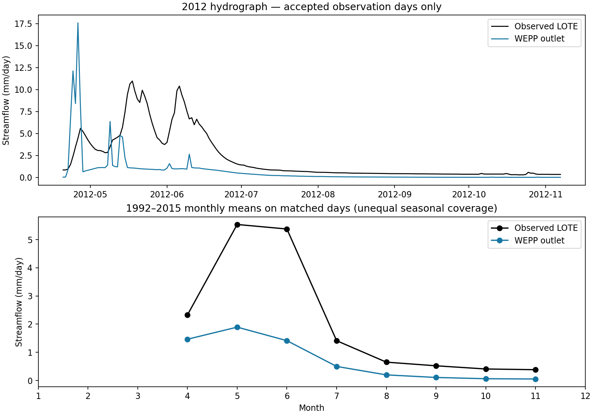

# Cultivated-ubiquity: initial calibration diagnosis

Read-only inspection on 2026-10-08 of [the public run](https://wc.openwepp.org/weppcloud/runs/cultivated-ubiquity/disturbed9002_wbt/), using filesystem artifacts on `hpc`. The public page was inaccessible to the web tool. No parameters were changed and no model runs were submitted. This is a baseline diagnosis, not calibration or evidence that a proposed parameter change works.

## Confirmed comparison

The uploaded observations match the prepared LOTE file exactly: 4,142 accepted days, 1992-10-01 through 2015-09-22. Recomputed daily outlet depths match `chanwb.parquet` outflow divided by the hillslope area used by Observed. The date alignment and imported observations therefore do not explain the large deficit.

| Measure on accepted days | Outlet | Hillslopes |
| --- | ---: | ---: |
| Mean modeled streamflow (mm/day) | 0.653 | 0.655 |
| Mean observed streamflow (mm/day) | 2.157 | 2.157 |
| Volume bias, modeled minus observed (%) | −69.73 | −69.65 |
| Daily NSE | −0.038 | −0.040 |
| Daily correlation | 0.482 | 0.480 |

The deficit is already present at hillslope scale. Channel routing changes matched mean flow by only about 0.3%, so it is not the principal source of the volume error.

The requested outlet matches the published LOTE coordinate; the snapped outlet is approximately 12 m away. Modeled contributing area is 21.595 km² versus the adopted literature area of 22.8 km² used for observed depths, a 5.3% difference. Check delineation, but an area discrepancy of this size cannot explain a roughly 70% flow deficit. Renormalizing the same observed discharge to the smaller modeled area would increase observed depth.

## Water balance and prepared inputs

For complete calendar years 1993–2015, modeled hillslope annual means are:

| Component | mm/year |
| --- | ---: |
| Precipitation | 774.0 |
| ET | 646.6 |
| Transpiration, included in ET | 643.0 |
| Surface runoff | 52.5 |
| Lateral flow | 59.0 |
| Percolation | 15.4 |
| Baseflow | 15.4 |
| Aquifer losses | 0.0 |
| Streamflow | 126.9 |

ET consumes approximately 84% of precipitation. This identifies ET/vegetation and its meteorological forcing as the first diagnostic priority; it does not establish whether the forcing, parameters, or process representation causes the excessive loss relative to observed runoff. Percolation and baseflow are consecutive transfers and must not be added together as independent exports.

Metadata selects 1990–2015 `ObservedPRISM` (Daymet-based observed climate with PRISM adjustment), spatial mode 1, executable `wepp_260803`, snow and baseflow enabled, frost disabled. Representative prepared climate `p1.cli` contains all 9,496 days in 1990–2015; its old CLIGEN header still advertises 100 years and the Cascade station (47.22° N, elevation 1,033 m). Audit how header location/elevation and daily radiation, wind, humidity, and temperature enter the executable before attributing errors solely to calibration. A header discrepancy alone does not prove which calculations are affected.

Prepared `pmetpara.txt` contains 322 hillslope entries with `kcb=0.95` and `rawp=0.8`. Prepared `gwcoeff.txt` specifies initial storage 0 mm, baseflow coefficient 0.04/day, deep seepage coefficient 0/day, and threshold area 1 ha. Prepared `snow.txt` specifies rain/snow threshold 0°C and new/settled snow densities 100/250 kg/m³. These were read from executable inputs, not only controller settings.

The 2012 example shows an early, sharp modeled spring pulse and insufficient sustained May–June flow. The full matched monthly comparison also shows underprediction throughout the available seasons. This warrants testing snow accumulation/melt and subsurface storage after addressing the water-volume deficit. It does not establish one uniform timing offset across all years.

## Proposed calibration sequence

1. Preserve this baseline. Check watershed boundaries and forcing against local precipitation, temperature, and snow observations, including Onion Park and Stringer Creek SNOTEL. Verify the effects of prepared climate header values and the daily radiation/wind/humidity chain.
2. Run a controlled vegetation/ET sensitivity experiment with lower `kcb`, holding climate, soil, snow, and groundwater settings fixed. Read back every generated `pmetpara.txt`: the disturbed workflow prepares its own table, so changing a controller field alone is insufficient evidence. Compare matched flow volume and modeled ET before selecting any value.
3. Diagnose snow timing with observed SWE and year-specific hydrographs. Adjust only parameters supported by that comparison; a single spring example is insufficient to choose new settings.
4. Then evaluate soil drainage/storage and groundwater recession. With only about 15 mm/year of recharge and zero deep seepage loss, changing the baseflow recession coefficient alone cannot supply the missing long-term water volume.
5. Reserve independent years for validation, retaining wet/dry years and documenting historical treatments. Keep the historical vegetation context distinct from the hypothetical OMNI thinning prescriptions.

Score only the accepted observation dates. Winter gaps prevent full-year observed water balances; Observed's yearly totals sum matched days and must not be labeled complete annual yields. No parameter value has been selected or validated by this assessment.

## Retained evidence

After diagnosis, the user supplied a PAT and two API fork requests were accepted for proposed `kcb=0.80` and `0.65` trials. Both jobs failed before copying data: importing the worker task attempts to open missing `/workdir/weppcloud2/weppcloud2/discord_bot/.bot_token`. Neither fork directory exists; no parameter edit or model execution occurred. [Trial receipts](trial_jobs.json) and job traces retain the failure. Hash readback confirms unchanged baseline climate, soil, and WEPP metadata, prepared PMET table, and observations. The [work package](../../../../../../docs/work-packages/20261008_tenderfoot_calibration/package.md) records the blocked experiment and recovery boundary.

`diagnose.py` regenerates [metrics](metrics.json), [matched monthly values](matched_monthly.csv), [modeled annual balances](modeled_annual_water_balance.csv), and the figure from ignored `raw/` files. Run it with the repository virtualenv. The script checks observed-series identity and daily outlet conversion against the generated channel artifact. [snapshot_manifest.json](snapshot_manifest.json) records source location and hashes of the non-atomic, partial acquisition. This snapshot is sufficient for these diagnostics, not for reproducing the complete WEPP execution.
