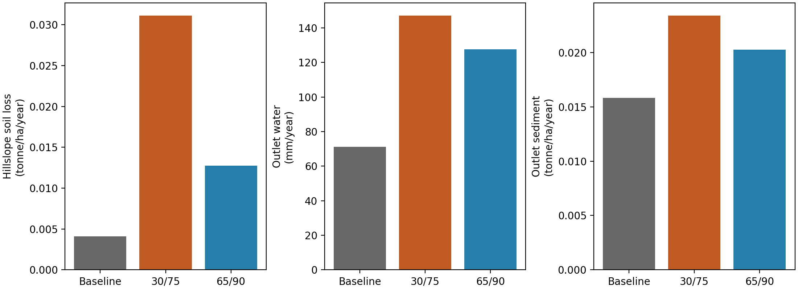
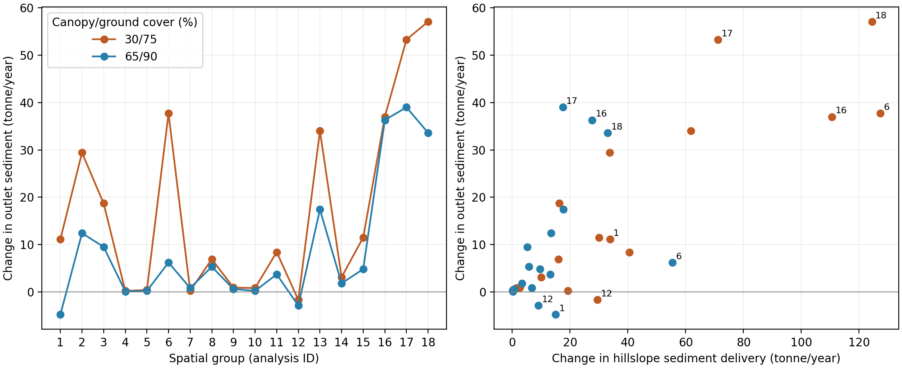
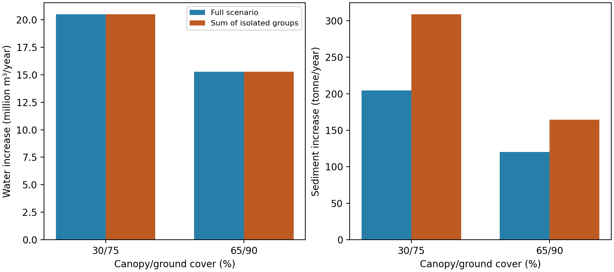

# From hillslope treatment to watershed response: OMNI scenarios and spatial contrasts in WEPPcloud

> Working manuscript, September 23, 2026. Intended audience: land managers,
> hydrologists, soil scientists, and watershed specialists. Not ready for
> submission: geographic verification, independent contrast/full-run comparison,
> a checked Tenderfoot dashboard example, and durable data archiving remain open.

**Authors and affiliations:** [TODO: confirm author list, order, and affiliations.]

## Abstract

Forest treatment planning requires comparison of both management prescriptions
and their placement within a watershed. Separate model projects can make these
comparisons difficult to maintain, while hillslope erosion estimates alone do
not describe sediment delivery downstream. OMNI extends WEPPcloud with scenarios
that share a watershed delineation and spatial contrasts that combine treatment
and baseline hillslope outputs before rerunning WEPP's channel routing.
Interactive maps and scenario summaries support inspection and comparison of
these alternatives. We demonstrate the approach in a 269.9-km² Tenderfoot-area
watershed using an unburned baseline, two thinning prescriptions, and 36 contrasts
across 18 spatial groups under a common 100-year synthetic climate sequence.
Mean annual hillslope soil loss increased from 0.0041 tonne/ha/year to 0.0311
and 0.0127 tonne/ha/year under prescriptions of 30/75 and 65/90 percent
canopy/ground cover. Mean outlet sediment increased by 47.9% and 28.2%,
respectively, with substantial variation among treatment locations. Adding the
isolated group sediment effects overestimated the corresponding full-scenario
increments by 51.0% and 36.5%, whereas outlet-water changes were nearly additive.
The results illustrate why treatment effects at the outlet must be evaluated
within their watershed context. Contrasts describe the effect of a selected
treatment while other areas remain at baseline; they are not additive shares
of a treatment portfolio. The application demonstrates a reproducible analysis
of saved model outputs, rather than field validation of thinning outcomes.

## 1. Introduction

Management of forests and other native-vegetation landscapes requires assessing
how disturbance and treatment alter runoff, erosion, and downstream sediment
delivery. Before wildfire, questions include the consequences of thinning and
prescribed fire and the risks associated with alternative burn conditions. After
wildfire, managers must evaluate potential impacts and decide where erosion
mitigation, such as mulching, is warranted. These decisions connect hillslope
conditions to water supplies, reservoirs, and aquatic resources downstream;
the locations producing the most erosion are not necessarily those where a
particular treatment produces the greatest outlet benefit. Forest erosion
research and post-fire decision tools establish the importance of evaluating
both disturbance and mitigation within their watershed context
([Elliot, 2013](https://doi.org/10.13031/2013.42680);
[Robichaud and Ashmun, 2013](https://doi.org/10.1071/WF11162)).

The Water Erosion Prediction Project (WEPP) is a process-based model of hydrology
and water erosion. It represents processes including infiltration, runoff,
detachment, sediment transport, and deposition at hillslope and watershed scales
([Flanagan et al., 2007](https://doi.org/10.13031/2013.23968)). Forest applications
build on dedicated soil and vegetation parameterizations and developments in
forest hydrology, including the representation of subsurface flow
([Elliot, 2004](https://doi.org/10.1111/j.1752-1688.2004.tb01030.x);
[Dun et al., 2009](https://doi.org/10.1016/j.jhydrol.2008.12.019)). WEPP-based tools
have supported evaluation of undisturbed forests, management disturbances, and
post-fire treatment alternatives; ERMiT, for example, provides probabilistic
hillslope erosion estimates for burned and recovering landscapes with and without
mitigation ([Robichaud et al., 2007](https://doi.org/10.1016/j.catena.2007.03.003)).

Geospatial interfaces such as GeoWEPP established workflows for assembling
spatial inputs and assessing land-use alternatives, emphasizing consistency
between data resolution, model representation, and the scale of the decision
([Renschler, 2003](https://doi.org/10.1002/hyp.1177)). WEPPcloud makes
watershed-scale modeling accessible through an online environment
that automatics the acquisition of environmental data, prepares WEPP inputs, executes simulations,
and presents results ([Lew et al., 2022](https://doi.org/10.1016/j.jhydrol.2022.127603)).
Its forest applications include undisturbed watershed assessment and pre- and
post-fire management comparisons
([Dobre et al., 2022](https://doi.org/10.1016/j.jhydrol.2022.127776)). Central to these
comparisons is the `(Un)Disturbed` parameterization framework: a common system
that translates vegetation or land-use class, soil texture, burn
severity, and treatment choices into WEPP management and soil inputs. Unburned
conditions are represented within this framework to provide consistent parameterization across scenarios.
Disturbance can change both vegetation and soil properties, so meaningful
comparisons require coordinated changes to the corresponding input files.
WEPPcloud's Treatments module applies management choices within this framework
by updating eligible hillslopes' vegetation management and associated soil
inputs. OMNI uses that module to construct related treatment alternatives and
organize their comparison. Neither module replaces WEPP's hydrologic and erosion
calculations.

Earlier WEPPcloud workflows used cloned projects to compare existing and treated
conditions, as described by Lew et al. (2022, section 4.1.5). Maintaining several
projects requires careful separation of intended treatment differences from
settings that should remain common. When a shared parameter is revised, users
must synchronize it across the relevant projects, including settings exposed in
WEPP Advanced Options. This repeated manual work is tedious and creates
opportunities for differences in model configuration to be mistaken for treatment
effects.

OMNI Scenarios automates the construction and management of these related
alternatives. A parent project supplies the watershed delineation, climate inputs,
and inherited model configuration; scenario definitions specify the burn or
treatment changes to apply. This preserves the same hillslope and channel
identities across alternatives and reduces the need to maintain equivalent settings in separate projects.
Inheritance applies when scenarios are constructed or rebuilt; completed results
must be regenerated after relevant inputs change.

OMNI Contrasts addresses the related question of how a localized change affects
the watershed outlet. In WEPPcloud's WEPP execution workflow, hillslope simulations
run first and write serialized hillslope "pass" files containing hydrologic and
sediment outputs. The watershed simulation reads these files as inputs to the
channel-network calculation. This separation provides a computational boundary
at which compatible control and treatment hillslope results can be combined.
Pass-file reuse and separate watershed execution are established WEPP capabilities
(Ascough et al., 1997, pp. 923–924); OMNI automates the selection and assembly
of compatible scenario outputs for spatial treatment comparisons.
WEPP's watershed formulation represents channel flow and sediment processes,
including detachment, transport, and deposition
([Ascough et al., 1997](https://doi.org/10.13031/2013.21343)).

For a single-hillslope contrast, OMNI substitutes the treatment scenario's pass
file for that hillslope, retains the control pass files elsewhere, and reruns
the watershed simulation. The resulting outlet difference describes the modeled
effect of that local intervention under the specified control conditions. Groups
of hillslopes can similarly represent a treatment area. This is useful when
comparing candidate mulch locations after a fire, evaluating a proposed treatment
unit, or examining downstream consequences in a municipal supply watershed;
targeted forest management for water supply has an established modeling precedent
([Srivastava et al., 2015](https://doi.org/10.1061/9780784479322.018)). Because each
contrast executes the watershed model, its outlet response retains process-based
water and sediment routing through the channel network. It is not estimated by
adding hillslope erosion reductions or applying a fixed delivery fraction.
Responses to multiple interventions therefore require their own routed evaluation,
rather than assuming that separate single-hillslope effects are additive.

Interpreting these alternatives also requires spatial and quantitative comparison.
Pi-VAT demonstrated the value of interactive synthesis of multi-scenario watershed
model outputs ([Deval et al., 2022](https://doi.org/10.1016/j.jhydrol.2022.127529)).
Here, we examine a workflow connecting OMNI's scenarios and spatial contrasts
with map-based inspection and quantitative comparison. A Tenderfoot-area
application addresses three questions: how do alternative thinning prescriptions
change water and sediment outputs; how do effects vary among treatment locations;
and can separate spatial effects be added to represent a combined treatment?
The purpose is to demonstrate the interpretation these comparisons support,
while distinguishing model responses from observed treatment outcomes.

## 2. Comparing management alternatives within one watershed

### 2.1. Treatments translate management choices into model inputs

WEPPcloud's Treatments module ensures that management prescriptions are sensible to the landuse and soil conditions they are applied to. For example, only forested hillslopes can be thinned or prescribed burned, and only burned hillslopes can be mulched. A treatment is an assignment to a
modeled hillslope, such as a thinning prescription, mulch application, or
prescribed fire. The module can be used directly within a project by selecting
hillslopes or supplying a treatment raster. The treatments user-interface provides the ability for users to upload a raster for specifying spatial treatments within each hillslope determines its assignment; the
raster does not automatically create smaller treatment units within that
hillslope. OMNI uses the same treatment machinery to build scenario alternatives.

Treatments operates within the `(Un)Disturbed` parameterization framework.
It identifies the existing vegetation or disturbance class, checks whether the
requested treatment is applicable, and updates the hillslope's management
assignment. It then uses soil texture and the resulting treatment class to
select the applicable soil-parameter rules. These rules produce treatment soil
files from the underlying soils and update the hillslope-to-soil assignments.
The subsequent input-preparation step writes the management files used by WEPP.
Treatment effects thus enter the hydrologic and erosion calculations through
model inputs; they are not percentage adjustments applied to predicted runoff
or sediment after a simulation.

The treatment types represent different changes. Thinning selects a management
class with specified canopy and ground cover and applies the corresponding
thinning soil rules to eligible forest hillslopes. The supplied parameter tables
can also distinguish forest and thinning conditions through erosion and
hydraulic parameters and vegetation properties such as rooting depth and leaf
area. A thinning alternative therefore represents a complete parameterized
condition, not an experiment in changing canopy cover alone. Exact parameter
values depend on the project's active lookup tables and management files.

Mulch follows a different path. It applies to eligible fire-disturbed hillslopes,
retains the burned class as the basis for soil and vegetation parameters, and
increases the initial ground cover protecting rill and interrill areas. The
cover calculation depends on both existing cover and application rate and
approaches a saturation limit, rather than adding the same number of percentage
points everywhere. Prescribed fire selects the corresponding forest, shrub, or
grass prescribed-fire class and its associated parameterization. These rules
represent specified post-treatment conditions; the module does not simulate
tree-removal operations or predict the behavior of a prescribed burn.

### 2.2. Representing mulch application as additional ground cover

Mulch protects exposed soil, but its modeled effect depends on how much cover
was already present, as mulch is added some covers bare ground and some covers already mulched ground. The Treatments module translates application rate into
initial ground cover using a bounded, saturating relationship:

\[
G(m) = 100 - \frac{100-G_0}{1+(a m)^b},
\]

where \(G_0\) is initial cover (%), \(G(m)\) is cover after application (%), and
\(m\) is the application rate in tons/acre as specified by the treatment catalog.
The implemented coefficients are \(a=0.8473653\) and \(b=1.7369656\), with
\(a m\) dimensionless. Zero application preserves existing cover, and increasing
application approaches 100% cover. The same application produces a smaller
absolute cover increase where the ground is already well protected.

For example, at 10% initial cover, applications of 0.5, 1, and 2 tons/acre produce
26.5%, 48.6%, and 74.3% cover. At 60% initial cover, the same rates produce
67.3%, 77.1%, and 88.6%. Consequently, the catalog labels `mulch_15`, `mulch_30`,
and `mulch_60`, corresponding to these three rates, should not be interpreted
as uniform increases of 15, 30, or 60 percentage points.

The calculation is applied separately to initial rill and interrill ground
cover on eligible burned hillslopes. The burned base supplies the other
management and soil parameters; WEPP then calculates the resulting runoff,
erosion, and sediment delivery. The cover relationship itself neither predicts
an erosion-reduction percentage nor represents mulch persistence over time.

The target cover values were supplied by P. R. Robichaud based on his
experience with mulch application: starting from 30% cover, 1 ton/acre gives
60% and 2 tons/acre gives 80% (personal communication; date to be supplied).
The coefficients were fitted to these expert-informed targets. The curve
extends those targets to other application rates and initial cover conditions;
that extension has not been independently validated against field measurements.
Application method, material, and measured cover should therefore inform the
choice and interpretation of a mulch scenario. The present analysis does not
establish the accuracy of this application-rate-to-cover relationship.

### 2.3. OMNI constructs and runs the related scenarios

OMNI supplies the organization around these treatment operations. Each scenario
has a definition describing its base condition, requested treatment, and any
applicable selection filters. The construction and execution sequence is:

1. **Establish a scenario workspace.** OMNI creates a separate child project
   under the parent run. The child refers to shared climate, terrain, and
   watershed assets, preserving the same hillslope and channel identities.
   It receives copies of project settings and the soil, land-use, and disturbance
   resources needed to construct its alternative inputs.
2. **Prepare the reference condition.** OMNI establishes the unburned, mapped
   burn-severity, or uniform burn-severity condition required by the scenario.
   For example, thinning is constructed on an unburned condition, while a mulch
   scenario uses its specified burned base. Land-use and soil inputs are rebuilt
   where the scenario requires them.
3. **Assign and apply the treatment.** For a treatment scenario, OMNI resolves
   the requested prescription in the treatment catalog and identifies eligible
   hillslopes, subject to any configured slope or burn-severity filters. It
   passes the resulting hillslope-to-treatment assignments to Treatments, which
   applies the management and soil rules described above. Channel elements are
   not assigned hillslope treatments.
4. **Prepare and execute WEPP.** The scenario's management and soil files are
   paired with the shared climate and slope inputs. WEPP runs the hillslopes,
   saves their water and sediment outputs, and then runs the watershed channel
   network. Each full scenario therefore has its own simulated hillslope and
   routed watershed results.
5. **Assemble comparable summaries.** OMNI retains scenario identity in combined
   hillslope, channel, and outlet tables. These outputs support numerical
   comparisons and provide the source hillslope results for later contrasts.

For Tenderfoot, the definitions `thinning_30_75` and `thinning_65_90` select two
catalog prescriptions. OMNI identifies the eligible forest hillslopes and asks
Treatments to construct their alternative management and soil assignments.
Treatments does not independently choose where thinning should occur. In the
full scenarios, all eligible forest is treated; subsequent contrasts select
which locations contribute treatment outputs to a particular watershed run.

This division of responsibilities lets users compare alternatives without
manually rebuilding and synchronizing separate projects: Treatments defines
how a prescription is represented, OMNI manages the related scenarios and
spatial selections, and WEPP calculates their responses. Shared inputs and
copied settings reflect the construction process, not a guarantee that completed
outputs remain current. Relevant parent edits require rebuilding or rerunning
the affected alternatives. New hillslope simulations are needed when treatment
or other hillslope inputs change; compatible saved outputs can be reused when
only their spatial selection changes in a contrast.

### 2.4. Contrasts evaluate treatment location

A full scenario answers what happens when a prescription is applied across all
eligible locations. A contrast asks what happens when that prescription is
applied only to a selected hillslope or group of hillslopes, with the remainder
of the watershed held at a reference condition. Here, the reference is the
undisturbed modeling baseline.

WEPP first simulates water movement and erosion on each hillslope. It saves the
water and sediment leaving those hillslopes in files subsequently read by the
watershed model. OMNI assembles a watershed using treatment outputs for the
selected hillslopes and baseline outputs elsewhere, then reruns channel routing.
The outlet response therefore includes the channel network's response to the
changed inputs. Hillslope soil loss and outlet sediment delivery are distinct:
sediment can be deposited before reaching the outlet, and channels can themselves
supply sediment through erosion.

A contrast is a conditional comparison. Its result describes treating the chosen
area while the rest of the watershed remains at baseline. If another area is also
treated, water and sediment entering the shared downstream network change again.
The combined response must be evaluated rather than assumed to equal the sum of
the separate effects. OMNI's spatial selections can represent individual
hillslopes, user-defined treatment areas, or drainage-based groups. The Tenderfoot
application uses groups, not individual-hillslope contrasts.

### 2.5. Specifying contrast pairs and treatment locations

A contrast definition combines an ordered **scenario pair** with a spatial
selection. The **control scenario** supplies hillslope outputs outside the
selected area; the **contrast scenario** supplies outputs inside it. Either
member can be the parent project's base condition or an available OMNI scenario
with the required outputs. For example, a burned control paired with a mulched
alternative asks about mulching selected burned hillslopes. An undisturbed
control paired with a thinning alternative asks about thinning selected forest
areas. The control need not be undisturbed, and changing the order of a pair
changes the question. A pair identifies the two sources used to construct a
mixed watershed; it does not simply subtract two full-scenario results.

The assembled hillslope outputs are routed through the parent project's channel
network and routing configuration. Comparison with the control's watershed
result then estimates the effect of the selected substitution under compatible
routing conditions. The shared delineation and hillslope identifiers make these
substitutions possible. Scenario treatment rules still determine which selected
hillslopes actually change: selecting an area does not make an ineligible land
cover receive the prescription.

OMNI provides four ways to specify locations:

- **Cumulative contribution screening** ranks hillslopes by a selected output
  from the control scenario and selects them until a cumulative fraction or
  hillslope-count limit is reached. Objectives include soil-loss mass, surface
  or subsurface runoff depth or volume, and total phosphorus mass. Optional
  filters restrict candidates by slope or burn severity; the cumulative fraction
  is calculated over the retained candidates. Often a small percentage of hillslopes will acount for a large percentage of the runoff or soil-loss.
  Each selected hillslope produces an independent contrast; the selected
  hillslopes are not progressively combined into one treated area. The current
  limit is 100 hillslopes due to computational limits. For water-contribution screening, volume is the
  appropriate objective: summing hillslope depths does not account for unequal
  hillslope areas.
- **Mapped treatment areas** use uploaded GeoJSON polygons, optionally labeled by a
  feature attribute. A hillslope is included when at least half its area
  overlaps a polygon. Features sharing an area label contribute to one
  selection, and different selections may overlap. Selected hillslopes are
  substituted as whole modeling units; polygon boundaries do not create
  fractional hillslope treatments.
- **Explicit hillslope groups** use user-supplied hillslope identifiers, with
  one group per line. This supports testing a known treatment unit or a
  particular combination of locations without drawing polygons.
- **Stream-order groups** use the drainage network to define treatment units.
  Successive order-reduction passes remove the smallest remaining headwater
  channels for grouping purposes. Original hillslopes are assigned to the
  resulting drainage groups by greatest spatial overlap. This changes the
  grouping used to select treatments; watershed routing retains the original
  channel network. This option requires WhiteboxTools delineation.

Cumulative screening uses one control–alternative pair per build. The other
three modes accept multiple pairs and evaluate each pair for each nonempty
area or group. Cumulative screening filters do not apply to these three modes. Thus, the Tenderfoot demonstration combines two pairs—undisturbed to
30/75 thinning and undisturbed to 65/90 thinning—with 18 drainage groups to
produce 36 contrasts. This design separates the choice of prescription from
its placement while keeping both explicit in the interpretation.

### 2.6. Maps and summaries support interpretation

GL-Dashboard displays management conditions and model outputs on a common map,
allowing users to inspect where a prescription changes soil loss, runoff, or
other quantities. Difference maps support comparison with a reference condition;
distributions and multi-scenario graphs help distinguish widespread responses
from a few large changes. Users must check which alternatives appear in each
map and graph and how the difference is defined. A positive difference can mean
an increase or a reduction, depending on the selected subtraction convention.
In this paper, a positive change always means **treatment minus baseline**.

The query engine provides access to model-output tables for filtering, joining
spatial attributes, and aggregating results. For example, a comparison can sum
soil-loss mass over selected hillslopes and divide by their combined area. It
should not average hillslope erosion rates without accounting for unequal areas.
Hillslope soil loss, sediment leaving hillslopes, and sediment leaving the
watershed must remain separate throughout the analysis. Here, numerical results
were calculated independently from saved model-output tables with retained
Python scripts. They are not values estimated from map colors or a test of the
query engine's performance.

## 3. Tenderfoot-area demonstration and analysis

### 3.1. Study extent and modeling conditions

The demonstration uses the WEPPcloud project
[`animal-misgiving`](https://wepp.cloud/weppcloud/runs/animal-misgiving/disturbed9002_wbt/)
in the Tenderfoot Creek area of Montana. Tenderfoot Creek Experimental Forest
provides a relevant management context: its research includes forest treatments,
water yield, sediment transport, and untreated reference catchments (USDA Forest
Service, n.d.). The modeled basin, however, covers **269.927 km²**, considerably
more than the approximately 36.9-km² experimental forest. This application is to demonstrate the
current modeling capability for demonstrative purposes, it is not a reconstruction of the experimental
forest's treatment layout or a comparison with its monitored catchments. The modeled results are not recommendations or suggestions for treating or not treating the area.

The model contains 2,149 hillslopes and 918 channels. The total area including channels is 26,993 ha.
The baseline uses the unburned parameterization without an SBS map. “Undisturbed”
is the model's baseline designation and does not establish that the entire basin
has never been harvested or otherwise managed.

All alternatives use a 100-year synthetic climate sequence generated in
WEPPcloud's PRISM stochastic mode, with station `mt241552`. The PRISM stochastic mode uses CLIGEN to generate a 100-year daily climate series, then uses PRISM gridded monthly precip and temperature to spatially downscale for each hillslope.
Mean annual precipitation over the modeled basin is approximately
560 mm. The years represent a climate realization, not a dated observation
period or a forecast of the next century.

### 3.2. Thinning prescriptions and spatial groups

Two scenarios prescribe **30% canopy cover with 75% ground cover** and **65%
canopy cover with 90% ground cover**, abbreviated 30/75 and 65/90. These are
remaining cover settings, not percentages of trees removed. Both scenarios
change the modeled evergreen-forest class, covering 25,768.182 ha, or about
95.6% of modeled hillslope area. Other land-cover classes retain their baseline
management. The prescriptions are hypothetical parameterized alternatives;
neither is presented as a measured operation at Tenderfoot. They use the
Treatments module's management classes and associated soil rules (Section 2.1).
The cover labels identify prescriptions rather than enumerate every model
parameter that differs from the forest baseline. These runs do not isolate
the individual effects of canopy cover, ground cover, or treatment soil rules.

The basin was divided into 18 drainage-based groups using stream-order selection
with three order-reduction passes. Each group was evaluated with both thinning
prescriptions, producing 36 contrasts. The groups do not overlap and together
contain all 2,149 hillslopes. Within a selected group, only hillslopes eligible
for thinning change management. Group size varies, so both selected area and
actually treated area are retained with the results. Group numbers in this paper
are analysis identifiers; exact hillslope membership accompanies the data.

### 3.3. Response measures and consistency checks

The analysis distinguishes three sediment quantities: gross hillslope soil loss,
sediment delivered from hillslopes to the channel network, and sediment discharged
at the watershed outlet. Gross channel soil loss is reported separately. These
quantities describe different parts of the sediment balance and are not
interchangeable measures of watershed erosion.

Mean annual hillslope soil loss per hectare was calculated by summing hillslope
soil-loss mass and dividing by total hillslope area. Outlet sediment density and
water-discharge depth use total contributing area. Each contrast was compared
with the same baseline. Average contrast effects give equal weight to each of
the 18 groups within a prescription; they do not describe equal-area treatments.
Annual results were paired by simulation year to characterize variation within
the shared climate realization.

To examine whether effects could be added, the 18 isolated group changes were
summed and compared with the corresponding full-scenario change. In notation,
if B is the baseline response, C_g the response after treating group g alone,
and S the full-scenario response, the comparison is between Σ(C_g − B) and
S − B. Because the groups form a complete partition, the same eligible
hillslopes are represented in both evaluations; their treatment configuration
outside any one group differs.

Checks confirmed complete group coverage, agreement between selected hillslopes
and saved baseline/treatment file assignments, and agreement of combined outlet
summaries with the individual run outputs. Reconstructed hillslope soil-loss
changes agreed with contrast reports within their printed precision. Annual
means were checked against long-term summaries. Input checksums and recorded
source-output dependencies were also verified. These tests assess internal
consistency; they do not replace comparison with observations or independently
prepared full simulations.

The combined contrast export contained incorrect reference values in stream-order
mode, making its stored differences zero. All differences reported here were
therefore calculated directly from the individual baseline and contrast outputs.
Outlet sediment densities were recalculated from mass and area because printed
densities were rounded to zero. A duplicate daily date label in the final
simulation year prevented a daily timing analysis; annual comparisons use the
separate annual output tables. Details and discrepancy records are retained in
the [analysis record](data/tenderfoot/analysis.md).

## 4. Results

### 4.1. Full scenarios: large relative changes from a small erosion baseline

Both prescriptions increased modeled hillslope soil loss, water discharge, and
outlet sediment compared with the baseline (Table 1). Mean annual hillslope soil
loss increased from 0.00407 tonne/ha/year to 0.03110 under 30/75 and 0.01273 under
65/90. These are increases by factors of approximately 7.64 and 3.13, but the
absolute rates remain small. Reporting percentages alone would obscure that
small starting value.

**Table 1.** Whole-watershed annual means over the 100-year climate realization.
Hillslope soil-loss density excludes channel area from its denominator; outlet
water depth includes the entire contributing area.

| Quantity | Baseline | 30/75 cover | 65/90 cover |
| --- | ---: | ---: | ---: |
| Hillslope soil loss (tonne/ha/year) | 0.00407 | 0.03110 | 0.01273 |
| Hillslope soil loss (tonne/year) | 109.75 | 838.47 | 343.24 |
| Outlet water discharge (mm/year) | 71.08 | 147.06 | 127.61 |
| Gross channel soil loss (tonne/year) | 1,162.6 | 2,507.4 | 2,125.9 |
| Outlet sediment delivery (tonne/year) | 426.9 | 631.5 | 547.2 |

Water discharge increased by 106.9% under 30/75 and 79.5% under 65/90. Outlet
sediment increased by 47.9% and 28.2%, respectively. Gross channel soil loss
exceeded gross hillslope soil loss under all three conditions. This highlights
the importance of channel response, although it does not establish what fraction
of outlet sediment originated from channels: deposition and storage occur
between sediment sources and the outlet.

**Figure 1.** Mean annual hillslope soil loss, outlet water discharge, and outlet
sediment delivery for the baseline and two prescribed cover conditions. All
values describe simulations, not measured treatment outcomes.

### 4.2. Average group effects and variation among locations

Treating one group at a time produced smaller whole-watershed changes than
applying the prescription to all eligible forest (Table 2). Across the 18 groups,
the average hillslope soil-loss increase was 36.9% for 30/75 and 11.8% for 65/90.
Average outlet-water increases were 5.94% and 4.42%, and average outlet-sediment
increases were 4.02% and 2.14%.

**Table 2.** Mean treatment-minus-baseline change across 18 equally weighted
spatial-group contrasts per prescription. Percentages refer to the
whole-watershed baseline. Density and depth increments use the entire modeled
hillslope or contributing area, respectively, not the treated group area.

| Change in annual mean | 30/75 cover | 65/90 cover |
| --- | ---: | ---: |
| Hillslope soil loss (%) | +36.9 | +11.8 |
| Hillslope soil loss (tonne/ha/year) | +0.00150 | +0.00048 |
| Outlet water discharge (%) | +5.94 | +4.42 |
| Outlet water discharge (mm/year) | +4.22 | +3.14 |
| Outlet sediment delivery (%) | +4.02 | +2.14 |
| Outlet sediment delivery (tonne/year) | +17.17 | +9.12 |

The means conceal substantial spatial variation. Isolated-group outlet sediment
changes ranged from −1.7 to +57.1 tonne/year under 30/75 and from −4.8 to +39.0
under 65/90. These differences reflect both group size and the hydrologic and
sediment response of its location; they should not be interpreted as an equal-area
comparison of treatment efficiency.

Changes in hillslope delivery did not give the same ranking as changes at the
outlet. Under 65/90, group 6 added 55.42 tonne/year of hillslope sediment delivery
but only 6.2 tonne/year at the outlet. Group 17 added 17.45 tonne/year of hillslope
delivery but 39.0 tonne/year at the outlet, accompanied by a larger increase in
gross channel erosion. Across all groups, rank correlations between added
hillslope delivery and added outlet sediment were 0.815 for 30/75 and 0.639 for
65/90. Hillslope response was informative, but insufficient to determine the
outlet response.

**Figure 2.** Mean annual outlet-sediment changes by spatial group (left) and in
relation to changes in hillslope sediment delivery (right). Selected group labels
identify examples discussed in the text. Each point represents treatment of one
group against the otherwise unchanged baseline. Groups have unequal areas.

### 4.3. Separate sediment effects do not sum to the combined effect

For 30/75, the isolated group sediment increments summed to 309.0 tonne/year,
whereas treating all eligible forest increased outlet delivery by 204.6
tonne/year. For 65/90, the corresponding increments were 164.2 and 120.3
tonne/year. Thus, adding isolated effects overestimated the full-scenario
increment by 51.0% and 36.5% (Figure 3). These discrepancies are much larger than
the 0.1-tonne resolution of the outlet summaries.

Hillslope soil-loss increments summed exactly when calculated from the source
hillslope summaries. Outlet-water increments were also nearly additive, differing
from their full-scenario increments by less than 0.004%. The sediment discrepancy
therefore arises after the hillslope responses are assembled and routed, rather
than from omitted or overlapping treatment groups.

**Figure 3.** Full-scenario changes compared with the sum of isolated group
changes. Water-volume changes are nearly additive, whereas summed sediment
changes exceed those from the corresponding full scenario. Both comparisons
refer to the same eligible treatment area and climate realization.

### 4.4. Long-term means do not describe every year

Both full prescriptions increased water discharge in all 100 simulated years.
Outlet sediment increased in 76 years under 30/75 and 78 under 65/90. Median
annual sediment increments were 92.2 and 69.3 tonnes, smaller than the respective
mean increments of 204.6 and 120.3 tonnes. A subset of years therefore contributed
disproportionately to the long-term mean response.

Small negative mean outlet responses also occurred among the spatial contrasts.
Group 12 increased local hillslope delivery and water discharge under both
prescriptions, while mean outlet sediment declined by 1.7 and 2.9 tonne/year.
Such results are consistent with a changed balance of transport and storage
within the model; they are not evidence that thinning generally reduces soil
loss. Channel-resolved contrast outputs would be needed to locate the reaches
responsible for these changes.

## 5. Implications for watershed treatment assessment

### 5.1. Match the response measure to the management question

A treatment assessment may seek to maintain soil on a slope, protect a stream
reach, or limit sediment reaching a reservoir. These objectives concern different
response measures. Hillslope soil loss addresses local detachment, while outlet
sediment reflects delivery through the intervening network as well as channel
erosion. A map of hillslope soil loss alone cannot establish the downstream
consequence of treating a particular area.

The Tenderfoot example shows how scenarios and contrasts can address these
questions in sequence. Full scenarios characterize the response to each
prescription. Spatial contrasts identify where applying that prescription changes
the selected downstream measure. Maps provide geographic context; tabular
aggregation supplies comparable masses, depths, and area-normalized rates.
An assessment can then focus on candidate locations that warrant closer field
inspection and more detailed treatment design.

The modeled increases reported here should not be interpreted as a recommendation
for or against thinning. The scenarios do not quantify wildfire probability,
future burn severity, vegetation recovery trajectories, habitat outcomes, or
operational costs. A broader decision would need those considerations and
site-specific information about how a proposed operation changes canopy,
ground cover, and soil conditions. In particular, these simulations do not
estimate an avoided postfire erosion benefit.

### 5.2. Evaluate combinations as combinations

The contrast results show why a list of individual effects is not a treatment
portfolio. Treating one area changes water and sediment entering downstream
channels. Treating additional areas changes those boundary conditions again,
so the outlet consequence of one intervention need not remain the same. The
substantial difference between summed and combined sediment responses makes
this qualification practically relevant in the present simulation.

For planning, isolated contrasts can screen locations and expose spatial
variation. Selected combinations then require their own assembled-and-routed
evaluation. Neither a ranking of hillslope erosion nor a ranking of isolated
outlet effects establishes an optimal treatment layout. The retained watershed
routing is central to that evaluation, rather than an optional correction to
hillslope totals.

### 5.3. Demonstrated capabilities and remaining uncertainty

The application demonstrates consistent spatial comparisons and internally
checked model responses. It does not validate treatment effects against field
measurements. The synthetic climate years characterize variation within one
realization, not independent treatment replicates or uncertainty in soil,
vegetation, and channel parameters. The large changes in water yield particularly
warrant scrutiny of those inputs before management use. Modeled absolute erosion
rates are not compared with a site-specific soil-loss tolerance or ecological
impact threshold here.

The model boundary must also be distinguished from the experimental forest's
boundary and monitoring catchments. A future observational evaluation would need
a matching contributing area, measured weather, and documented treatment history.
An independent full simulation of a selected contrast is still needed to test
assembly equivalence directly. Agreement among the saved outputs and source
assignments establishes a narrower form of consistency.

Reuse of hillslope outputs avoids repeating that component of computation for
each compatible contrast, but no measured speedup is claimed. Similarly, the
available map and query capabilities establish a way to inspect alternatives,
not evidence of improved decisions or reduced user task time. Publication should
include a Tenderfoot dashboard example with selected values checked against the
saved tables; the numerical figures here are script-generated.

## 6. Conclusions

OMNI organizes management alternatives around a common watershed project and
uses spatial contrasts to evaluate how selected treatment locations affect
routed water and sediment. In the Tenderfoot-area demonstration, two thinning
prescriptions increased mean hillslope soil loss and outlet sediment, while
absolute hillslope losses remained modest. The magnitude and, in some cases,
sign of the outlet sediment response depended on treatment location.

Summing isolated group effects overestimated full-scenario sediment increments
by 51.0% and 36.5%, even though water-volume changes were nearly additive. This
provides a concrete reason to evaluate treatment combinations through the
watershed model. For land managers and watershed specialists, the contribution
is a practical connection between treatment definitions, spatial inspection,
and downstream response assessment. Field validation and management judgment
remain necessary to turn a modeled comparison into a treatment decision.

## Code and data availability

WEPPcloud source is available in [WEPPpy](https://github.com/rogerlew/wepppy).
The [Tenderfoot analysis record](data/tenderfoot/analysis.md) documents the
snapshot, inputs, numerical checks, and limitations. Retained
[acquisition](data/tenderfoot/fetch_snapshot.py) and
[analysis](data/tenderfoot/analyze.py) scripts reproduce the tables and figures;
CSV results and a file-checksum manifest accompany them. The approximately
224-MB raw snapshot is retained locally and excluded from Git. A durable archive
of those exact inputs is needed for publication because the online project can
change. The recorded source commit is unknown; the retained outputs and model
executable name do not establish complete runtime provenance.

## Author contributions and AI assistance

[TODO: confirm authors, affiliations, and contributions.]
An AI coding assistant assisted with literature and source review, analysis
scripts, artifact checks, figures, and manuscript drafting. The authors are
responsible for reviewing the analysis, interpretation, and final text.

## Appendix A. Complementary postfire scenario example: Lookout Creek

The earlier Lookout Creek demonstration (`traveled-calligrapher`, Oregon)
illustrates the same scenario workflow for postfire mitigation. Its approximately
61.34-km² delineation uses a mapped soil burn severity baseline, an undisturbed
reference, and two mulch alternatives with nominal 30% and 60% ground-cover
increase settings. Climate inputs cover 1986–2025 using observed GRIDMET data.
Applying alternative conditions across that weather sequence is not a historical
reconstruction of fire timing and vegetation recovery.

Preliminary mean annual hillslope soil losses were 1.560 tonne/ha/year for the
SBS-based parent, 0.006 for the undisturbed reference, and 1.388 and 1.295 for the
two mulch alternatives. These watershed-wide averages use 6,124.9762 ha of
hillslope area and imply reductions of approximately 11% and 17% with mulch.
Treatment masks and exact averaging years require final verification before
publication. [Scenario data](data/lookout/scenarios/scenarios.out.parquet) and
[the dashboard difference map](figures/gl-dashboard-difference-map.png) are
retained; the map's Base − Scenario convention is opposite to the
Treatment − Baseline convention used for Tenderfoot in this paper.

The Forest Service's initial BAER assessment reported that approximately 85% of
the entire Lookout Fire perimeter was low severity or unburned/underburned, with
13% moderate and 2% high soil burn severity. Retained soil structure and
infiltration supported an expectation of limited erosion overall, with localized
hazards on steep burned slopes lacking cover (USDA Forest Service, 2023). This
is qualitative context, not validation of modeled erosion or mulch effectiveness;
fire-perimeter proportions are not the modeled watershed's proportions.
Andrews Forest documentation subsequently reported sediment blockage at the
Mack Creek gauge and unusable discharge records from December 1, 2023 to
February 14, 2024 (Johnson et al., 2026). Modest watershed averages can coexist
with consequential local effects.

A separate comparison of the SBS-based parent's daily discharge with USGS
14161500 for August 1, 2023–December 31, 2025 gave NSE 0.474, KGE 0.450, and
modeled volume 30.7% below observations. These metrics provide hydrologic context
only; they do not validate sediment or the treatment comparisons. The
[assessment](data/lookout/fit-2023-2025/assessment.json) and supporting
[precipitation analysis](data/lookout/precipitation-comparison/provenance.json)
remain available.

## References

Ascough II, J. C., Baffaut, C., Nearing, M. A., and Liu, B. Y. (1997).
The WEPP watershed model: I. Hydrology and erosion. *Transactions of the ASAE*,
40(4), 921–933. https://doi.org/10.13031/2013.21343

Deval, C., et al. (2022). Pi-VAT: A web-based visualization tool for decision
support using spatially complex water quality model outputs. *Journal of
Hydrology*, 607, 127529. https://doi.org/10.1016/j.jhydrol.2022.127529

Dobre, M., et al. (2022). WEPPcloud: An online watershed-scale hydrologic modeling
tool. Part II. Model performance assessment and applications to forest management
and wildfires. *Journal of Hydrology*, 610, 127776.
https://doi.org/10.1016/j.jhydrol.2022.127776

Dun, S., et al. (2009). Adapting the Water Erosion Prediction Project (WEPP) model
for forest applications. *Journal of Hydrology*, 366, 46–54.
https://doi.org/10.1016/j.jhydrol.2008.12.019

Elliot, W. J. (2004). WEPP Internet Interfaces for Forest Erosion Prediction.
*JAWRA*, 40(2), 299–309. https://doi.org/10.1111/j.1752-1688.2004.tb01030.x

Elliot, W. J. (2013). Erosion processes and prediction with WEPP technology in
forests in the Northwestern U.S. *Transactions of the ASABE*, 56(2), 563–579.
https://doi.org/10.13031/2013.42680

Flanagan, D. C., Gilley, J. E., and Franti, T. G. (2007). Water Erosion Prediction
Project (WEPP): Development History, Model Capabilities, and Future Enhancements.
*Transactions of the ASABE*, 50(5), 1603–1612.
https://doi.org/10.13031/2013.23968

Johnson, S., Henshaw, D., Nash, B., Remillard, S., and Rothacher, J. (2026).
Stream discharge in gaged watersheds at the HJ Andrews Experimental Forest,
1949 to present. *Andrews Forest LTER Site*, database HF004, version 39.
See "Quality Assurance - HF004" for the Mack Creek post-fire sedimentation note.
https://andrewsforest.oregonstate.edu/data/datacatalog/HF004
Accessed September 21, 2026.

Larsen, I. J., and MacDonald, L. H. (2007). Predicting postfire sediment yields
at the hillslope scale: Testing RUSLE and Disturbed WEPP. *Water Resources
Research*, 43, W11412. https://doi.org/10.1029/2006WR005560

Lew, R., et al. (2022). WEPPcloud: An online watershed-scale hydrologic modeling
tool. Part I. Model description. *Journal of Hydrology*, 608, 127603.
https://doi.org/10.1016/j.jhydrol.2022.127603

Renschler, C. S. (2003). Designing geo-spatial interfaces to scale process models:
the GeoWEPP approach. *Hydrological Processes*, 17, 1005–1017.
https://doi.org/10.1002/hyp.1177

Robichaud, P. R., and Ashmun, L. E. (2013). Tools to aid post-wildfire assessment
and erosion-mitigation treatment decisions. *International Journal of Wildland
Fire*, 22, 95–105. https://doi.org/10.1071/WF11162

Robichaud, P. R., Elliot, W. J., Pierson, F. B., Hall, D. E., and Moffet, C. A.
(2007). Predicting postfire erosion and mitigation effectiveness with a web-based
probabilistic erosion model. *CATENA*, 71(2), 229–241.
https://doi.org/10.1016/j.catena.2007.03.003

Srivastava, A., Elliot, W. J., and Wu, J. Q. (2015). Use of Fire Spread and
Hydrology Models to Target Forest Management on a Municipal Watershed.
*Watershed Management 2015*, 194–208. https://doi.org/10.1061/9780784479322.018

USDA Forest Service, Willamette National Forest (2023, October 5).
Emergency response team shares soil-burn severity map and research from Lookout
Fire: Field surveys, satellite images provide a picture of burned areas and soil
stability. Forest Service news release.
[Official release](https://inciweb-prod-media-bucket.s3.us-gov-west-1.amazonaws.com/s3fs-public/2023-10/Emergency%20response%20team%20shares%20soil-burn%20severity%20map%20and%20research%20from%20Lookout%20Fire.pdf).

USDA Forest Service (n.d.). Tenderfoot Creek Experimental Forest. Rocky Mountain
Research Station. [Site description and monitoring overview](https://research.fs.usda.gov/rmrs/forestsandranges/locations/tcef).
Accessed September 23, 2026.

<!-- Draft reference list: expand abbreviated author lists at submission.
Full-text acquisition status and additional reviewed literature are recorded in
references/literature-review.md and references/access-needed.md. -->
