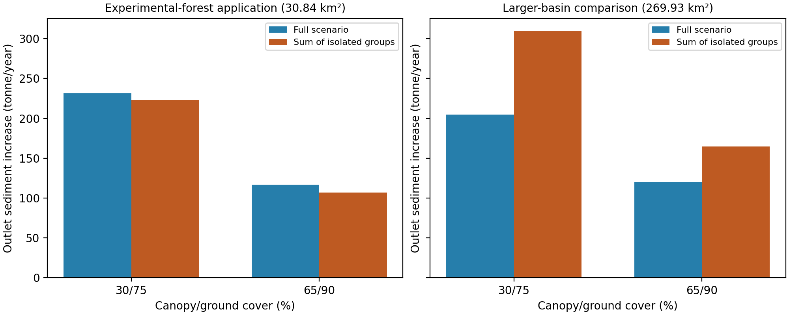

# From hillslope treatment to watershed response: OMNI scenarios and spatial contrasts in WEPPcloud

> Working manuscript, October 8, 2026. Primary case: `turbinate-melodrama`;
> larger-basin comparison: `animal-misgiving`. Screenshot placeholders are
> intentional. Boundary verification, consumed-input parameter audit, independent
> contrast/full-run comparison, and durable model-input archiving remain open.

**Authors and affiliations:** [TODO: confirm author list, order, and affiliations.]

## Abstract

Forest treatment planning requires comparison of both management prescriptions
and their placement within a watershed. OMNI extends WEPPcloud with scenarios
that share a watershed delineation and spatial contrasts that combine treatment
and baseline hillslope outputs before rerunning WEPP's channel routing. We
apply the workflow to a 30.84-km² Tenderfoot experimental-forest application,
using two thinning prescriptions and 66 contrasts across 33 spatial groups.
Under a common 100-year synthetic climate realization, mean hillslope soil loss
increased from 0.00398 tonne/ha/year to 0.03547 and 0.01253 tonne/ha/year for
30/75 and 65/90 percent canopy/ground-cover prescriptions. Mean outlet sediment
increased by 143.7% and 72.5%. Summing isolated group effects underestimated the
full-scenario sediment increments by 3.7% and 8.3%. In a complementary
269.93-km² Tenderfoot-area application, summed effects instead overestimated
the increments by 51.4% and 37.0%. Outlet-water changes were nearly additive in
both applications. Basin extent, treatment grouping, and climate realization
differed between the applications, preventing attribution of this difference
to basin size alone. Contrasts describe conditional effects of selected
treatments; their sum is not necessarily the response to a treatment portfolio.
The applications demonstrate internally checked model comparisons, rather than
field validation of thinning outcomes.

## 1. Introduction

Management of forests and other native-vegetation landscapes requires assessing
how disturbance and treatment alter runoff, erosion, and downstream sediment
delivery. Before wildfire, questions include the consequences of thinning and
prescribed fire and the risks associated with alternative burn conditions. After
wildfire, managers must evaluate potential impacts and decide where erosion
mitigation, such as mulching, is warranted. These decisions connect hillslope
conditions to water supplies, reservoirs, and aquatic resources downstream;
the locations producing the most erosion are not necessarily those where a
particular treatment produces the greatest outlet benefit. Forest erosion
research and post-fire decision tools establish the importance of evaluating
both disturbance and mitigation within their watershed context
([Elliot, 2013](https://doi.org/10.13031/2013.42680);
[Robichaud and Ashmun, 2013](https://doi.org/10.1071/WF11162)).

The Water Erosion Prediction Project (WEPP) is a process-based model of hydrology
and water erosion. It represents processes including infiltration, runoff,
detachment, sediment transport, and deposition at hillslope and watershed scales
([Flanagan et al., 2007](https://doi.org/10.13031/2013.23968)). Forest applications
build on dedicated soil and vegetation parameterizations and developments in
forest hydrology, including the representation of subsurface flow
([Elliot, 2004](https://doi.org/10.1111/j.1752-1688.2004.tb01030.x);
[Dun et al., 2009](https://doi.org/10.1016/j.jhydrol.2008.12.019)). WEPP-based tools
have supported evaluation of undisturbed forests, management disturbances, and
post-fire treatment alternatives; ERMiT, for example, provides probabilistic
hillslope erosion estimates for burned and recovering landscapes with and without
mitigation ([Robichaud et al., 2007](https://doi.org/10.1016/j.catena.2007.03.003)).

Geospatial interfaces such as GeoWEPP established workflows for assembling
spatial inputs and assessing land-use alternatives, emphasizing consistency
between data resolution, model representation, and the scale of the decision
([Renschler, 2003](https://doi.org/10.1002/hyp.1177)). WEPPcloud makes
watershed-scale modeling accessible through an online environment
that automates environmental-data acquisition, prepares WEPP inputs, executes simulations,
and presents results ([Lew et al., 2022](https://doi.org/10.1016/j.jhydrol.2022.127603)).
Its forest applications include undisturbed watershed assessment and pre- and
post-fire management comparisons
([Dobre et al., 2022](https://doi.org/10.1016/j.jhydrol.2022.127776)). Central to these
comparisons is the `(Un)Disturbed` parameterization framework: a common system
that translates vegetation or land-use class, soil texture, burn
severity, and treatment choices into WEPP management and soil inputs. Unburned
conditions are represented within this framework to provide consistent parameterization across scenarios.
Disturbance can change both vegetation and soil properties, so meaningful
comparisons require coordinated changes to the corresponding input files.
WEPPcloud's Treatments module applies management choices within this framework
by updating eligible hillslopes' vegetation management and associated soil
inputs. OMNI uses that module to construct related treatment alternatives and
organize their comparison. Neither module replaces WEPP's hydrologic and erosion
calculations.

Earlier WEPPcloud workflows used cloned projects to compare existing and treated
conditions, as described by Lew et al. (2022, section 4.1.5). Maintaining several
projects requires careful separation of intended treatment differences from
settings that should remain common. When a shared parameter is revised, users
must synchronize it across the relevant projects, including settings exposed in
WEPP Advanced Options. This repeated manual work is tedious and creates
opportunities for differences in model configuration to be mistaken for treatment
effects.

OMNI Scenarios automates the construction and management of these related
alternatives. A parent project supplies the watershed delineation, climate inputs,
and inherited model configuration; scenario definitions specify the burn or
treatment changes to apply. This preserves the same hillslope and channel
identities across alternatives and reduces the need to maintain equivalent settings in separate projects.
Inheritance applies when scenarios are constructed or rebuilt; completed results
must be regenerated after relevant inputs change.

OMNI Contrasts addresses the related question of how a localized change affects
the watershed outlet. In WEPPcloud's WEPP execution workflow, hillslope simulations
run first and write serialized hillslope "pass" files containing hydrologic and
sediment outputs. The watershed simulation reads these files as inputs to the
channel-network calculation. This separation provides a computational boundary
at which compatible control and treatment hillslope results can be combined.
Pass-file reuse and separate watershed execution are established WEPP capabilities
(Ascough et al., 1997, pp. 923–924); OMNI automates the selection and assembly
of compatible scenario outputs for spatial treatment comparisons.
WEPP's watershed formulation represents channel flow and sediment processes,
including detachment, transport, and deposition
([Ascough et al., 1997](https://doi.org/10.13031/2013.21343)).

For a single-hillslope contrast, OMNI substitutes the treatment scenario's pass
file for that hillslope, retains the control pass files elsewhere, and reruns
the watershed simulation. The resulting outlet difference describes the modeled
effect of that local intervention under the specified control conditions. Groups
of hillslopes can similarly represent a treatment area. This is useful when
comparing candidate mulch locations after a fire, evaluating a proposed treatment
unit, or examining downstream consequences in a municipal supply watershed;
targeted forest management for water supply has an established modeling precedent
([Srivastava et al., 2015](https://doi.org/10.1061/9780784479322.018)). Because each
contrast executes the watershed model, its outlet response retains process-based
water and sediment routing through the channel network. It is not estimated by
adding hillslope erosion reductions or applying a fixed delivery fraction.
Responses to multiple interventions therefore require their own routed evaluation,
rather than assuming that separate single-hillslope effects are additive.

Interpreting these alternatives also requires spatial and quantitative comparison.
Pi-VAT demonstrated the value of interactive synthesis of multi-scenario watershed
model outputs ([Deval et al., 2022](https://doi.org/10.1016/j.jhydrol.2022.127529)).
Here, we examine a workflow connecting OMNI's scenarios and spatial contrasts
with map-based inspection and quantitative comparison. A Tenderfoot experimental-forest application,
with a larger Tenderfoot-area basin for comparison, addresses three questions: how do alternative thinning prescriptions
change water and sediment outputs; how do effects vary among treatment locations;
and can separate spatial effects be added to represent a combined treatment?
The purpose is to demonstrate the interpretation these comparisons support,
while distinguishing model responses from observed treatment outcomes.

## 2. Comparing management alternatives within one watershed

### 2.1. Treatments define the modeled condition

The Treatments module translates a management prescription into hillslope
management and soil inputs within the `(Un)Disturbed` framework. Eligibility
rules restrict thinning to applicable forest classes and mulching to applicable
burned classes; prescribed-fire classes include forest, shrub, and grass.
These checks establish software eligibility, not site-specific silvicultural
suitability. Assignments can be selected directly or derived from a treatment
raster. Each assigned hillslope remains a whole modeling unit; raster or polygon
boundaries do not automatically create fractional hillslope treatments.

Thinning selects a management class with specified canopy and ground cover and
applies its associated soil rules. Forest and thinning classes can also differ
in hydraulic and erosion parameters, rooting depth, and leaf area. Thus, a
30/75 prescription identifies a complete parameterized condition, not a
canopy-only experiment. Mulch retains the burned base and increases initial
rill and interrill ground cover using the saturating relationship in Appendix B.
Prescribed fire selects the appropriate vegetation-specific treatment class.
WEPP calculates the responses from these inputs; Treatments does not apply
percentage adjustments to predicted runoff or sediment.

### 2.2. Scenarios and contrasts answer different questions

OMNI constructs related scenario workspaces from a parent project. Children
share terrain, watershed, and climate assets, retain common hillslope/channel
identities, and receive the mutable settings and resources needed to prepare
alternative conditions. OMNI establishes the reference condition, identifies
eligible treatment hillslopes, applies Treatments, and executes hillslope and
watershed simulations. Full scenarios in this study treat all eligible forest.
Inheritance occurs at construction or rebuilding; subsequent relevant parent
edits require regenerating affected inputs and outputs.

A contrast selects treatment-scenario hillslope pass files inside a chosen area
and control-scenario pass files elsewhere. OMNI reruns the watershed calculation
using the parent project's channel network and routing configuration. The
control and alternative must therefore have compatible geometry, climate,
execution settings, and routing conditions. An ordered scenario pair identifies
the two sources of hillslope outputs; it is not simply a subtraction of two
full-scenario outlet values. A burned control and mulched alternative, for
example, ask a different question from an unburned control and thinned alternative.

The resulting difference is conditional on the rest of the basin remaining at
control. Treating another area changes inputs to shared downstream channels,
so the combined response may differ from the sum of isolated effects. Selected
combinations require their own assembled-and-routed evaluation.

### 2.3. Selecting treatment locations

OMNI supports four selection modes. All substitute whole hillslope outputs;
scenario eligibility still determines which selected hillslopes actually change.

| Selection mode | Definition and interpretation |
| --- | --- |
| Cumulative contribution screening | Ranks positive control outputs and selects hillslopes up to a cumulative fraction or count limit. Each selection creates an independent single-hillslope contrast, not a growing portfolio. Optional slope/severity filters apply before calculating the retained total. |
| Mapped treatment areas | Uses uploaded GeoJSON polygons and optional labels. At least half a hillslope must overlap a polygon for inclusion; features sharing a label form one selection. Selections may overlap. |
| Explicit hillslope groups | Uses user-supplied hillslope IDs, one group per line, to evaluate known treatment units or combinations. |
| Stream-order groups | Applies order-reduction passes to the drainage network for grouping, then assigns original hillslopes by greatest spatial overlap. Requires WhiteboxTools delineation and retains the original routing network. |

Cumulative screening uses one scenario pair and is currently limited to 100
selected hillslopes. Its water-volume objectives account for area, whereas
summing hillslope depths does not. Other modes accept multiple pairs per group
and do not use the cumulative-screening filters. Both applications here use
stream-order groups, with each group evaluated against both thinning scenarios.

> **Screenshot placeholder — Figure 1: scenario and contrast setup.** Capture
> `turbinate-melodrama` with the two prescriptions, undisturbed control,
> stream-order mode, two reduction passes, and 66 contrasts. Show the settings
> that establish the comparison; exclude unrelated interface panels.

### 2.4. Inspecting and quantifying the comparisons

GL-Dashboard provides spatial inspection of management conditions and model
outputs, difference maps, distributions, and multi-scenario graphs. Map and
graph selections must be checked separately. The query engine supports table
filtering, spatial joins, and aggregation. Area-weighted erosion rates, for
example, require summing soil-loss mass and dividing by the corresponding area,
not taking an unweighted mean of hillslope rates.

In this paper positive changes mean **treatment minus baseline**. The documented
dashboard difference-map convention is Base minus Scenario, so a displayed
positive value can have the opposite meaning. Captions must identify the
convention rather than silently reverse it. Numerical results below come from
retained output tables and analysis scripts. Screenshot placeholders do not
constitute validation of dashboard values or of query-engine performance.

## 3. Tenderfoot applications and analysis

### 3.1. Study extents and common design

The primary application is the public WEPPcloud project
[`turbinate-melodrama`](https://wc.openwepp.org/weppcloud/runs/turbinate-melodrama/disturbed9002_wbt/),
named “tenderfoot exp forest.” Its modeled contributing area is 30.84 km².
Tenderfoot Creek Experimental Forest provides the management context: its
research includes forest treatments, water yield, and sediment transport (USDA
Forest Service, n.d.). The administrative forest covers approximately 36.9 km²;
the model delineation must be overlaid with that boundary and the monitoring
catchments before claiming an exact match. The application does not reconstruct
the experimental forest's actual treatment layout.

The earlier project
[`animal-misgiving`](https://wepp.cloud/weppcloud/runs/animal-misgiving/disturbed9002_wbt/)
is retained as a larger Tenderfoot-area comparison. The relationship between
these delineations, including whether one fully contains the other, remains to
be verified spatially. They are separate model configurations, not a controlled
basin-size experiment.

**Table 1.** Modeled extents and comparison designs. “Experimental-forest”
identifies the primary application, not a verified administrative boundary.

| Property | Experimental-forest application | Larger-basin comparison |
| --- | ---: | ---: |
| Contributing area (km²) | 30.84 | 269.93 |
| Hillslopes / channels | 455 / 239 | 2,149 / 918 |
| Eligible treated forest (ha) | 3,066.15 | 25,768.18 |
| Stream-order reduction passes | 2 | 3 |
| Disjoint groups / contrasts | 33 / 66 | 18 / 36 |
| Synthetic climate years | 100 | 100 |
| CLIGEN seed | 92740 | 76729 |
| Mean precipitation (mm/year) | 801.1 | 559.7 |

Both applications use PRISM stochastic climate mode with CLIGEN station
`mt241552`, spatially distributed climate inputs, and selected WEPP executable
`wepp_260803`. Alternatives within each application share the same climate
realization. Between applications, the seed and climate support differ. These
years represent synthetic weather variability, not a dated observation period
or a forecast. Saved settings enable snow and baseflow, disable frost, and set
channel critical shear to 19 Pa. These settings describe the runs; they do not
establish their suitability for every site or complete executable provenance.

> **Screenshot placeholder — Figure 2: study extents and treatment groups.**
> Show both modeled boundaries, outlets, and the official experimental-forest
> boundary. Include a detailed panel of the primary application's 33 groups,
> channel network, and eligible forest. Verify geographic overlap, scale, group
> IDs, and boundary sources before interpreting the two extents as nested.

### 3.2. Prescriptions and treatment support

The two prescriptions specify remaining canopy/ground cover of **30%/75%** and
**65%/90%**. They are hypothetical parameterized conditions, not percentages of
trees removed or measured operations. Full scenarios change the eligible
forest class; other classes retain baseline management. Within a contrast,
only eligible hillslopes in the selected group change. “Undisturbed” names the
model baseline and does not establish an absence of historical management.

Groups form a complete, nonoverlapping partition within each application.
Actual treated areas range from 7.29 to 251.29 ha in the primary application
and 43.92 to 3,321.74 ha in the larger basin. Group IDs are local analysis
identifiers and do not denote corresponding locations between applications.
Differences among groups therefore combine treatment area, hillslope response,
and position in the drainage network.

> **Parameter-audit placeholder.** Add baseline/30–75/65–90 values from the
> actual prepared management and soil files: canopy and ground cover, relevant
> hydraulic/erosion parameters, rooting and leaf-area settings, and any spatial
> ranges. Document initialization, treatment persistence or repetition, and
> whether a warm-up period was excluded. Prepared inputs are present on `hpc`,
> but that audit is not complete; cover labels alone cannot explain the water
> yield changes or establish a century-long treatment trajectory.

### 3.3. Quantities, precision, and checks

The analysis separates gross hillslope soil loss, sediment leaving hillslopes,
gross channel soil loss, and sediment discharged at the outlet. Hillslope
soil-loss density uses summed source-summary mass divided by total modeled
hillslope area. Outlet-water depth uses total contributing area. Group means
give equal weight to groups, not equal treated areas.

Outlet and channel means and differences are calculated from the individual
annual tables, pairing the same simulation years. This avoids repeatedly
subtracting rounded long-term baseline values when summing many contrasts.
If B is baseline, C_g is the response to treating group g alone, and S is the
full-scenario response, the additivity comparison is Σ(C_g − B) versus S − B.
We report 100[Σ(C_g − B)/(S − B) − 1] as the signed percentage discrepancy.
Positive values indicate overestimation by the sum; negative values indicate
underestimation. These are discrepancies between simulations, not model errors
against observations.

Checks verified snapshot hashes, recorded source-output dependencies, scenario
and contrast summary agreement, source assignments, group coverage, annual
means against long-term reports, and reconstruction of mixed hillslope losses.
All 66 and 36 contrast status artifacts indicate completion, but the numerical
checks, rather than status alone, support the reported comparisons.

Both saved combined contrast exports incorrectly repeat each contrast's own
values in their control columns and consequently store zero differences. All
paper differences are recalculated from individual baseline and contrast
outputs. This workaround supports the analysis but does not establish a correct
end-to-end interactive contrast report. The larger run also has a previously
identified duplicate daily event label; this study uses separate annual tables.
The [comparison analysis record](data/tenderfoot-experimental/analysis.md)
documents these checks and the precision change from the earlier draft.

## 4. Results

### 4.1. Full prescriptions change both hillslope and outlet responses

In the primary application, mean hillslope soil loss increased from 0.00398
tonne/ha/year to 0.03547 under 30/75 and 0.01253 under 65/90 (Table 2).
Outlet water increased by 79.4% and 54.5%, and outlet sediment by 143.7% and
72.5%. These are responses to the complete treatment parameterization; they do
not isolate the effects of canopy or ground cover. Absolute erosion values
are provided alongside relative changes, without assigning an ecological
acceptability threshold.

**Table 2.** Primary application's annual means. Hillslope masses come from
source hillslope summaries; outlet and channel values are means of annual tables.

| Quantity | Baseline | 30/75 cover | 65/90 cover |
| --- | ---: | ---: | ---: |
| Hillslope soil loss (tonne/ha/year) | 0.00398 | 0.03547 | 0.01253 |
| Hillslope soil loss (tonne/year) | 12.26 | 109.26 | 38.59 |
| Outlet water discharge (mm/year) | 156.58 | 280.94 | 241.91 |
| Gross channel soil loss (tonne/year) | 149.29 | 283.31 | 238.06 |
| Outlet sediment delivery (tonne/year) | 160.94 | 392.26 | 277.69 |

Gross channel soil loss exceeds gross hillslope soil loss in all three
conditions. These totals do not identify the channel-origin fraction of outlet
sediment because deposition intervenes between sources and the outlet. The
larger-basin application also increases mean hillslope loss, water discharge,
and outlet sediment under both prescriptions; its outlet sediment changes are
47.9% and 28.2%.

> **Screenshot placeholder — Figure 3: checked primary-case dashboard.** Show
> a treatment difference map and the baseline/30–75/65–90 scenario graph. State
> each metric, unit, aggregation period, and subtraction direction. Check
> selected hillslope values and graph aggregates against the retained tables;
> identify any export workaround. Do not substitute the older basin's image.

### 4.2. Individual groups give conditional, unequal-area responses

Across the primary application's 33 groups, mean outlet-sediment increments
were 6.75 tonne/year for 30/75 and 3.24 for 65/90. These equal-group means are
4.20% and 2.02% of baseline outlet delivery. Mean outlet-water increments were
3.77 and 2.59 mm/year, respectively, using the whole basin as the denominator.
Mean hillslope soil-loss increments were 0.00095 and 0.00026 tonne/ha/year,
using the whole hillslope area; these are 24.0% and 6.5% of baseline soil loss.
These averages depend on the chosen partition and are not per-hectare treatment
benefits.

Group outlet-sediment responses range from approximately −0.04 to +21.33
tonne/year under 30/75 and −0.19 to +11.50 under 65/90. The very small negative
values warrant checking report precision and routing details before assigning
them physical significance. The range primarily demonstrates variation among
conditional group responses, with unequal treatment areas explicitly retained
in the accompanying results.

The larger basin provides a stronger example of different hillslope and outlet
rankings. Under 65/90, group 6 adds 55.42 tonne/year of hillslope sediment delivery
but about 6.2 tonne/year at the outlet; group 17 adds 17.45 tonne/year locally
but about 39.1 tonne/year at the outlet. These group numbers refer only to the
larger-basin analysis. Mean and annual channel summaries are available for its
contrasts and can support a reach-by-reach investigation; those diagnostics
have not yet established the mechanism behind the differing responses.

### 4.3. The sum can underestimate or overestimate the combined effect

In the primary application, adding isolated group effects underestimates the
full-scenario sediment increment by 3.7% and 8.3%. In the larger basin, the same
comparison overestimates it by 51.4% and 37.0% (Table 3; Figure 4). The two
applications therefore demonstrate different directions and magnitudes of
nonadditivity.

**Table 3.** Mean annual outlet-sediment increments, calculated from annual
tables. Discrepancies use unrounded values before display rounding.

| Application | Prescription | Sum of isolated changes (tonne/year) | Full-scenario change (tonne/year) | Signed discrepancy (%) |
| --- | --- | ---: | ---: | ---: |
| Experimental forest | 30/75 | 222.81 | 231.32 | −3.7 |
| Experimental forest | 65/90 | 107.07 | 116.75 | −8.3 |
| Larger basin | 30/75 | 309.84 | 204.60 | +51.4 |
| Larger basin | 65/90 | 164.84 | 120.30 | +37.0 |

Hillslope soil-loss increments sum to the full-scenario increment within
numerical precision because the groups partition the same source hillslopes.
Outlet-water discrepancies are less than 0.001% in all four comparisons.
The sediment discrepancy appears after the selected hillslope outputs are
assembled and routed; omitted or overlapping groups do not explain it.
Independent full-run checks are still needed to verify assembly equivalence.

**Figure 4.** Full-scenario outlet-sediment increments and the sum of isolated
group increments. Within each application, both calculations represent the same
eligible treated hillslopes and weather sequence. Between applications, basin
extent, group design, and climate realization differ. The figure does not isolate
a basin-size effect.

### 4.4. Annual responses also differ between applications

Both full prescriptions increase water and outlet sediment in all 100 simulated
years of the primary application. Median annual sediment increments are 179.55
and 97.40 tonnes, below the means of 231.32 and 116.75 tonnes. In the larger
basin, water increases in all years, but sediment increases in 76 years under
30/75 and 78 under 65/90. Its median sediment increments are 92.2 and 69.3 tonnes.
The long-term mean therefore conceals variation within each climate realization;
these years are not independent treatment experiments or a parameter-uncertainty
ensemble.

## 5. Implications for watershed treatment assessment

### 5.1. Match the quantity to the management question

Maintaining soil on a hillslope and limiting sediment reaching a downstream
resource are different objectives. Hillslope soil loss describes local erosion;
outlet sediment also reflects delivery, channel erosion, and deposition through
the intervening network. Full scenarios characterize prescription responses,
while contrasts evaluate selected treatment locations against an explicit
baseline. Spatial inspection can then guide closer field assessment and more
detailed treatment design.

The modeled increases are not recommendations for or against thinning. These
simulations do not quantify avoided wildfire, future burn severity, recovery
trajectories, habitat outcomes, or operational costs. Management interpretation
requires evidence about how actual operations change canopy, ground cover,
and soil properties, and whether the modeled conditions represent the intended
period after treatment.

### 5.2. Basin extent is a hypothesis; grouping is part of the experiment

Basin extent and drainage-network configuration are plausible explanations for
the different sediment interactions. A larger network could alter the balance
of channel erosion and deposition as treatment-generated inputs combine.
However, the present comparison does not isolate that mechanism: the modeled
areas, hillslope populations, group boundaries, order-reduction passes, and
climate realizations differ.

Grouping itself affects the additivity comparison. Interactions among hillslopes
inside one group are already represented in its routed contrast. Summing group
effects omits interactions between groups. Changing the partition can therefore
change the discrepancy even with the basin, treatment inputs, and weather held
fixed. Group count alone does not predict the direction or magnitude of that
change.

A first follow-up will vary grouping resolution within one application while
reusing its baseline and treatment hillslope outputs and holding channel inputs
fixed. A subsequent basin-extent comparison should verify spatial overlap,
align weather and treatment inputs over shared areas, and use comparable group
support. Channel summaries can then identify reaches where delivery and erosion
responses diverge. These are proposed diagnostic comparisons, not completed
results. No general transition from underestimation to overestimation with
increasing basin size is established here.

### 5.3. What the workflow establishes

An isolated contrast describes treating one group while the rest of the basin
retains baseline conditions. Neither its ranking nor the sum of several such
contrasts establishes an optimal portfolio. Candidate combinations require
their own routed evaluation. The two applications show why a universal correction
factor or assumption about the direction of summation bias would be unsupported.

The analysis establishes internal consistency of retained outputs, not field
accuracy or independent equivalence of assembled and fully simulated contrasts.
The large water-yield changes deserve a consumed-input audit before management
use. Boundary verification, treatment-parameter documentation, and an independent
full-run comparison remain necessary. The interactive workflow also needs checked
screenshots and correction or explicit handling of the stored contrast-difference
problem. Reusing hillslope outputs avoids repeating that computation, but no
measured speedup, user-error reduction, or improvement in management decisions
is claimed.

## 6. Conclusions

OMNI organizes treatment alternatives around a common watershed and evaluates
selected locations by reusing compatible hillslope results and rerunning channel
routing. In the primary Tenderfoot experimental-forest application, isolated
group effects underestimate full-scenario sediment increments by 3.7% and 8.3%;
in a larger Tenderfoot-area basin they overestimate them by 51.4% and 37.0%.
Water changes remain nearly additive in both. Treatment effects at the outlet
are conditional on the modeled watershed and the treatment configuration
elsewhere. Basin extent and grouping provide testable explanations for the
difference between applications, but neither has yet been isolated. Evaluating
combinations explicitly connects spatial treatment choices to their modeled
downstream consequences while leaving field validation and management judgment
as essential next steps.

## Code and data availability

WEPPcloud source is available in [WEPPpy](https://github.com/rogerlew/wepppy).
The [two-application analysis record](data/tenderfoot-experimental/analysis.md)
and [comparison script](data/tenderfoot-experimental/analyze.py) document and
reproduce the revised numerical comparison. The
[earlier analysis](data/tenderfoot/analysis.md) retains the larger-basin snapshot
and its original summary-based calculations. Tracked manifests and generated
CSVs accompany both records; raw snapshots remain locally retained and excluded
from Git. These snapshots reproduce output analysis, not complete model
execution. Prepared model inputs and the executable still require durable
archiving. Both applications record an unknown source commit; an executable
selection name does not establish complete runtime provenance. Public project
URLs are mutable and do not replace an archive of the reviewed artifacts.

## Author contributions and AI assistance

[TODO: confirm authors, affiliations, and contributions.]
An AI coding assistant assisted with literature and source review, analysis
scripts, artifact checks, figures, and manuscript drafting. The authors are
responsible for reviewing the analysis, interpretation, and final text.

## Appendix A. Complementary postfire scenario example: Lookout Creek

The earlier Lookout Creek demonstration (`traveled-calligrapher`, Oregon)
illustrates the same scenario workflow for postfire mitigation. Its approximately
61.34-km² delineation uses a mapped soil burn severity baseline, an undisturbed
reference, and two mulch alternatives labeled `mulch_30` and `mulch_60`,
corresponding to catalog application rates of 1 and 2 tons/acre. These labels
do not specify uniform percentage-point cover increases (Appendix B). Climate
inputs cover 1986–2025 using GRIDMET data.
Applying alternative conditions across that weather sequence is not a historical
reconstruction of fire timing and vegetation recovery.

Preliminary mean annual hillslope soil losses were 1.560 tonne/ha/year for the
SBS-based parent, 0.006 for the undisturbed reference, and 1.388 and 1.295 for the
two mulch alternatives. These watershed-wide averages use 6,124.9762 ha of
hillslope area and imply reductions of approximately 11% and 17% with mulch.
Treatment masks and exact averaging years require final verification before
publication. [Scenario data](data/lookout/scenarios/scenarios.out.parquet) and
[the dashboard difference map](figures/gl-dashboard-difference-map.png) are
retained; the map's Base − Scenario convention is opposite to the
Treatment − Baseline convention used for Tenderfoot in this paper.

The Forest Service's initial BAER assessment reported that approximately 85% of
the entire Lookout Fire perimeter was low severity or unburned/underburned, with
13% moderate and 2% high soil burn severity. Retained soil structure and
infiltration supported an expectation of limited erosion overall, with localized
hazards on steep burned slopes lacking cover (USDA Forest Service, 2023). This
is qualitative context, not validation of modeled erosion or mulch effectiveness;
fire-perimeter proportions are not the modeled watershed's proportions.
Andrews Forest documentation subsequently reported sediment blockage at the
Mack Creek gauge and unusable discharge records from December 1, 2023 to
February 14, 2024 (Johnson et al., 2026). Modest watershed averages can coexist
with consequential local effects.

A separate comparison of the SBS-based parent's daily discharge with USGS
14161500 for August 1, 2023–December 31, 2025 gave NSE 0.474, KGE 0.450, and
modeled volume 30.7% below observations. These metrics provide hydrologic context
only; they do not validate sediment or the treatment comparisons. The
[assessment](data/lookout/fit-2023-2025/assessment.json) and supporting
[precipitation analysis](data/lookout/precipitation-comparison/provenance.json)
remain available.

## Appendix B. Mulch application and initial ground cover

Mulch protects exposed soil, but its modeled effect depends on how much cover
was already present. Added mulch can cover either bare or already protected ground. The Treatments module translates application rate into
initial ground cover using a bounded, saturating relationship:

\[
G(m) = 100 - \frac{100-G_0}{1+(a m)^b},
\]

where \(G_0\) is initial cover (%), \(G(m)\) is cover after application (%), and
\(m\) is the application rate in tons/acre as specified by the treatment catalog.
The implemented coefficients are \(a=0.8473653\) and \(b=1.7369656\), with
\(a m\) dimensionless. Zero application preserves existing cover, and increasing
application approaches 100% cover. The same application produces a smaller
absolute cover increase where the ground is already well protected.

For example, at 10% initial cover, applications of 0.5, 1, and 2 tons/acre produce
26.5%, 48.6%, and 74.3% cover. At 60% initial cover, the same rates produce
67.3%, 77.1%, and 88.6%. Consequently, the catalog labels `mulch_15`, `mulch_30`,
and `mulch_60`, corresponding to these three rates, should not be interpreted
as uniform increases of 15, 30, or 60 percentage points.

The calculation is applied separately to initial rill and interrill ground
cover on eligible burned hillslopes. The burned base supplies the other
management and soil parameters; WEPP then calculates the resulting runoff,
erosion, and sediment delivery. The cover relationship itself neither predicts
an erosion-reduction percentage nor represents mulch persistence over time.

The target cover values were supplied by P. R. Robichaud based on his
experience with mulch application: starting from 30% cover, 1 ton/acre gives
60% and 2 tons/acre gives 80% (personal communication; date to be supplied).
The coefficients were fitted to these expert-informed targets. The curve
extends those targets to other application rates and initial cover conditions;
that extension has not been independently validated against field measurements.
Application method, material, and measured cover should therefore inform the
choice and interpretation of a mulch scenario. The present analysis does not
establish the accuracy of this application-rate-to-cover relationship.

## References

Ascough II, J. C., Baffaut, C., Nearing, M. A., and Liu, B. Y. (1997).
The WEPP watershed model: I. Hydrology and erosion. *Transactions of the ASAE*,
40(4), 921–933. https://doi.org/10.13031/2013.21343

Deval, C., et al. (2022). Pi-VAT: A web-based visualization tool for decision
support using spatially complex water quality model outputs. *Journal of
Hydrology*, 607, 127529. https://doi.org/10.1016/j.jhydrol.2022.127529

Dobre, M., et al. (2022). WEPPcloud: An online watershed-scale hydrologic modeling
tool. Part II. Model performance assessment and applications to forest management
and wildfires. *Journal of Hydrology*, 610, 127776.
https://doi.org/10.1016/j.jhydrol.2022.127776

Dun, S., et al. (2009). Adapting the Water Erosion Prediction Project (WEPP) model
for forest applications. *Journal of Hydrology*, 366, 46–54.
https://doi.org/10.1016/j.jhydrol.2008.12.019

Elliot, W. J. (2004). WEPP Internet Interfaces for Forest Erosion Prediction.
*JAWRA*, 40(2), 299–309. https://doi.org/10.1111/j.1752-1688.2004.tb01030.x

Elliot, W. J. (2013). Erosion processes and prediction with WEPP technology in
forests in the Northwestern U.S. *Transactions of the ASABE*, 56(2), 563–579.
https://doi.org/10.13031/2013.42680

Flanagan, D. C., Gilley, J. E., and Franti, T. G. (2007). Water Erosion Prediction
Project (WEPP): Development History, Model Capabilities, and Future Enhancements.
*Transactions of the ASABE*, 50(5), 1603–1612.
https://doi.org/10.13031/2013.23968

Johnson, S., Henshaw, D., Nash, B., Remillard, S., and Rothacher, J. (2026).
Stream discharge in gaged watersheds at the HJ Andrews Experimental Forest,
1949 to present. *Andrews Forest LTER Site*, database HF004, version 39.
See "Quality Assurance - HF004" for the Mack Creek post-fire sedimentation note.
https://andrewsforest.oregonstate.edu/data/datacatalog/HF004
Accessed September 21, 2026.

Lew, R., et al. (2022). WEPPcloud: An online watershed-scale hydrologic modeling
tool. Part I. Model description. *Journal of Hydrology*, 608, 127603.
https://doi.org/10.1016/j.jhydrol.2022.127603

Renschler, C. S. (2003). Designing geo-spatial interfaces to scale process models:
the GeoWEPP approach. *Hydrological Processes*, 17, 1005–1017.
https://doi.org/10.1002/hyp.1177

Robichaud, P. R., and Ashmun, L. E. (2013). Tools to aid post-wildfire assessment
and erosion-mitigation treatment decisions. *International Journal of Wildland
Fire*, 22, 95–105. https://doi.org/10.1071/WF11162

Robichaud, P. R., Elliot, W. J., Pierson, F. B., Hall, D. E., and Moffet, C. A.
(2007). Predicting postfire erosion and mitigation effectiveness with a web-based
probabilistic erosion model. *CATENA*, 71(2), 229–241.
https://doi.org/10.1016/j.catena.2007.03.003

Srivastava, A., Elliot, W. J., and Wu, J. Q. (2015). Use of Fire Spread and
Hydrology Models to Target Forest Management on a Municipal Watershed.
*Watershed Management 2015*, 194–208. https://doi.org/10.1061/9780784479322.018

USDA Forest Service, Willamette National Forest (2023, October 5).
Emergency response team shares soil-burn severity map and research from Lookout
Fire: Field surveys, satellite images provide a picture of burned areas and soil
stability. Forest Service news release.
[Official release](https://inciweb-prod-media-bucket.s3.us-gov-west-1.amazonaws.com/s3fs-public/2023-10/Emergency%20response%20team%20shares%20soil-burn%20severity%20map%20and%20research%20from%20Lookout%20Fire.pdf).

USDA Forest Service (n.d.). Tenderfoot Creek Experimental Forest. Rocky Mountain
Research Station. [Site description and monitoring overview](https://research.fs.usda.gov/rmrs/forestsandranges/locations/tcef).
Accessed September 23, 2026.

<!-- Draft reference list: expand abbreviated author lists at submission.
Full-text acquisition status and additional reviewed literature are recorded in
references/literature-review.md and references/access-needed.md. -->
