# Assign (Async) Pattern Example

This example demonstrates a workflow combining **assign** (async/parallel) and **handoff** (sequential) patterns.

## Pattern Overview

This example showcases:
- **Assign (Async)**: Supervisor spawns multiple Data Analysts in parallel
- **Handoff (Sequential)**: Supervisor waits for Report Generator to complete
- **Send Message**: Data Analysts send results back when done
- **Mixed orchestration**: Both parallel and sequential execution in one workflow

## Example Scenario: Parallel Data Analysis with Report Generation

A supervisor orchestrates parallel data analysis while also preparing a report template.

### Complete Workflow:

```mermaid
graph TD
    A[["🤖 Supervisor<br/>Agent"]] -->|1. assign async| B[["🤖 Data Analyst 1<br/>Agent"]]
    A -->|1. assign async| C[["🤖 Data Analyst 2<br/>Agent"]]
    A -->|1. assign async| D[["🤖 Data Analyst 3<br/>Agent"]]
    A -->|2. returns immediately| A
    A -->|3. handoff waits| E[["🤖 Report Generator<br/>Agent"]]
    E -->|3. returns template| A
    B -->|4. send_message| A
    C -->|4. send_message| A
    D -->|4. send_message| A
    A -->|5. combines & outputs| F["📄 Final Report<br/>(Output)"]
    
    style B fill:#e1f5ff
    style C fill:#e1f5ff
    style D fill:#e1f5ff
    style F fill:#fff4e6
```



**Workflow Steps:**
1. Supervisor → 3 Data Analysts (**assign** - async/parallel, one per dataset)
2. Supervisor gets immediate return (non-blocking)
3. Supervisor → Report Generator (**handoff** - blocking, waits for completion)
4. Data Analysts → Supervisor (**send_message** - async callback with results)
5. Supervisor aggregates all results and combines with template into final report

### Key Characteristics:

- **Data Analysts**: Work in parallel, each analyzing one dataset independently
- **Report Generator**: Sequential agent (Supervisor waits for completion)
- **Parallel execution**: 3 Data Analysts run simultaneously
- **Final assembly**: Supervisor combines results when all Data Analysts complete

## Agent Profiles

All agents require the **cao-mcp-server** configuration in their frontmatter to access orchestration tools:

```yaml
---
name: your_agent_name
description: Your agent description
mcpServers:
  cao-mcp-server:
    type: stdio
    command: uvx
    args:
      - "--from"
      - "git+https://github.com/awslabs/cli-agent-orchestrator.git@main"
      - "cao-mcp-server"
---
```

This configuration provides three orchestration tools:

### 1. `handoff` - Sequential/Blocking Pattern
**When to use:** Need results before continuing

**How it works:**
- Creates a new terminal with specified agent
- Sends message and **waits** for completion
- Returns the agent's output
- Blocks until agent finishes

**Example usage in agent prompt:**
```
Use handoff when you need complete results:

handoff(
  agent_profile="report_generator",
  message="Create report template with sections: Summary, Analysis, Conclusions"
)

This blocks until report_generator completes and returns the template.
```

### 2. `assign` - Async/Parallel Pattern
**When to use:** Fire-and-forget, parallel execution

**How it works:**
- Creates a new terminal with specified agent
- Sends message and **returns immediately**
- Does NOT wait for completion
- Worker must use `send_message` to return results

**Example usage in agent prompt:**
```
Use assign for parallel tasks:

1. Get your terminal ID: my_id = CAO_TERMINAL_ID

2. Assign with callback instructions:
   assign(
     agent_profile="data_analyst",
     message="Analyze dataset [values]. 
              Send results to terminal {my_id} using send_message."
   )

3. Continue immediately (non-blocking)
4. Repeat for other datasets
```

### 3. `send_message` - Async Communication
**When to use:** Send results back to another agent

**How it works:**
- Sends message to another terminal's inbox
- Message queued if receiver is busy
- Delivered when receiver is IDLE

**Example usage in agent prompt:**
```
Use send_message to return results:

send_message(
  receiver_id="abc12345",
  message="Dataset A analysis: mean=3.0, median=3.0, std=1.414"
)

Message will be delivered to terminal abc12345's inbox.
```

## Agent Profile Details

### 1. Analysis Supervisor (`analysis_supervisor.md`)
- Orchestrates the entire workflow
- Assigns to 3 Data Analysts (parallel, async)
- Handoffs to Report Generator (sequential, waits)
- Receives results from Data Analysts via send_message
- Combines everything into final output

### 2. Data Analyst (`data_analyst.md`)
- Receives task from Supervisor via assign
- Performs statistical analysis on one dataset
- Sends results back to Supervisor via send_message
- Multiple instances run in parallel

### 3. Report Generator (`report_generator.md`)
- Creates report templates
- Supervisor waits for completion (handoff)
- Returns formatted report structure

## Setup

1. Start the CAO server:
```bash
cao-server
```

2. Install the agent profiles:
```bash
cao install examples/assign/analysis_supervisor.md
cao install examples/assign/data_analyst.md
cao install examples/assign/report_generator.md
```

3. Launch the supervisor:
```bash
cao launch --agents analysis_supervisor
```

## Usage

In the supervisor terminal, try this example task:

```
Analyze these datasets and create a comprehensive report:
- Dataset A: [1, 2, 3, 4, 5]
- Dataset B: [10, 20, 30, 40, 50]
- Dataset C: [5, 15, 25, 35, 45]

Calculate mean, median, and standard deviation for each dataset.
Generate a professional report with the analysis results.
```

## Detailed Workflow

### Step 1: Supervisor Gets Terminal ID
```
Supervisor checks CAO_TERMINAL_ID (e.g., "super123")
Needs this for Data Analysts to send results back
```

### Step 2: Supervisor Assigns to Data Analysts (Parallel)
```
assign(agent_profile="data_analyst", 
       message="Analyze Dataset A: [values]. Send to super123.")

assign(agent_profile="data_analyst",
       message="Analyze Dataset B: [values]. Send to super123.")

assign(agent_profile="data_analyst",
       message="Analyze Dataset C: [values]. Send to super123.")

All 3 assigns return immediately - Data Analysts work in parallel
```

### Step 3: Supervisor Handoffs to Report Generator
```
handoff(agent_profile="report_generator",
        message="Create report template...")

Supervisor WAITS for Report Generator to complete
Receives template back
```

### Step 4: Data Analysts Send Results Back
```
Data Analyst 1 → send_message(receiver_id="super123", message="Dataset A results...")
Data Analyst 2 → send_message(receiver_id="super123", message="Dataset B results...")
Data Analyst 3 → send_message(receiver_id="super123", message="Dataset C results...")

Messages queued in Supervisor's inbox
```

### Step 5: Supervisor Final Assembly
```
Supervisor receives all 3 Data Analyst results (via inbox)
Combines:
  - Report template (from Report Generator)
  - Dataset A analysis (from Data Analyst 1)
  - Dataset B analysis (from Data Analyst 2)
  - Dataset C analysis (from Data Analyst 3)
Presents final comprehensive report to user
```

## Workflow Diagram (Sequence)

```mermaid
sequenceDiagram
    participant User as 👤 User
    participant Supervisor as 🤖 Supervisor Agent
    participant DA1 as 🤖 Data Analyst 1
    participant DA2 as 🤖 Data Analyst 2
    participant DA3 as 🤖 Data Analyst 3
    participant ReportGen as 🤖 Report Generator

    User->>Supervisor: Analyze 3 datasets & create report
    
    Note over Supervisor: Get terminal ID: "super123"
    
    Supervisor->>DA1: assign(Dataset A)
    Supervisor->>DA2: assign(Dataset B)
    Supervisor->>DA3: assign(Dataset C)
    
    Note over Supervisor: All assigns return immediately
    Note over DA1,DA3: Analysts working in parallel
    
    Supervisor->>ReportGen: handoff(create template)
    Note over Supervisor: WAITS for completion
    ReportGen-->>Supervisor: Returns template
    
    Note over Supervisor: Has template, waiting for data...
    
    DA1-->>Supervisor: send_message(Dataset A results)
    DA2-->>Supervisor: send_message(Dataset B results)
    DA3-->>Supervisor: send_message(Dataset C results)
    
    Note over Supervisor: Combines template + all results
    
    Supervisor->>User: 📄 Final comprehensive report
```



## Pattern Comparison

| Pattern | Used By | Behavior | Use Case |
|---------|---------|----------|----------|
| **Assign** | Supervisor → Data Analysts | Non-blocking, parallel execution | Independent parallel tasks |
| **Handoff** | Supervisor → Report Generator | Blocking, waits for completion | Sequential task that must complete |
| **Send Message** | Data Analysts → Supervisor | Async callback | Return results from parallel work |

## Key Insights

1. **Assign enables true parallelism**: 3 Data Analysts process simultaneously
2. **Handoff for sequential work**: Report Generator must complete before final assembly
3. **Send message for callbacks**: Async communication from workers to supervisor
4. **Inbox queuing**: Messages wait if receiver is busy, delivered when IDLE
5. **Efficient workflow**: Supervisor uses wait time productively (getting report template)

## Timing Example

```
T=0s:   Assign Data Analyst 1 (returns immediately)
T=1s:   Assign Data Analyst 2 (returns immediately)
T=2s:   Assign Data Analyst 3 (returns immediately)
T=3s:   Handoff to Report Generator (blocks)
T=33s:  Report Generator completes (30s work)
T=33s:  Supervisor has template, waiting for data...
T=20s:  Data Analyst 1 completes (started at T=0s)
T=21s:  Data Analyst 2 completes (started at T=1s)
T=22s:  Data Analyst 3 completes (started at T=2s)
T=33s:  Supervisor receives all results, combines with template
T=33s:  Present final report
```

## Tips

- Always get your terminal ID before assigning
- Include callback terminal ID in all assign messages
- Assign all parallel tasks quickly (don't wait between assigns)
- Use handoff for work that must complete before final assembly
- Check inbox for incoming results from assigned workers
- Aggregate all results before presenting final output
